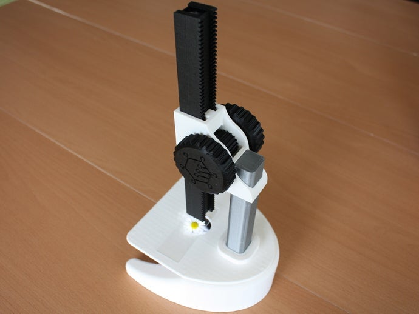
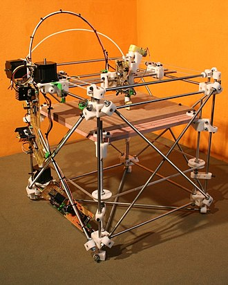
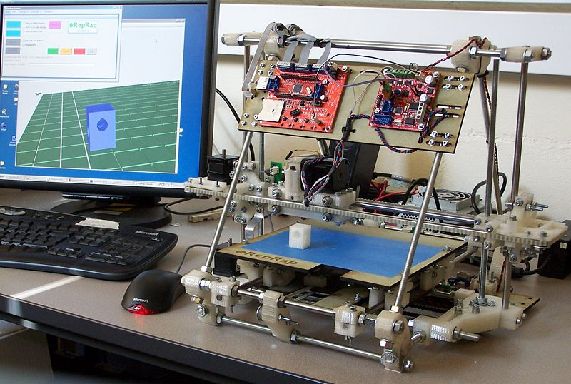
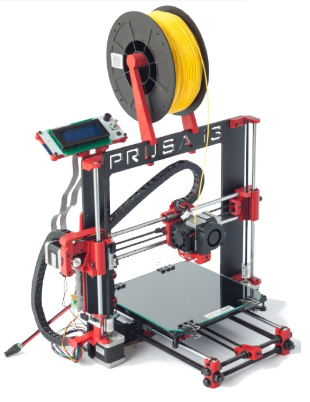

# Historia de la impresión 3D

[Vídeo: 0.0 Introducción a la impresión 3D](https://drive.google.com/file/d/1GQ6ZUEaMOJSZ3Ud2KeI1mPKz7Luu3vJJ/view?usp=sharing)

La aparición de herramientas abiertas como Arduino, ha permitido el desarrollo de herramientas cada vez más complejas y tan exitosas como [**RepRap**](https://reprap.org/wiki/RepRap), proyecto abanderado por [*Adrian Bowyer*](https://es.wikipedia.org/wiki/Adrian_Bowyer), originariamente destinado a crear máquinas que facilitaran la creación de prototipos en los laboratorios de un modo más rápido y eficiente. 

Este proyecto ha hecho accesible a todo el público las **impresoras 3D**, permitiendo que cualquier persona con unos mínimos conocimientos técnicos pueda montarlas y utilizarlas.

Adrian Bowyer creó una impresora que era capaz de imprimir ciertas piezas (de plástico) que no podía comprar, y que permitieron mejorar su diseño (que usabas piezas de madera talladas a mano). Imprimió unas piezas nuevas que regaló a su compañero de laboratorio junto con todos los detalles para reproducir su impresora y este puedo hacer una nueva impresora (la que aparece como “Child” en la foto).

De hecho, compartió sus diseños en internet permitiéndonos a todos acceder a esa tecnología.

Sus diseños se fueron difundiendo y perfeccionando, haciendo cada vez impresoras más precisas y duraderas. Como las mejoras se volvían a compartir, todos los usuarios podían volver a mejorar sus impresoras, puesto que podían imprimir las piezas con los nuevos diseños.

Al mismo tiempo se mejoraba tanto el firmware de las impresoras, como todo el software necesario para que estas imprimieran. Todo ello con licencia Open Source.

Este proceso de mejora y difusión de la información dio lugar a varias generaciones de impresoras. Muchas de las impresoras actuales derivan de la I3 que diseñó Josef Prusa, por eso se llama a esa versión Prusa i3.

El éxito de este modelo fue tal que el carismático [*Josef Prusa*](https://www.prusa3d.es/sobre-nosotros/#timeline) fundó una empresa  [*Prusa Research*](https://www.prusa3d.es/) en 2012, y había vendido más de 130000 impresoras en 2018. 

Hay que tener en cuenta que el compartir todos los diseños con licencia abierta ha permitido que multitud de empresas creen sus propios productos optimizándolos en tener mejores precios o distinta funcionalidad.

Hoy en día estas impresoras son un producto que puedes comprar y empezar a usar cuando llegues a casa. Como prueba una imagen donde se ve una impresión 3D hecha por mismísimo Alberto Chicote (sí, el cocinero) a partir de un diseño compartido en internet.

*Imagen de un busto de Nefertiti impreso por el cocinero Alberto Chicote. [Modelo](https://www.myminifactory.com/object/3d-print-bust-of-nefertiti-at-the-egyptian-museum-berlin-2951)*

En España, este movimiento tuvo su difusión de la mano de los [tutoriales de Juan González](http://www.iearobotics.com/wiki/index.php?title=Guia_de_montaje_de_la_Prusa_2) [*@obijuan*](http://www.iearobotics.com/wiki/index.php?title=Obijuan_Academy) que nos permitieron aprender sobre el uso de las impresoras y el software libre de diseño 3D como [*FreeCad*](https://www.freecadweb.org/). 

A partir de su iniciativa se crearon comunidades online, como [CloneWars](https://www.reprap.org/wiki/Proyecto_Clone_Wars) donde los participantes regalaban las piezas de plástico a quien quería montarse una impresora a cambio de que éste hiciera lo mismo cuando la tuviera lista, lo que dio lugar a un ["árbol genealógico"](https://www.reprap.org/wiki/Clone_Wars:_El_imperio_de_los_clones/es).

También nacieron multitud de comunidades locales, como la granadina "Granada Imprusa" en diferentes localizaciones, agrupando a maker que a su vez se reunían en eventos como las [Maker Faire](https://galicia.makerfaire.com/).

El mundo de la impresión 3D nos da un gran ejemplo de lo que podemos conseguir dentro del Open Hardware: diseños y proyectos que podemos descargar y reproducir con nuestra impresora 3D, como por ejemplo este [Microscopio impreso](https://www.thingiverse.com/thing:77450) (sólo necesita las lentes y la iluminación).

*Microscopio impreso. [Modelo](https://www.thingiverse.com/thing:77450)*

### Evolución de los modelos

Vamos a hacer un rápido recorrido entre los modelos iniciales de la evolución de las impresoras 3D, a partir de las primeras versiones de RepRap.

En la imagen que hemos visto antes podemos ver la primera versión, la conocida como **I1** (la “I” viene de iteración), es  decir, la primera iteración realizada de estos equipos. Vemos que este modelo ya incluye todos los componentes que tendrán las distintas impresoras actuales pero con una estructura bastante compleja en la que eran necesarias muchas varillas y muchos elementos. A este modelo se le denominaba "Darwin", supongo que porque era el principio de la evolución.

A partir del modelo inicial se fueron generando muchas derivaciones optimizando la estructura mejorando la velocidad incrementando la potencia del procesador que lo controlaba y añadiendo funcionalidades que la hacían cada vez más sencilla de replicar y con una mayor estabilidad y velocidad de funcionamiento.  Ya estaba clara a partir de esta semilla inicial la naturaleza devolución que estaba implícitamente en un proceso en el que se compartían constantemente las mejoras que ayudaban a ir  produciendo nuevas generaciones,  que contenían aquellas mejoras que eran aceptadas por la mayoría de los usuarios. De la mejoras más utilizadas apareció la versión denominada **I2** y de nombre "Mendel".

Fueron muchas las empresas que comenzaron a producir kit que vendían para que los usuarios pudieran comprarlo y construirse su propia impresora de una forma más sencilla. También existían cadenas como hemos visto de usuarios que se regalaban entre sí las piezas impresas y que solo tenían que comprar los componentes electrónicos y las partes mecánicas. La versión **I3** fue un éxito de producción y fueron muchísimas las empresas que la vendían. En la imagen podéis ver el modelo **I3** de la empresa española Bq que fue un enorme éxito internacional de ventas.

Si nos fijamos, a día de hoy, muchos modelos se parecen bastante entre sí pues casi todos derivan de estos modelos iniciales. Más adelante vamos a ver las distintas arquitecturas existentes.
