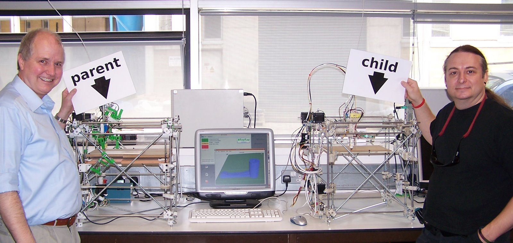

# Historia de la impresión 3D

[Vídeo: 0.0 Introduccion a la impresión 3D](https://youtu.be/tcj_56s_TuQ)

A partir de estos desarrollos abiertos como Arduino se han creado proyectos más complejos y tan exitosos como [**RepRap**](https://reprap.org/wiki/RepRap), proyecto abanderado por [*Adrian Bowyer*](https://es.wikipedia.org/wiki/Adrian_Bowyer), originariamente destinado a crear prototipos en los laboratorios de un modo más rápido y eficiente y que ha hecho accesible a todo el público las **impresoras 3D**, permitiendo que cualquier persona con unos mínimos conocimientos técnicos pueda montarlas y utilizarlas.

*Primera replicación de una impresora 3D.*

Adrian Bowyer creó una impresora que era capaz de imprimir ciertas piezas (de plástico) que no podía comprar, y que permitieron mejorar su diseño (que usabas piezas de madera talladas a mano). Imprimió unas piezas nuevas que regaló a su compañero de laboratorio junto con todos los detalles para reproducir su impresora y este puedo hacer una nueva impresora (la que aparece como “Child” en la foto)

De hecho, compartió sus diseños en internet permitiéndonos a todos acceder a esa tecnología.

Sus diseños se fueron difundiendo y perfeccionando, haciendo cada vez impresoras más precisas y duraderas. Como las mejoras se volvían a compartir, todos los usuarios podían volver a mejorar sus impresoras, puesto que podián imprimir las piezas con los nuevos diseños.

Al mismo tiempo se mejoraba tanto el firmware de las impresoras, como todo el software necesario para que estas imprieran. Todo ello con licencia Open Source.

Este proceso de mejora y difusión de la información dio lugar a varias generaciones de impresoras. Muchas de las impresoras actuales derivan de la I3 que diseñó Joseph Prusa, por ese se llama a esa versión Prusa i3.

El éxito de este modelo fue tal que el carismático [*Joseph Prusa*](https://www.prusa3d.es/sobre-nosotros/#timeline) fundó una empresa  [*Prusa Research*](https://www.prusa3d.es/) en 2012, y había vendido más de 130000 impresoras en 2018. 

Hay que tener en cuenta que el compartir todos los diseños con licencia abierta ha permitido que multitud de empresas creen sus propios productos optimizándolos en tener mejores precios o distinta funcionalidad.

Hoy en día estas impresoras son un producto que puedes comprar y empezar a usar cuando llegues a casa. Como prueba una imagen donde se ve una impresión 3D hecha por mismísimo Alberto Chicote (sí, el cocinero) a partir de un diseño compartido en internet

> Imagen un busto de Nefertity impreso por el cocinero Alberto Chicote
> Modelo: https://www.myminifactory.com/object/3d-print-bust-of-nefertiti-at-the-egyptian-museum-berlin-2951

En España, este movimiento tuvo su difusión de la mano de los [tutoriales de Juan González](http://www.iearobotics.com/wiki/index.php?title=Guia_de_montaje_de_la_Prusa_2) [*@obijuan*](http://www.iearobotics.com/wiki/index.php?title=Obijuan_Academy) que nos permitieron aprender sobre el uso de las impresoras y el software libre de diseño 3D como [*FreeCad*](https://www.freecadweb.org/). 

A partir de su iniciativa se crearon comunidades online, como [CloneWars](https://www.reprap.org/wiki/Proyecto_Clone_Wars) donde los participantes regalaban las piezas de plástico a quien quería montarse una impresora a cambio de que éste hiciera lo mismo cuando la tuviera lista, lo que dio lugar a un ["árbol genealógio"](https://www.reprap.org/wiki/Clone_Wars:_El_imperio_de_los_clones/es)

También nacieron multitud de comunidades locales, como la granadina "Granada Imprusa"

El mundo de la impresión 3D nos da un gran ejemplo de lo que podemos conseguir dentro del Open Hardware: diseños y proyectos que podemos descargar y reproducir con nuestra impresora 3D, como por ejemplo este [Microscopio impreso](https://www.thingiverse.com/thing:77450) (sólo necesita las lentes y la iluminación)

> Microscopio impreso
> Imagen del modelo https://www.thingiverse.com/thing:77450

[Referencia]( https://en.m.wikipedia.org/wiki/3D_printing)
