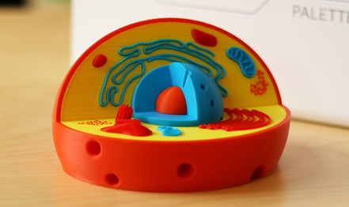
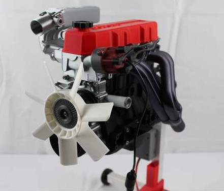

# Aplicaciones de la impresión 3D

[Vídeo: Aplicaciones de la impresión 3D](https://drive.google.com/file/d/1LC2ZIpNanY9b26CEf6Yww9RNSlE6En7V/view?usp=sharing)

Realmente podemos decir que el número de aplicaciones de las impresoras 3D es prácticamente infinito.  en todos los campos permiten la realización de prototipos y la copia de pieza a las que no tenemos acceso para realizar una de estas copias solamente tenemos que realizar un diseño o bien escanear una pieza original.

Vamos a ver algunos de estos ejemplos, en campos concretos, si bien te invito a que investigues por tu cuenta y encuentre muchas aplicaciones que ni siquiera hemos pensado que estaban disponibles a día de hoy.

## Aplicaciones escolares

[Aparatos para el cole](https://www.thingiverse.com/javacasm/collections/cole)

Son muchos los diseños disponibles para fines educativos. Existen modelos de prácticamente cualquiera de los campos que se utilizan en el ámbito docente.  
Especialmente existen modelos de aquellos conceptos un poco más complejos de entender, como puede ser por ejemplo la hélice del ADN, que tiene disponibles muchos modelos según tratemos de entender su estructura física o bien su composición química como podemos ver en los siguientes ejemplos:

También son muchos los [Proyectos de ciencia](https://www.thingiverse.com/MakerBotLearning/collections/science-projects) disponibles para imprimir en todo tipo de Ciencias con pueden ser las ciencias naturales la geología o cualquiera de los ámbitos vamos a poder encontrar una representación esquemática de un corte de la tierra:

O de los diferentes tipos de células, como la célula animal:

O la célula vegetal

[Modelo de célula animal](https://www.thingiverse.com/thing:2485063)

En el ámbito educativo existen excelentes recopilaciones de [Propuestas de usos educativos de la impresión 3D](http://www3.gobiernodecanarias.org/medusa/ecoescuela/3d/impresion-3d/como-funciona/propuestas-de-uso-educativo-de-la-impresion-3d/)

## Juguetes

También podemos encontrar todo tipo de juguetes para imprimir,  como por ejemplo este proyecto de realización de los conocidos  es [Spinners](https://github.com/javacasm/Spinners),  tan de moda hace unos años. R realizamos este proyecto con el alumnado de bachillerato para aprender conceptos de Física de robótica de tecnología en general y que vieran como ellos mismo podían fabricar sus propios componentes y trabajar con diseños propios en un laboratorio.

## Matemáticas

Un campo  qué aplicación ideal para la impresión 3D son las matemáticas dónde podemos imprimir todo tipo de [Figuras geométricas](https://www.thingiverse.com/javacasm/collections/figuras-geometricas) que van a facilitar el aprendizaje de todos los conceptos de la geometría y de muchos campos diferentes.

## Material de laboratorio

Como ya hemos visto las impresoras 3D aparecieron como una forma de facilitar la creación de prototipos.  Uno de estos campos más interesantes es la creación de [Material de Laboratorio](https://www.thingiverse.com/javacasm/collections/laboratorio) de bajo coste y sobre todo el tener la total libertad para crear nuestro propio material modificando el que ya existe o adaptándola a nuestras necesidades.

## Química

La [Química](https://www.thingiverse.com/javacasm/collections/quimica)  es un campo donde podemos aprovechar las capacidades visuales de las piezas impresas en 3D para entender conceptos complejos como puede ser la estructura de las moléculas.

## Aplicaciones médicas

La posibilidad de diseñar y adaptar elementos ya existentes o crear otros a partir de fotografías,  radiografías  o cualquier otro formato de imagen médico, ha permitido que la impresora 3D se cuele en dentro de los hospitales, facilitando a los médicos la posibilidad de ver en 3D y estudiar antes de realizar una operación el aspecto que van a tener los diferentes partes del paciente con el que van a trabajar, como 

[[ejemplo]](https://twitter.com/rupermac/status/722907922930380801)

Otro ejemplo de proyecto extremadamente interesante con aplicaciones médicas en este caso de prótesis, es el [Proyecto e-NABLE](http://enablingthefuture.org/) (por si quieres saber más de su [Historia](http://www.imprimalia3d.com/noticias/2014/03/06/001528/pr-tesis-manos-mediante-impresi-n-3d)) que se encarga de la creación y adaptación de prótesis de brazo especialmente para niño para los que el coste de una prótesis industrial sería prohibitivo dado lo rápido que crecen. Para ello adapta modelo estándar qué prótesis a las medidas concretas de cada uno de los niños imprimiéndolos de forma gratuita. A medida que van creciendo se van haciendo nuevas adaptaciones

## Aplicaciones para ingeniería

Otro campo de aplicación natural de la impresión 3D es sin duda el mundo de la ingeniería donde se pueden crear maquetas, modelos a escala y prototipos de todo tipo de equipamiento.

Pueden ser el mundo de la *arquitectura* donde se trabaja mucho con maquetas:

O en el mundo de la ingeniería mecánica dónde se hacen todo tipo de máquinas Cómo pueden ser los motores, como podemos ver en estos ([diseños](https://github.com/gNSortino/OSREngines))

O maquetas de máquinas ([modelo](http://www.thingiverse.com/thing:644933)) y motores, como esta réplica de un motor real de Toyota

o su cambio de marchas

[[modelo]](http://www.thingiverse.com/thing:713815)  [[vídeo]](https://www.youtube.com/watch?v=-FyC3dn3HJY)

O para la construcción de prototipos de máquinas de laboratorio  para realizar todo tipo de ensayo como estos de [medida de resistencia de materiales](http://3dprint.com/57992/testrbot-3d-print-testing/) 

O esta turbina de avión:

 [[modelo]](https://www.thingiverse.com/thing:392115)[[historia del modelo]](http://3dprint.com/17716/3d-printed-jet-engine/)

[[modelo]](http://www.thingiverse.com/thing:114468)    [[vídeo]](https://www.youtube.com/watch?v=6rX4xv5-NvE)

Podemos trabajar y tocar con equipos que en otro caso estarían fuera de nuestro alcance:

[[modelo]](https://www.thingiverse.com/thing:392115)

