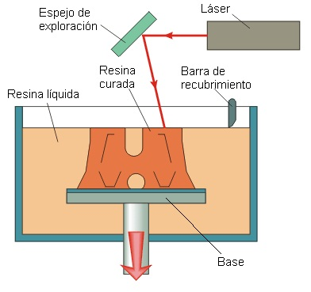

# Tecnologías de impresión 3D

## FDM (FFF)

La tecnología FDM (Fused deposition modeling) estaba protegida por patentes y nació una tecnología que en esencia es similar, o Fused Filament Fabrication (FFF) que hemos visto en impresoras como RepRap

## DLP

DLP (Digital Light Processing) una fuente de luz (similar a un proyector) solidifica una resina fotosensible dependiendo de la cantidad de luz recibida.

## SLA

SLA (Stereolitografía) Similar a DLP pero la imagen se crea con un láser. Se pueden usar resinas más económicas (el láser es más potente).

## SLS  

SLS (Selective laser sintering) es similar a SLA per en lugar de una resina usa un material pulverizado.

### FDM vs DLP

Actualmente 

* FDM va desde 0.5 a 0.127 mm
* DLP consigue 0.05 a 0.01 mm

FDM 0.2mm vs DLP 0.02mm

## Recursos

[Tecnologías de impresoras 3D](http://tecnologiadelosplasticos.blogspot.com.es/2013/02/impresion-3d.html):

[Tecnologías de impresión 3D](http://www.xataka.com/perifericos/estas-son-las-tecnologias-de-impresion-3d-que-hay-sobre-la-mesa-y-lo-que-puedes-esperar-de-ellas)

[Impresión 3d en wikipedia](http://es.wikipedia.org/wiki/Impresi%C3%B3n_3D)

[Tipos de impresoras 3D](http://comohacer.eu/comparativa-impresoras-3d/#Tipos_de_impresion_3D)
