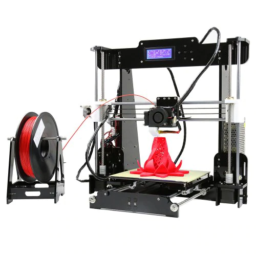

# Comprar una impresora

Vamos a ver algunos detalles

* **Impresora barata**: alrededor de los 200 - 300 €. Vienen casi montadas, en  kits bastante sencillos de montar. Tienen una durabilidad bastante correcta. Además algo muy importante es que tienen una gran comunidad detrás que nos permite mejorarla, entenderla y arreglar si tenemos algún problema.

* **Gama alta**: vamos a encontrar impresoras cerradas, por ejemplo de marca Ultimaker o de  makerbot sí sí que tienen unos precios del orden de los 2000 y pico euros pero una enorme calidad y una gran estabilidad además estamos comprando un producto que tiene un gran soporte y una excelente calidad

[Vídeo: 0.5 ¿Qué impresora comprar?](https://youtu.be/AFRegfBQCF0)

## CREALITY ENDER 3 (160-180eu) 

[Videoreview](https://www.youtube.com/watch?v=6LQl-UUEVO8)

## Geeetech A10 3D Printer (160eu)

## Anet A8 (130eu)

## Artillery Genius (250e)

## Anycubics i3 Mega (300€)

[Comparativa de impresoras 3D](http://comohacer.eu/comparativa-impresoras-3d/#Comparativa_de_impresoras_3D)

[Otra comparativa](http://buenosybaratos.es/electronica/impresora-3d/las-mejores-impresoras-3d/)

## Kingroon Kp3S

Se trata de una impresora compacta, de tamaño aceptable y con una buena área de impresión 180x180, con un "semi" extrusor directo que nos va a evitar tema de atascos si estamos empezando.

Esta no la he probado (todavía) pero el compañero Juan Pablo Moraga nos la recomienda y me fío 100% de su criterio

[Vídeo donde la revisan](https://www.youtube.com/watch?v=4lRdFfXaNj8)

Se puede conseguir por unos 140€

## [Prusa Original i3 MK3S](https://www.prusa3d.es/original-prusa-i3-mk3-spa/) 769€ el kit

### Complemento multimaterial

[Multimaterial MMU2S](https://www.prusa3d.es/original-prusa-i3-multi-material-2-0/)

Soporta hasta 5 filamentos

## Calidad industrial - [Ultimaker](https://ultimaker.com/es/3d-printers) - 2500€

## ¿Dónde comprarlas?

# Recomendados

[En Granada - Createc3D](https://createc3d.com/shop/es/19-kit-impresoras-3d) Recomendado para quien requiera soporte presencial

[Online - micro-log.com](https://micro-log.com)

## Cual elegir

* Según las necesidades
* Según el uso
* Según el espacio
* Según nuestras habilidades

## ¿Nos atrevemos con un kit?

Bq

Createc3D

## Materiales reciclados
