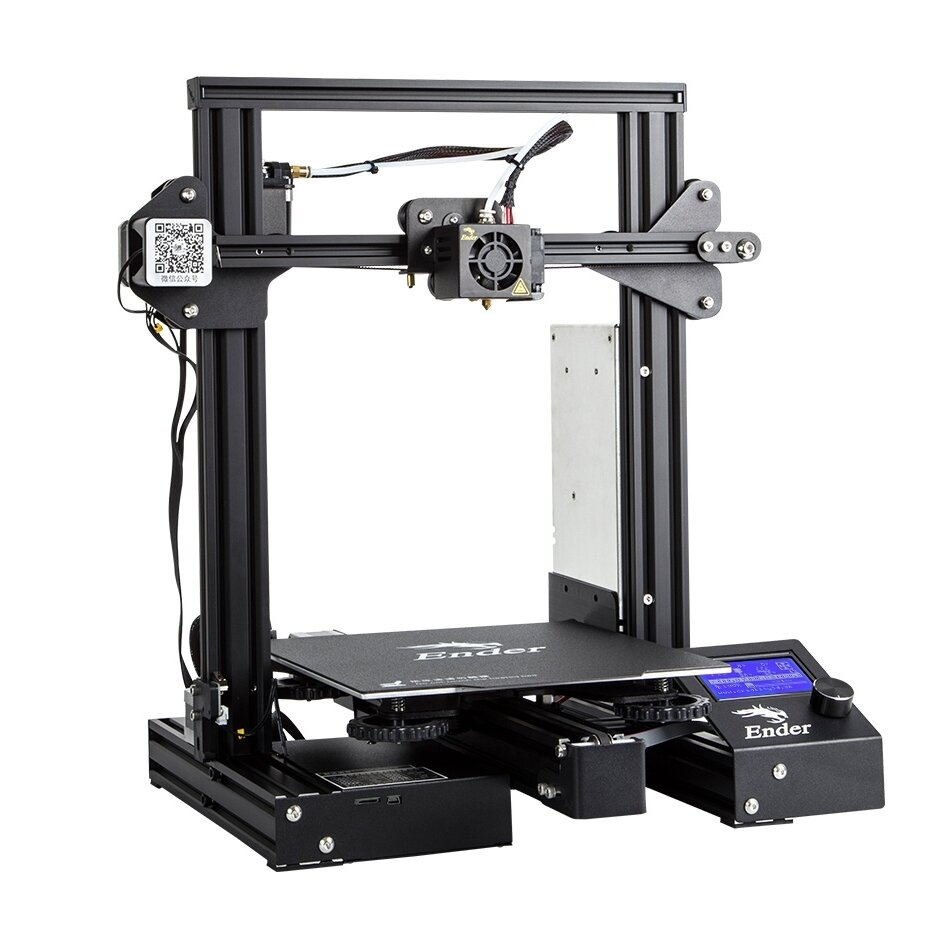
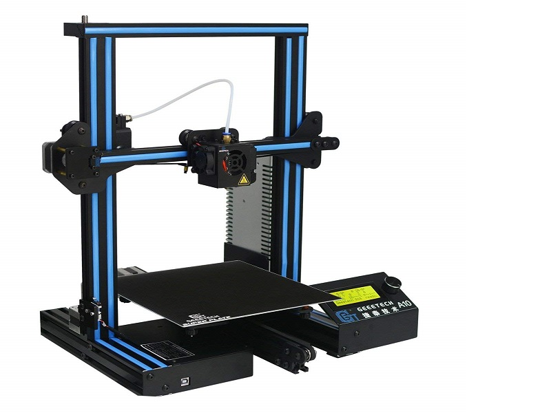
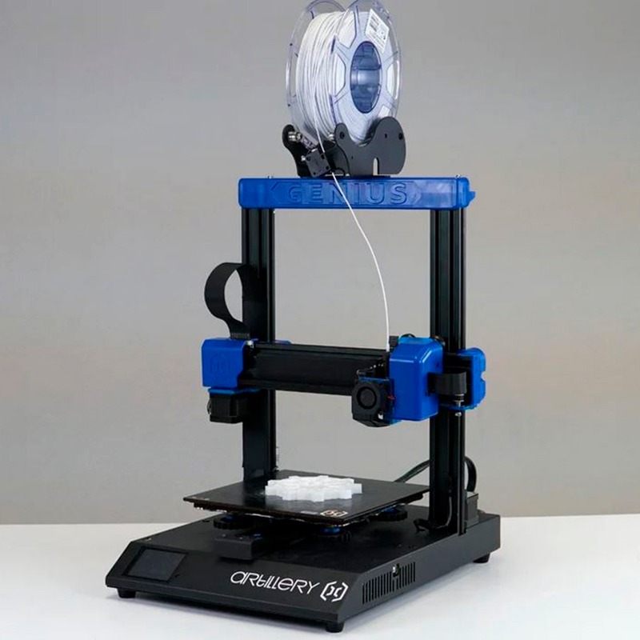
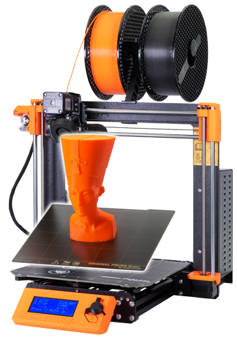

# Comprar una impresora

Vamos a ver algunos detalles

* **Impresora barata**: alrededor de los 200 - 300 €. Vienen casi montadas, en  kits bastante sencillos de montar. Tienen una durabilidad bastante correcta. Además algo muy importante es que tienen una gran comunidad detrás que nos permite mejorarla, entenderla y arreglar si tenemos algún problema.

* **Gama alta**: vamos a encontrar impresoras cerradas, por ejemplo de marca Ultimaker o de  makerbot sí sí que tienen unos precios del orden de los 2000 y pico euros pero una enorme calidad y una gran estabilidad además estamos comprando un producto que tiene un gran soporte y una excelente calidad.

En el rango medio nos encontramos con los equipos de la empresa [Prusa Research](https://www.prusa3d.es/) creada por Joseph Prusa, que no ni más ni menos que el diseñador de esta generación de impresora. El 99% todas las impresoras que ahora se hacen heredan de una forma prácticamente directa de sus diseños. 
Su impresora, ORIGINAL PRUSA I3
MK3S+ es considerada como la mejor impresora del mercado para ese rango de precio

Este fabricante además tiene una enorme vocación opensource licenciando todo su diseño todos sus proyectos como opensource por ejemplo el Prusa Slicer que marca el estándar ahora mismo su desarrollo es completamente libre y gratuito

Si tenemos un presupuesto de 1000 €, yo personalmente preferiría comprar 3 impresora de 300 € antes que una impresora de 1000 €:  en el tiempo en el que nosotros vamos a cambiar de impresora o amortizarla sin ninguna duda será más rentable.

En qué contexto podemos pensar en una impresora de más calidad o bien en alguien que no quiere molestarse en utilizarla en calibrarla y en un tipo de cliente que la necesita para imprimir sin pensar

[Vídeo: 0.5 ¿Qué impresora comprar?](https://youtu.be/AFRegfBQCF0)

## CREALITY ENDER 3 (160-180eu) 

[Videoreview](https://www.youtube.com/watch?v=6LQl-UUEVO8)

## Geeetech A10 3D Printer (160eu)

## Artillery Genius (250e)

## Anycubics i3 Mega (300€)

[Comparativa de impresoras 3D](http://comohacer.eu/comparativa-impresoras-3d/#Comparativa_de_impresoras_3D)

[Otra comparativa](http://buenosybaratos.es/electronica/impresora-3d/las-mejores-impresoras-3d/)

## Kingroon Kp3S

Se trata de una impresora compacta, de tamaño aceptable y con una buena área de impresión 180x180, con un "semi" extrusor directo que nos va a evitar tema de atascos si estamos empezando.

[Vídeo donde la revisan](https://www.youtube.com/watch?v=4lRdFfXaNj8)

Se puede conseguir por unos 140€

## [Prusa Original i3 MK3S](https://www.prusa3d.es/original-prusa-i3-mk3-spa/) 769€ el kit y montada 999€

 La calidad excelente el montaje está muy bien estructurado y no lleva más ya de 1.5-2 horas con el calibrado.

La calidad de esta impresora va por delante del resto de fabricantes, ellos son los que marcan completamente el camino que van siguiendo los restantes fabricantes  en cuanto a calidad a diseño y ya lo tiene usuario medio suele esperar.

Además de la impresora se puede estar en dos formatos: el formato mini y el formato estándar m3ks:

Además tienen un complemento para multifilamento que nos permite utilizar hasta 5 filamentos al mismo tiempo para producir impresiones de una excelente calidad

## ORIGINAL PRUSA MINI+

Otra opción muy interesante es la ORIGINAL PRUSA MINI+

### Complemento multimaterial

[Multimaterial MMU2S](https://www.prusa3d.es/original-prusa-i3-multi-material-2-0/)

Soporta hasta 5 filamentos

## Calidad industrial - [Ultimaker](https://ultimaker.com/es/3d-printers) - 2500€

## ¿Dónde comprarlas?

# Recomendados

[En Granada - Createc3D](https://createc3d.com/shop/es/19-kit-impresoras-3d) Recomendado para quien requiera soporte presencial

[Online - micro-log.com](https://micro-log.com)

## Cual elegir

* Según las necesidades
* Según el uso
* Según el espacio
* Según nuestras habilidades

## ¿Nos atrevemos con un kit?

Bq

Createc3D

## Materiales reciclados
