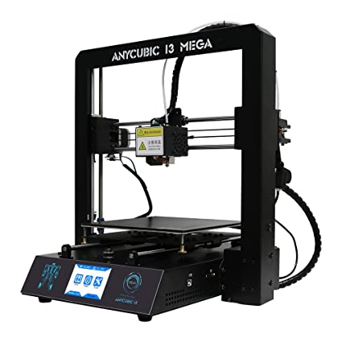

# Comprar una impresora

El mundo de las impresoras 3D, como todo lo relacionado con la tecnología, ha cambiado mucho en los últimos tiempos. Desde hace muy poco existen impresoras mucho más autónomas y a un precio bastante reducido, que ya nos permiten imprimir directamente desde el móvil modelos que ya están preparados ser impresos. 

Eso sí, dependemos completamente del fabricante en todos los aspectos.CSon modelos seleccionados, personalizados y adaptados a su propias impresora. Con ello consiguen una mayor calidad y facilidad de uso.

Por un lado ganamos en facilidad y por otro lado perdemos en posibilidades y versatilidad de uso.

Si eres el afortunado poseedor de una impresora Bambulab o una creality  K1 estás de suerte porque vas a poder imprimir con mucha más facilidad los modelos que estos fabricantes seleccionen.

Pero si tú quieres elegir los modelos, elegir la calidad o realizar manualmente  el proceso,  porque de lo que se trata es de aprender a hacerlo tú mismo, no que te lo haga el fabricante, vas a necesitar los contenidos de este curso.

Aunque tu impresora estén entre estas más modernas, te recomiendo que al menos revises los materiales, para aprender a hacer el proceso manualmente, por si llega un momento en el que necesitas imprimir algo que el fabricante no ha pensado y no quiere imprimir.

El proceso en esta impresora automática sigue siendo el mismo salvo que gran parte ya lo ha realizado el fabricante por ti.

Seguro que en lo que dura el curso aparecerán nuevos modelos... y esta guía estará aún más desfasada, espero que al menos te sirva como referencia.
## ¿Qué impresora comprar?

Antes de entrar hablar de modelos concretos, vamos a definir tres categorías:

* **Impresora barata**: alrededor de los 200 - 300 €. Vienen casi montadas, en  kits bastante sencillos de montar. Tienen una durabilidad bastante correcta. Además algo muy importante es que tienen una gran comunidad detrás que nos permite mejorarla, entenderla y arreglar si tenemos algún problema.

* En el **gama media** (en torno a los 1000€) nos encontramos con los equipos de la empresa [Prusa Research](https://www.prusa3d.es/) creada por Josef Prusa, que no ni más ni menos que el diseñador de esta generación de impresoras: el 90% de todas las impresoras que ahora se hacen heredan de una forma prácticamente directa de sus diseños.   Su impresora, ORIGINAL PRUSA I3 MK3S+ es considerada como la mejor impresora del mercado para ese rango de precio. Este fabricante además tiene una enorme vocación Open Source, licenciando todo su diseño, sus proyectos como opensource. Por ejemplo el software Prusa Slicer de laminado, marca el estándar ahora mismo su desarrollo es completamente libre y gratuito

* **Gama alta**: vamos a encontrar impresoras cerradas, por ejemplo de marca Ultimaker o de  makerbot sí sí que tienen unos precios del orden de los 2000 y pico euros pero una enorme calidad y una gran estabilidad además estamos comprando un producto que tiene un gran soporte y una excelente calidad.

Antes de elegir nuestro modelo tenemos que pensar :

* El uso que le vamos a dar,  el número de horas que vamos a utilizar la una impresora de gama media tiene una vida útil del orden de las 1500 horas de impresión.  una impresora profesional sin ningún problema llegará hasta las 5000 horas. Pasado este tiempo necesitaremos reparaciones y nuevos ajustes.
* Tenemos que pensar si vamos a necesitar imprimir piezas de gran tamaño en cuyo caso deberíamos de buscar una impresora que tenga una base mayor. Por supuesto al aumentar este tamaño se incrementa bastante el precio.
* Tenemos que pensar también el espacio que tenemos disponible: una impresora profesional suele ocupar bastante espacio y requerirá una estantería o mesa aparte.  en cambio podemos encontrar una impresora barata con una base de tamaño aproximado de 40 x 40 cm.
* Si nos decidimos por una impresora en kit tenemos que contar con que tendremos que montarla, lo cual requiere de bastante tiempo, dependiendo del modelo y además de ciertos conocimientos para ajustar y calibrar bien.
* Otro punto a tener en cuenta es la documentación, el soporte técnico y la comunidad que hay alrededor de la impresora que nos van a facilitar enormemente el uso incluso la mejora de nuestra impresora.

Si tenemos un presupuesto de 1000 €, yo personalmente preferiría comprar 3 impresora de 300 € antes que una impresora de 1000 €:  en el tiempo en el que nosotros vamos a cambiar de impresora o amortizarla sin ninguna duda será más rentable.

En qué contexto podemos pensar en una impresora de más calidad o bien en alguien que no quiere molestarse en calibrarla y en un tipo de cliente que la necesita para imprimir sin pensar

[Vídeo un poco obsoleto...: 0.5 ¿Qué impresora comprar?](https://drive.google.com/file/d/1d7lQ8J45gFST8fa8AP_rTovF5ZLSqkVe/view?usp=sharing)

Vamos a ver algunos ejemplos de modelos que a día de hoy tienen una gran fama y un buen precio y que podían ser una compra interesante. Empezaremos por aquellos modelos que he probado y  de los que tengo buena opinión:

## CREALITY ENDER 3 - La clásica

El modelo Creality Ender y sus actualizaciones Pro o la versión v2,v3, SE, ...  han sido un total éxito de ventas la mayoría de los usuarios están muy contentos con su funcionamiento.  El montaje es rápido (2 horas para v1 y 1 hora para la v2) y se obtienen  resultados de bastante calidad. 

Las últimas versionwa disponible, se puede montar y calibrar en menos de una hora.  Al ver  que coexisten en el mercado versiones distintas, nos queda la duda de por qué comprar una impresora antigua si ya existe una mejorada: pues porque podemos encontrar la primera versión a un precio muy, [muy competitivo](https://store.creality.com/es/products/ender-3-impresora-3d) ¡¡99€!!. Ocurre como en los móviles, que el último  está un poco caro y el anterior es una opción muy buena de precio. Si te da el presupuesto yo me iría  a por una más moderna, pero si lo que quieres es tener varias para que tu alumnado aprenda, 3 antiguas es mejor que 1 nueva.

Se trata de impresora de batalla, capaz de imprimir durante bastantes horas con muy buen funcionamiento.

[Videoreview](https://www.youtube.com/watch?v=6LQl-UUEVO8)

## Kingroon Kp3S

![[kingroon_kp3S.png]]

Se trata de una impresora compacta, de tamaño aceptable y con una buena área de impresión 180x180, con un "semi" extrusor directo que nos va a evitar tema de atascos si estamos empezando.

El montaje es muy rápido teniendo la lista para imprimir en menos de media hora.

[Vídeo donde la revisan](https://www.youtube.com/watch?v=4lRdFfXaNj8)

Se puede conseguir por unos 140€

Es la impresora ideal para tenerla en nuestro escritorio,  salvo por el problema de que es un poco ruidosa.

Cualquiera de estas dos de estas impresoras son una muy buena elección para empezar. Sin embargo en el mercado existen muchísimos modelos que tienen también una muy buena calidad y que por el precio que cuestan nos dan una excelente relación calidad-precio. 

## Artillery Genius

La marca Artillery nos propone en este modelo una impresora muy completa, muy bien acabada, con un montaje muy rápido (menos de 1 hora) y con muy buen resultado en cuanto a la calidad de la impresora.  Son impresoras muy estables con las que se consigue una muy buena velocidad de impresión.

## Anycubics i3 Mega

La marca Anycubic produce una impresora de gran calidad que se montan muy rápido y con las que se consigue una impresión muy estable.

## Creality Ender 3 V3 SE**
La Ender 3 V3 SE es una opción económica y sencilla para principiantes que buscan iniciarse en la impresión 3D sin complicaciones. Su nivelación automática y extrusor directo permiten imprimir con materiales flexibles como TPU con facilidad.

![[Creality_Ender_3_V3_SE.png]]

- *Ideal para*: Usuarios nuevos en impresión.
- *Limitaciones*: Velocidad máxima moderada (250 mm/s).

## **Creality Ender 3 S1**

Este modelo mejora la serie Ender con un extrusor directo avanzado y una cama más grande (270 mm de altura). Es perfecta para quienes buscan calidad sin gastar demasiado.
![[Creality_ender_3_S1.png]]
- *Ideal para*: Usuarios intermedios que imprimen con materiales técnicos.
- *Limitaciones*: Precio ligeramente superior al promedio.

## **Voxelab Aquila D1**

La Aquila D1 ofrece un equilibrio entre precio y prestaciones con nivelación automática precisa y compatibilidad con filamentos comunes como PLA y PETG.
![[Voxelab_Aquila_D1.png]]
- *Ideal para*: Usuarios domésticos con presupuesto ajustado.
- *Limitaciones*: Menor velocidad comparada con otras opciones.

## **Anycubic Kobra 2 Pro**

Este modelo destaca por su velocidad de impresión (300 mm/s) y facilidad de configuración gracias a su sistema de auto-nivelación avanzado.

![[Anycubic_cobra.png]]
- *Ideal para*: Usuarios que valoran rapidez y calidad.
- *Limitaciones*: Volumen limitado frente a otras impresoras similares.

## **Bambu Lab A1 Mini**

La A1 Mini es una impresora compacta diseñada para usuarios que priorizan velocidad (500 mm/s) y facilidad de uso en espacios pequeños.
![[BambuLab_A1_mini.png]]
- *Ideal para*: Proyectos pequeños o usuarios principiantes.
- *Limitaciones*: Volumen reducido; no apta para piezas grandes.

## Modelos de gama media

Si no decidimos por una impresora de calidad media con un presupuesto entorno a los 1000 € sin duda me elegiría la impresora Prusa Original i3 MK3S

## [Prusa Original i3 MK3S](https://www.prusa3d.es/original-prusa-i3-mk3-spa/) 769€ el kit y montada 999€

 La calidad excelente el montaje está muy bien estructurado y no lleva más ya de 1.5-2 horas con el calibrado.

La calidad de esta impresora va por delante del resto de fabricantes, ellos son los que marcan completamente el camino que van siguiendo los restantes fabricantes  en cuanto a calidad a diseño y ya lo tiene usuario medio suele esperar.

Además de la impresora se puede estar en dos formatos: el formato mini y el formato estándar m3ks:

Además tienen un complemento para multifilamento que nos permite utilizar hasta 5 filamentos al mismo tiempo para producir impresiones de una excelente calidad

## ORIGINAL PRUSA MINI+

Otra opción muy interesante es la ORIGINAL PRUSA MINI+

Con el modelo Mini conseguimos una impresora de prácticamente la misma calidad que su hermana mayor pero con un tamaño muy pequeñito ideal cuando queremos tenerla en nuestro escritorio.

### Comparativa de impresoras 3D para uso personal (2025)

A continuación, se presenta una tabla comparativa con las mejores impresoras 3D disponibles en el mercado en un rango de precios hasta 500 €, destacando sus características clave, ventajas y posibles inconvenientes.

---

| **Modelo**                 | **Volumen de impresión** | **Velocidad máxima** | **Materiales compatibles** | **Nivelación automática** | **Precio aproximado** | **Ventajas**                                                                 | **Inconvenientes**                                                   |
| -------------------------- | ------------------------ | -------------------- | -------------------------- | ------------------------- | --------------------- | ---------------------------------------------------------------------------- | -------------------------------------------------------------------- |
| **Creality Ender 3 V3 SE** | 220 x 220 x 250 mm       | 250 mm/s             | PLA, PETG, TPU             | Sí                        | ~250 €                | Económica, fácil de usar, buena calidad para principiantes.                  | Velocidad limitada frente a modelos más avanzados.                   |
| **Creality Ender 3 S1**    | 220 x 220 x 270 mm       | 200 mm/s             | PLA, ABS, PETG, TPU        | Sí                        | ~400 €                | Extrusor directo ideal para materiales flexibles, auto-nivelación eficiente. | Menor volumen de impresión que otros modelos en el rango.            |
| **Voxelab Aquila D1**      | 220 x 220 x 250 mm       | 200 mm/s             | PLA, ABS, PETG, TPU        | Sí                        | ~300 €                | Precio asequible, nivelación automática precisa.                             | Menor velocidad y opciones limitadas en software.                    |
| **Anycubic Kobra 2 Pro**   | 220 x 220 x 250 mm       | 300 mm/s             | PLA, PETG, TPU             | Sí                        | ~450 €                | Velocidad alta, estructura robusta y fácil configuración.                    | Volumen limitado frente a modelos similares.                         |
| **Bambu Lab A1 Mini**      | 180 x 180 x 180 mm       | 500 mm/s             | PLA, PETG, TPU             | Sí                        | ~299 €                | Compacta, silenciosa y rápida; ideal para espacios pequeños.                 | Volumen reducido; no apta para proyectos grandes.                    |

### Conclusión

La elección de una impresora depende de tus necesidades específicas:
- Si buscas economía y facilidad: **Creality Ender 3 V3 SE** o **Voxelab Aquila D1**.
- Para mayor versatilidad: **Creality Ender S1** o **Anycubic Kobra Pro**.
- Si priorizas velocidad y diseño compacto: **Bambu Lab A1 Mini**.

Cada modelo tiene ventajas únicas que se adaptan a diferentes perfiles de usuario.

## Calidad profesional

## Comparativa de impresoras 3D profesionales: Prusa Core One, Creality K1, Bambu Lab P1P y más

Las impresoras 3D profesionales han evolucionado para ofrecer una combinación de velocidad, precisión y versatilidad en materiales. En este artículo, comparamos algunas de las mejores opciones disponibles en el mercado, incluyendo la **Prusa Core One**, la **Creality K1**, la **Bambu Lab P1P**, y otras competidoras destacadas.

---

### **1. Prusa Core One**

![[Prusa_core_one.png]]

**Características principales**:
- **Volumen de impresión**: 250 × 220 × 270 mm.
- **Tecnología**: CoreXY cerrada con control activo de temperatura (hasta 55 °C).
- **Velocidad máxima**: Alta velocidad con boquilla de alto flujo y compensación de vibraciones.
- **Materiales compatibles**: PLA, PETG, ASA, ABS, PC, Nylon.
- **Extras**: Nextruder con refrigeración de 360°, pantalla LCD táctil, conectividad Wi-Fi/Ethernet.

**Ventajas**:
1. Fiabilidad excepcional para materiales técnicos como Nylon y PC gracias al control activo de temperatura.
2. Precisión impecable en modelos complejos con voladizos hasta 75°.
3. Diseño robusto y compacto que ahorra espacio en el área de trabajo.

**Inconvenientes**:
- Precio elevado comparado con otras opciones.
- Menor velocidad frente a modelos como la Bambu Lab P1P.

---

### **2. Bambu Lab P1P**

![[Bambu_lab_P1P.png]]

**Características principales**:
- **Volumen de impresión**: 256 × 256 × 256 mm.
- **Tecnología**: CoreXY con aceleración de hasta 20,000 mm/s².
- **Velocidad máxima**: Hasta 500 mm/s.
- **Materiales compatibles**: PLA, PETG, TPU, PVA; filamentos técnicos como ABS requieren carcasa opcional (P1S).
- **Extras**: Compatible con AMS para impresión multicolor; paneles personalizables.

**Ventajas**:
1. Impresión ultrarrápida gracias a su aceleración avanzada y compensación activa de vibraciones.
2. Fácil instalación (lista para usar en solo 15 minutos).
3. Personalización estética mediante paneles laterales imprimibles.

**Inconvenientes**:
- Requiere actualización a P1S para trabajar con materiales avanzados como ABS o PC.
- Menor estabilidad térmica comparada con impresoras completamente cerradas.

---

### **3. Creality K1**

![[Creality_K1.png]]

**Características principales**:
- **Volumen de impresión**: 220 × 220 × 250 mm.
- **Tecnología**: CoreXY abierta con boquilla de alta temperatura (hasta 300 °C).
- **Velocidad máxima**: Hasta 600 mm/s.
- **Materiales compatibles**: PLA, PETG, TPU; ABS y ASA requieren condiciones controladas.
- **Extras**: Cámara integrada para monitoreo remoto.

**Ventajas**:
1. Velocidad superior a la mayoría de las impresoras en su rango gracias a su diseño optimizado CoreXY.
2. Precio competitivo frente a modelos como la Prusa Core One o Bambu Lab P1P.
3. Cámara integrada ideal para monitorear proyectos largos o realizar timelapses.

**Inconvenientes**:
- Diseño abierto limita su capacidad para trabajar con materiales técnicos sensibles al calor.
- Menor volumen de construcción comparado con la Bambu Lab P1P.

---

### **4. Anycubic Kobra Max**

![[AnyCubic_Cobra_Max.png]]

Aunque no es estrictamente una impresora profesional, la Anycubic Kobra Max destaca por su gran volumen de impresión (400 × 400 × 450 mm), siendo ideal para proyectos grandes.

---

### Tabla comparativa

| **Modelo**               | **Volumen de impresión (mm)** | **Velocidad máxima (mm/s)** | **Materiales compatibles**         | **Diseño térmico/cerrado** | **Precio aproximado (€)** |
|---------------------------|------------------------------|-----------------------------|------------------------------------|----------------------------|---------------------------|
| Prusa Core One            | 250 × 220 × 270             | Alta velocidad              | PLA, PETG, ASA, ABS, Nylon         | Cerrado                   | ~2,000                   |
| Bambu Lab P1P             | 256 × 256 × 256             | Hasta 500                   | PLA, PETG, TPU; ABS (opcional)     | Semi-abierto              | ~700                     |
| Creality K1               | 220 × 220 × 250             | Hasta 600                   | PLA, PETG, TPU; ABS (limitado)     | Abierto                   | ~600                     |
| Anycubic Kobra Max        | 400 × 400 × 450             | ~200                        | PLA, PETG                         | Abierto                   | ~500                     |

---

### Conclusión

La elección entre estas impresoras depende del tipo de proyectos que desees realizar:

- Si necesitas trabajar con materiales técnicos y priorizas precisión y estabilidad térmica: la **Prusa Core One** es la mejor opción.
- Para velocidad extrema y facilidad de uso desde el primer momento: la **Bambu Lab P1P**, especialmente si se actualiza a P1S.
- Si buscas un modelo rápido y económico para proyectos generales: la **Creality K1** es una excelente alternativa.
- Para proyectos grandes o decorativos sin requerimientos técnicos avanzados: considera la **Anycubic Kobra Max**, ideal por su gran volumen.

Estas impresoras representan lo mejor en tecnología profesional dentro del mundo FDM/FFF y son capaces de satisfacer las necesidades tanto de usuarios avanzados como industriales.

## ¿Dónde comprarlas?

Existen muchísimos sitios online, donde podemos comprar la impresora. Últimamente los fabricantes se han puesto las pilas y puedes comprar directamente, en tiendas en Europa y a un precio competitivo. Prefiero no dar ningún enlace puesto que  no puedo responder ni por la calidad, ni por el trato al cliente de la mayoría de estas tiendas.

Sí que os recomiendo cualquiera de estos tienda con las que sí que he comprado:

En Granada - [Createc3D](https://createc3d.com/shop/es/19-kit-impresoras-3d) Recomendado para quien requiera soporte presencial

Online - [micro-log.com](https://micro-log.com)

Personalmente también he comprado en muchas tiendas online como Aliexpress, Amazon,  Banggood,  pero como sabéis todo en estos sitios son bazares donde existen diferentes vendedores y prefiero no dar enlace de los que no puedo responder.

Si no tenemos experiencia comprando en estas tiendas conviene saber que a veces nos pueden cobrar además del precio y de los gastos de envío los gastos de aduana que el caso de la impresora al ser paquetes pesados y voluminosos puede ser bastante importantes.

Lo más difícil ¿dónde comprarlas?:

* Si vas a necesitar soporte o quizás tirar de garantía, de cabeza a una tienda nacional. En caso de que la impresora viniera mal desde Aliexpress o similar no hay problema en devolverla, pero es más complejo. Eso sí, vas a tener que pagar IVA y un sobreprecio
* Si crees que puedes apañarte arreglando alguna cosa, o de hecho piensas cacharrear a fondo, de cabeza a aliexpress o Banggood. Aquí tendrás factura, pero si quieres deducir IVA o imputarse como gastos no va a ser fácil. Ahora hay tiendas que envían desde España o Europa con lo que seguro que no vas a tener que pagar Aduanas y eso sería una pasta.
* Amazon es una mezcla: pagas más por tener factura pero siguen siendo los mismos vendedores online.

Decídete por un par de modelos (yo suelo hacer un ranking) y compara precios/plazos de entrega.

## ¿Cuál elegir?

Resumiendo:

* Según las necesidades: tamaño de las impresiones, ¿necesito multifilamento?
* Según el uso:  con qué frecuencia vamos a imprimir.
* Según el espacio: de qué espacio dispones.
* Según nuestras habilidades: ¿Necesito una impresora montada o puedo montarla yo mismo?

## ¿Nos atrevemos con un kit?

Algo a tener en cuenta cuando vamos a comprar una impresora es el tiempo y la complejidad que tiene el montaje muchas de ellas vienen en formato kit lo que quiere decir que tenemos que ir  ensamblando los distintos componentes y conectando los diferentes elementos electrónicos.

Normalmente el precio de un kit inversamente proporcional a su complejidad de montaje es decir los kits más baratos suelen ser más complejos de montar.

Antes de comprar un kit debemos asegurarnos de que tiene una buena documentación y de que vamos a tener un soporte técnico en el caso en el que no podamos completar su montaje.

(Imágenes usadas con el permiso de los fabricantes)