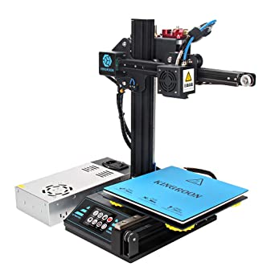
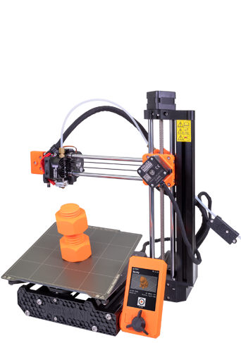
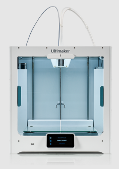

# Comprar una impresora

Antes de entrar hablar de modelos concretos, vamos a definir tres categorías:

* **Impresora barata**: alrededor de los 200 - 300 €. Vienen casi montadas, en  kits bastante sencillos de montar. Tienen una durabilidad bastante correcta. Además algo muy importante es que tienen una gran comunidad detrás que nos permite mejorarla, entenderla y arreglar si tenemos algún problema.

* En el **gama media** (en torno a los 1000€) nos encontramos con los equipos de la empresa [Prusa Research](https://www.prusa3d.es/) creada por Josef Prusa, que no ni más ni menos que el diseñador de esta generación de impresoras: el 90% de todas las impresoras que ahora se hacen heredan de una forma prácticamente directa de sus diseños.   Su impresora, ORIGINAL PRUSA I3 MK3S+ es considerada como la mejor impresora del mercado para ese rango de precio. Este fabricante además tiene una enorme vocación Open Source, licenciando todo su diseño, sus proyectos como opensource. Por ejemplo el software Prusa Slicer de laminado, marca el estándar ahora mismo su desarrollo es completamente libre y gratuito

* **Gama alta**: vamos a encontrar impresoras cerradas, por ejemplo de marca Ultimaker o de  makerbot sí sí que tienen unos precios del orden de los 2000 y pico euros pero una enorme calidad y una gran estabilidad además estamos comprando un producto que tiene un gran soporte y una excelente calidad.

Antes de elegir nuestro modelo tenemos que pensar :

* El uso que le vamos a dar,  el número de horas que vamos a utilizar la una impresora de gama media tiene una vida útil del orden de las 1500 horas de impresión.  una impresora profesional sin ningún problema llegará hasta las 5000 horas. Pasado este tiempo necesitaremos reparaciones y nuevos ajustes.
* Tenemos que pensar si vamos a necesitar imprimir piezas de gran tamaño en cuyo caso deberíamos de buscar una impresora que tenga una base mayor. Por supuesto al aumentar este tamaño se incrementa bastante el precio.
* Tenemos que pensar también el espacio que tenemos disponible: una impresora profesional suele ocupar bastante espacio y requerirá una estantería o mesa aparte.  en cambio podemos encontrar una impresora barata con una base de tamaño aproximado de 40 x 40 cm.
* Si nos decidimos por una impresora en kit tenemos que contar con que tendremos que montarla, lo cual requiere de bastante tiempo, dependiendo del modelo y además de ciertos conocimientos para ajustar y calibrar bien.
* Otro punto a tener en cuenta es la documentación, el soporte técnico y la comunidad que hay alrededor de la impresora que nos van a facilitar enormemente el uso incluso la mejora de nuestra impresora.

Si tenemos un presupuesto de 1000 €, yo personalmente preferiría comprar 3 impresora de 300 € antes que una impresora de 1000 €:  en el tiempo en el que nosotros vamos a cambiar de impresora o amortizarla sin ninguna duda será más rentable.

En qué contexto podemos pensar en una impresora de más calidad o bien en alguien que no quiere molestarse en calibrarla y en un tipo de cliente que la necesita para imprimir sin pensar

[Vídeo: 0.5 ¿Qué impresora comprar?](https://drive.google.com/file/d/1d7lQ8J45gFST8fa8AP_rTovF5ZLSqkVe/view?usp=sharing)

Vamos a ver algunos ejemplos de modelos que a día de hoy tienen una gran fama y un buen precio y que podían ser una compra interesante. Empezaremos por aquellos modelos que he probado y  de los que tengo buena opinión:

## CREALITY ENDER 3 (160-180eu) 

El modelo Creality Ender y su actualizaciones Pro o la versión v2,  han sido un total éxito de ventas la mayoría de los usuarios están muy contentos con su funcionamiento.  El montaje es rápido (2 horas para v1 y 1 hora para la v2) y se obtienen  resultados de bastante calidad. 

La última versión disponible, la v2, se puede montar y calibrar en menos de una hora.  Al ver  que coexisten en el mercado dos versiones distintas nos queda la duda de por qué comprar una impresora antigua si ya existe una mejorada: pues porque podemos encontrar la primera versión a un precio muy, muy competitivo. Ocurre como en los móviles, que el último  está un poco caro y el anterior es una opción muy buena de precio. Si te da el presupuesto yo me iría  a por la V2 que es excelente.

Se trata de impresora de batalla, capaz de imprimir durante bastantes horas con muy buen funcionamiento.

[Videoreview](https://www.youtube.com/watch?v=6LQl-UUEVO8)

## Kingroon Kp3S

Se trata de una impresora compacta, de tamaño aceptable y con una buena área de impresión 180x180, con un "semi" extrusor directo que nos va a evitar tema de atascos si estamos empezando.

El montaje es muy rápido teniendo la lista para imprimir en menos de media hora.

[Vídeo donde la revisan](https://www.youtube.com/watch?v=4lRdFfXaNj8)

Se puede conseguir por unos 140€

Es la impresora ideal para tenerla en nuestro escritorio,  salvo por el problema de que es un poco ruidosa.

Cualquiera de estas dos de estas impresoras son una muy buena elección para empezar. Sin embargo en el mercado existen muchísimos modelos que tienen también una muy buena calidad y que por el precio que cuestan nos dan una excelente relación calidad-precio. 

## Geeetech A10 3D Printer (160eu)

Se trata de una impresora bastante buena y que se puede conseguir a un precio muy barato es prácticamente una versión clónica de la Creality Ender 3.

## Artillery Genius (250e)

La marca Artillery nos propone en este modelo una impresora muy completa, muy bien acabada, con un montaje muy rápido (menos de 1 hora) y con muy buen resultado en cuanto a la calidad de la impresora.  Son impresoras muy estables con las que se consigue una muy buena velocidad de impresión.

## Anycubics i3 Mega (300€)

La marca Anycubic produce una impresora de gran calidad que se montan muy rápido y con las que se consigue una impresión muy estable.

## Modelos de gama media

Si no decidimos por una impresora de calidad media con un presupuesto entorno a los 1000 € sin duda me elegiría la impresora Prusa Original i3 MK3S

## [Prusa Original i3 MK3S](https://www.prusa3d.es/original-prusa-i3-mk3-spa/) 769€ el kit y montada 999€

 La calidad excelente el montaje está muy bien estructurado y no lleva más ya de 1.5-2 horas con el calibrado.

La calidad de esta impresora va por delante del resto de fabricantes, ellos son los que marcan completamente el camino que van siguiendo los restantes fabricantes  en cuanto a calidad a diseño y ya lo tiene usuario medio suele esperar.

Además de la impresora se puede estar en dos formatos: el formato mini y el formato estándar m3ks:

Además tienen un complemento para multifilamento que nos permite utilizar hasta 5 filamentos al mismo tiempo para producir impresiones de una excelente calidad

## ORIGINAL PRUSA MINI+

Otra opción muy interesante es la ORIGINAL PRUSA MINI+

Con el modelo Mini conseguimos una impresora de prácticamente la misma calidad que su hermana mayor pero con un tamaño muy pequeñito ideal cuando queremos tenerla en nuestro escritorio.

### Complemento multimaterial

Los modelos de la marca Prusa disponen también de manera opcional  del complemento  [Multimaterial MMU2S](https://www.prusa3d.es/original-prusa-i3-multi-material-2-0/) que nos va a permitir imprimir simultáneamente con hasta 5 filamentos con resultados de gran calidad. 

Soporta hasta 5 filamentos

## Calidad profesional

[Ultimaker](https://ultimaker.com/es/3d-printers) - 2500€

## ¿Dónde comprarlas?

Existen muchísimos sitios online, donde podemos comprar la impresora. Prefiero no dar ningún enlace puesto que  no puedo responder ni por la calidad, ni por el trato al cliente de la mayoría de estas tiendas.
Sí que os recomiendo cualquiera de estos tienda con las que sí que he comprado:

En Granada - [Createc3D](https://createc3d.com/shop/es/19-kit-impresoras-3d) Recomendado para quien requiera soporte presencial

Online - [micro-log.com](https://micro-log.com)

Personalmente también he comprado en muchas tiendas online como Aliexpress, Amazon,  Banggood,  pero como sabéis todo en estos sitios son bazares donde existen diferentes vendedores y prefiero no dar enlace de los que no puedo responder.

Si no tenemos experiencia comprando en estas tiendas conviene saber que a veces nos pueden cobrar además del precio y de los gastos de envío los gastos de aduana que el caso de la impresora al ser paquetes pesados y voluminosos puede ser bastante importantes.

Lo más difícil ¿dónde comprarlas?:

* Si vas a necesitar soporte o quizás tirar de garantía, de cabeza a una tienda nacional. En caso de que la impresora viniera mal desde Aliexpress o similar no hay problema en devolverla, pero es más complejo. Eso sí, vas a tener que pagar IVA y un sobreprecio
* Si crees que puedes apañarte arreglando alguna cosa, o de hecho piensas cacharrear a fondo, de cabeza a aliexpress o Banggood. Aquí tendrás factura, pero si quieres deducir IVA o imputarse como gastos no va a ser fácil. Ahora hay tiendas que envían desde España o Europa con lo que seguro que no vas a tener que pagar Aduanas y eso sería una pasta.
* Amazon es una mezcla: pagas más por tener factura pero siguen siendo los mismos vendedores online.

Decídete por un par de modelos (yo suelo hacer un ranking) y compara precios/plazos de entrega.

## ¿Cuál elegir?

Resumiendo:

* Según las necesidades: tamaño de las impresiones, ¿necesito multifilamento?
* Según el uso:  con qué frecuencia vamos a imprimir.
* Según el espacio: de qué espacio dispones.
* Según nuestras habilidades: ¿Necesito una impresora montada o puedo montarla yo mismo?

## ¿Nos atrevemos con un kit?

Algo a tener en cuenta cuando vamos a comprar una impresora es el tiempo y la complejidad que tiene el montaje muchas de ellas vienen en formato kit lo que quiere decir que tenemos que ir  ensamblando los distintos componentes y conectando los diferentes elementos electrónicos.

Normalmente el precio de un kit inversamente proporcional a su complejidad de montaje es decir los kits más baratos suelen ser más complejos de montar.

Antes de comprar un kit debemos asegurarnos de que tiene una buena documentación y de que vamos a tener un soporte técnico en el caso en el que no podamos completar su montaje.
