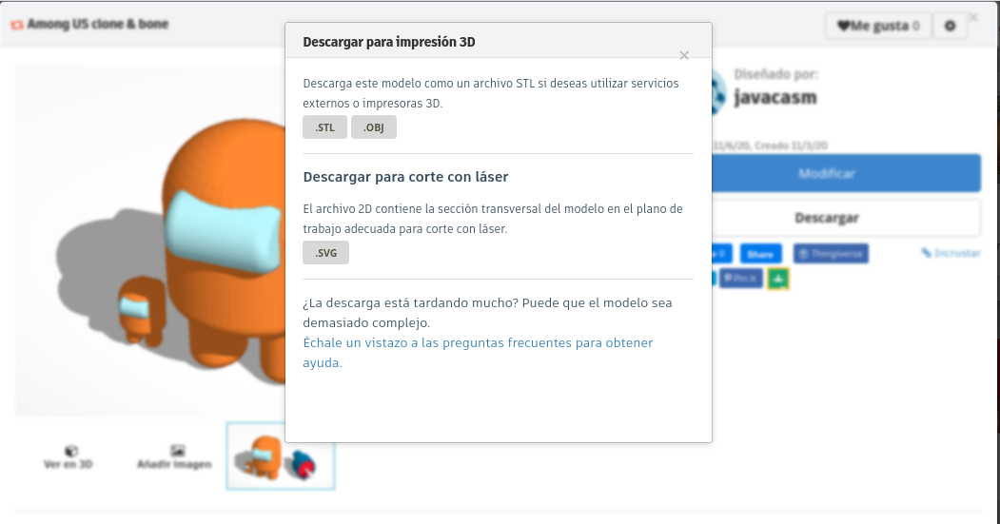
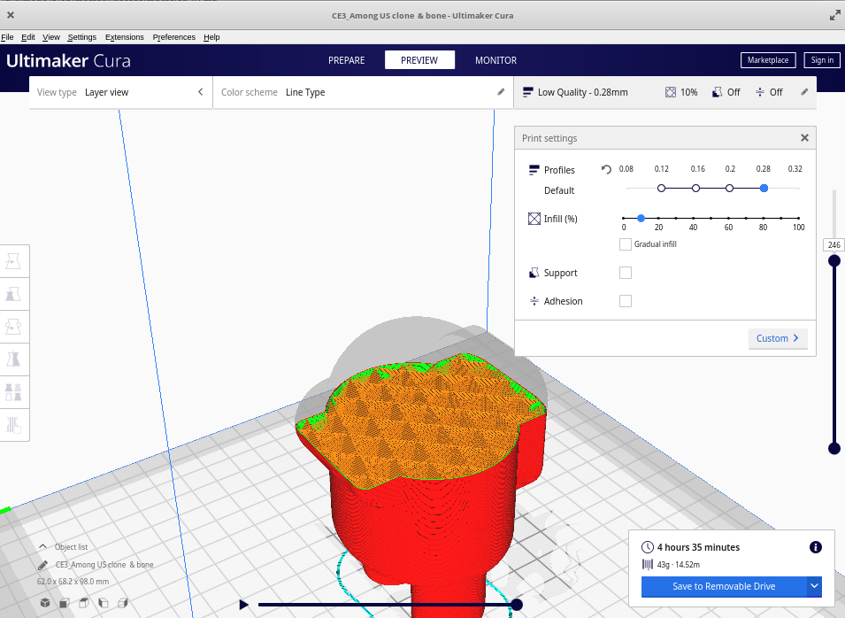

# Guía super rápida de uso para impacientes

* Descargamos modelo (fichero **STL**) de thinkercad.com o de thingiverse.com

* Descargamos el programa laminador [Ultimaker Cura](https://ultimaker.com/es/software)

* Configuramos los parámetros de la impresión: calidad, soporte y convertimos nuestro modelo en instrucciones para la impresora (fichero **gcode**) que copiamos a la tarjeta SD de la impresora

* Preparamos nuestra impresora: cargamos filamento, comprobamos la nivelación
* Seleccionamos en la impresora el fichero a imprimir y pulsamos **Print**