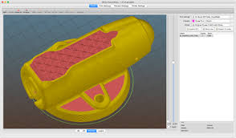

# Proceso de impresión 3D

El Proceso de impresión consiste siempre en los mismos pasos:

1. Preparación impresora: tenemos que tenerla montada, operativa y calibrada, con el filamento colocado y preparado para comenzar a imprimir. Todo esto lo hacemos en la impresora.
1. Preparación del modelo: debemos configurar las opciones de impresión de manera que podamos imprimir el modelo en las mejores condiciones, de calidad y de velocidad. Todo este proceso lo hacemos en el software de laminado
1. Lanzamos la impresión. Una vez exportado el fichero desde el laminador a la impresora, lanzamos el proceso de impresión en esta. Debemos vigilar su desarrollo para evitar errores.

##### MODELO (exportación)-> STL/OBJ (laminador)-> GCode -> Impresora

[Vídeo: 1.0 Proceso de impresión 3D](https://drive.google.com/file/d/19V8opZFFsoWpD34MG_kkph5Mw0ElxjDq/view?usp=sharing)

El proceso básico de impresión tiene los siguientes paso:

1. Descargamos el modelo en formato STL, bien desde un repositorio de modelos o exportándolo de nuestro programa de diseño 3D
1. En el programa laminador (slicer) configuramos cómo será la impresión:

    1. Seleccionamos nuestro **modelo de impresora**
    1. Seleccionamos el **tipo de filamento** a usar
    1. Porcentaje de relleno

    

    

    1. Calidad de la impresión, que vendrá dada principalmente por la **altura de capa**
    1. Si queremos que se creen estructura de **soporte**
    1. Si necesitamos estructuras para mejorar la **adherencia**

    
    
