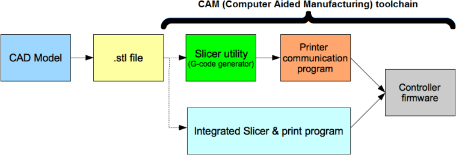

# Proceso de impresión 3D

##### MODELO (exportación)-> STL (laminador)-> GCode -> Impresora

[Vídeo: 1.0 Proceso de impresión 3D](https://youtu.be/qP4qwX_k7ag)

El proceso básico de impresión tiene los siguientes paso:

1. Descargamos el modelo en formato STL, bien desde un repositorio de modelos o exportándolo de nuestro programa de diseño 3D
1. En el programa laminador (slicer) configuramos cómo será la impresión:
    1. Seleccionamos nuestro **modelo de impresora**
    1. Seleccionamos el **tipo de filamento** a usar
    1. Porcentaje de relleno
    
    

    1. Calidad de la impresión, que vendrá dada principalmente por la **altura de capa**
    1. Si queremos que se creen estructura de **soporte**
    1. Si necesitamos estructuras para mejorar la **adherencia**
    