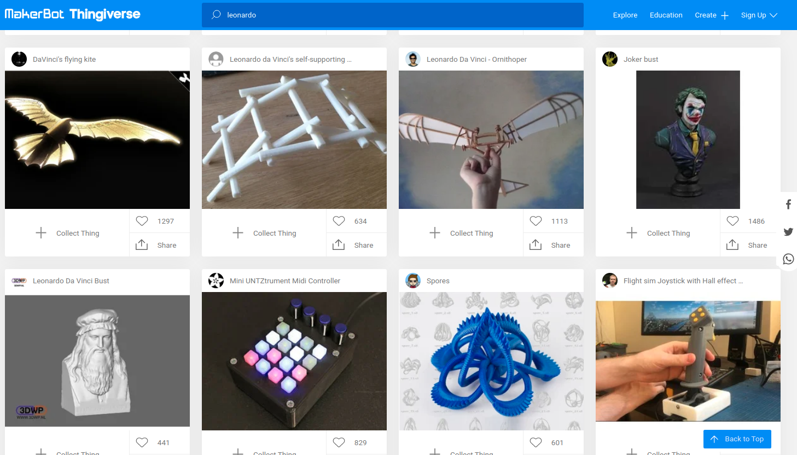
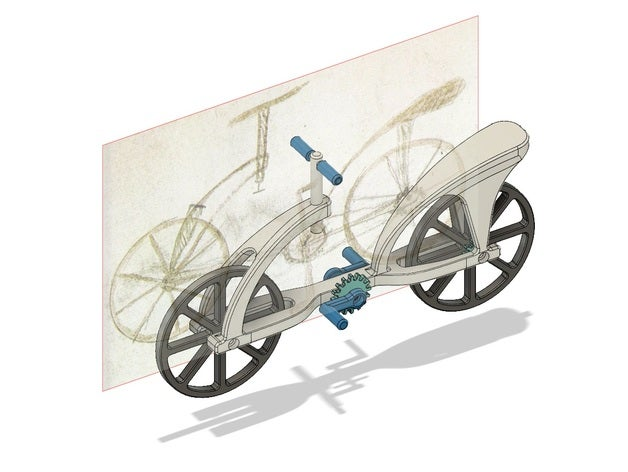

#### Repositorios de modelos 3D

Vamos a hacer un recorrido sobre diferentes repositorios de modelos desde los que podemos descargar ficheros para imprimir.

[Vídeo: 2.0 Dónde obtener modelos para imprimir: repositorio y tinkercad](https://drive.google.com/file/d/1_SmJO0vc-zB2pzVtisMQqFWJCwVDWiEn/view?usp=sharing)

En estos repositorios vamos a encontrar todo tipo de diseños, que se habrán realizado con diferentes programas de diseño. Pero la mayoría de ellos tendrán un fichero de malla de puntos de tipo STL o de tipo OBJ que vamos a poder utilizar para imprimir.   En el caso en el que el fichero estuviera en otro formato vamos a  necesitar convertirlo a uno de estos dos formatos. Esto lo podremos hacer en la mayoría de los software de diseño donde siempre va a asistir una opción de exportación a formato **STL** o formato **OBJ**. 

Puesto que existen diferentes técnicas de diseño no todos los modelos son aptos para imprimirse.  Algunos de ellos, a pesar de que tengan un aspecto excelente, incluyen en su estructura pequeños agujeros o fisuras. En el proceso de laminado, el programa laminador cometerá errores  al generar las capas y  nos desaconsejará su impresión.

Existen muchos, y seguro que algunos se quedan en el tintero, no dudes en comentar si echas alguno en falta.

## [Thingiverse](http://www.thingiverse.com)

Es con diferencia el repositorio más utilizado. En él vamos a encontrar todo tipo de modelos.  como casi todas estas páginas funciona como una red social en la que como usuario podemos seguir a otro usuario diseñadores y podemos marcar como me gusta con preferido y guardando distintos modelos que vayamos seleccionando. 

Su funcionamiento es totalmente **gratuito** podemos subir nuestros contenidos siempre que queramos y descargar el contenido que otro usuario ha subido.  

Hace un tiempo hubo cierta polémica acerca de ciertos modelos que algunos usuario habían subido y que  la empresa Makerbot, dueña de Thingiverse, había utilizado sin respetar la licencia.

En Thingiverse podemos obtener prácticamente de todo. Para ello sólo tenemos que usar el buscador e ir explorando los resultados.

Por ejemplo si [buscamos "Leonardo" podemos encontrar muchos diseños relacionados](https://www.thingiverse.com/search?q=leonardo&type=things&sort=relevant)

Entre los resultados vemos que hay [diseños relacionados](https://www.thingiverse.com/thing:3693906)  y muy interesantes

Y otros que en principio no tienen nada que ver... nos ocurre un poco como nos pasa cuando buscamos en Internet, que hay un poco de todo.

En thingiverse no hay nadie que se encargue de organizar la información ni filtrar. 

Vamos a ver ahora una colección de repositorios donde los diseños son en media de gran calidad, puesto que existen cuidadores que se encargan de validar la calidad de los diseños.

## Printables: La plataforma de Prusa Research para la impresión 3D

[Printables](https://www.printables.com), desarrollado por **Prusa Research**, es una de las plataformas más populares para compartir y descargar modelos 3D. Anteriormente conocido como PrusaPrinters.org, este sitio ha evolucionado para convertirse en una referencia en la comunidad de impresión 3D, ofreciendo características únicas que lo diferencian de otras plataformas como Thingiverse o MakerWorld. A continuación, exploramos sus características, ventajas y cómo ha impactado en el mundo de la impresión 3D.

### **¿Qué es Printables?**

Printables es una base de datos en línea que permite a los usuarios compartir y descargar modelos 3D imprimibles. Aunque fue creado por Prusa Research, esta plataforma no está limitada a usuarios de impresoras Prusa; cualquier persona con una impresora 3D puede beneficiarse de su contenido. Desde su cambio de nombre en 2022, Printables ha ampliado su alcance y funcionalidades, atrayendo a una comunidad global de diseñadores y aficionados.

**Características principales**:
1. **Variedad de modelos**: Miles de archivos STL disponibles, organizados por categorías y filtros avanzados.
2. **Filtros personalizados**: Permite buscar modelos según tipo de impresora, material, diámetro de boquilla, tiempo de impresión e incluso cantidad de filamento utilizado[1][2].
3. **Concursos creativos**: La plataforma organiza competiciones mensuales con premios atractivos como filamentos o impresoras 3D[1].
4. **Sistema de recompensas**: Los diseñadores ganan puntos que pueden canjear por productos físicos o digitales.
5. **Tienda Printables**: Una sección dedicada a la compra y venta de diseños exclusivos[7].

---

### **Ventajas de Printables frente a otras plataformas**

1. **Interfaz moderna y funcional**:
   - Printables ofrece un diseño intuitivo que facilita la navegación y búsqueda de modelos. A diferencia de Thingiverse, conocido por sus problemas técnicos y diseño anticuado, Printables es rápido y eficiente[1][2].

2. **Calidad del contenido**:
   - Los modelos subidos pasan por un control más estricto para evitar duplicados o diseños mal optimizados. Esto asegura una experiencia más satisfactoria para los usuarios[1].

3. **Accesibilidad para todos los usuarios**:
   - Aunque está desarrollado por Prusa Research, no limita el contenido a sus impresoras. Los archivos son compatibles con cualquier marca y modelo[2][4].

4. **Sistema comunitario activo**:
   - La plataforma fomenta la interacción entre diseñadores mediante comentarios, concursos y recompensas. Esto crea un entorno dinámico y colaborativo[1].

5. **Opciones avanzadas para creadores**:
   - Printables Clubs permite a los diseñadores ofrecer suscripciones similares a Patreon, brindando acceso exclusivo a modelos premium y otras ventajas[2].

6. **Soporte para múltiples formatos**:
   - A diferencia de MakerWorld, que prioriza el formato 3MF, Printables permite subir archivos en diversos formatos como STL, STEP o G-Code[3].

## MakerWorld: Una plataforma innovadora para el modelado 3D

MakerWorld, desarrollado por Bambu Lab, ha emergido como una de las plataformas más destacadas en el ámbito de la impresión 3D. Este portal combina funcionalidades avanzadas con un enfoque colaborativo, ofreciendo a los usuarios una experiencia única para compartir, descargar y crear modelos 3D. A continuación, exploramos las características principales de MakerWorld, sus ventajas frente a otras plataformas como Thingiverse y Printables, y su impacto en la comunidad de impresión 3D.

---

### **Características principales de MakerWorld**

1. **Repositorio colaborativo**:
   - MakerWorld conecta a diseñadores, usuarios, proveedores de filamentos e impresoras 3D en un ecosistema integrado[3].
   - Los modelos compartidos pueden incluir configuraciones prelaminadas optimizadas, facilitando el proceso de impresión para usuarios menos experimentados[3].

2. **Protección de derechos de autor**:
   - La plataforma cuenta con un equipo dedicado a garantizar que los modelos respeten las licencias Creative Commons y protejan la propiedad intelectual del creador original[3].

3. **Integración con IA**:
   - MakerWorld incluye herramientas como el *PrintMon Maker*, que utiliza inteligencia artificial para generar modelos 3D a partir de texto o imágenes, fomentando la creatividad y simplificando el acceso al modelado[4].

4. **Sistema de recompensas**:
   - Los diseñadores pueden ganar puntos por descargas y publicaciones, que se traducen en descuentos o productos gratuitos dentro del ecosistema Bambu Lab[6].

5. **Facilidad de uso**:
   - La interfaz moderna y funcional permite navegar rápidamente entre categorías y modelos, resolviendo problemas comunes como la lentitud en plataformas tradicionales como Thingiverse[6].

---

### **Ventajas frente a Thingiverse**

1. **Velocidad y rendimiento**:
   - MakerWorld ofrece tiempos de carga más rápidos y una experiencia más fluida en comparación con Thingiverse, que ha sido criticado por sus frecuentes fallos técnicos[5][6].

2. **Sistema de recompensas atractivo**:
   - Mientras Thingiverse carece de incentivos directos para los diseñadores, MakerWorld recompensa activamente a los creadores con puntos que pueden canjear por productos o descuentos[5][6].

3. **Protección de licencias**:
   - A diferencia de Thingiverse, MakerWorld asegura que los modelos compartidos respeten las licencias establecidas, evitando problemas relacionados con el plagio[3].

4. **Modelos prelaminados**:
   - Los usuarios pueden descargar configuraciones optimizadas junto con los modelos STL, algo que no está disponible en Thingiverse[3].

5. **Integración con IA**:
   - MakerWorld lidera en innovación al permitir la generación automática de modelos mediante inteligencia artificial, una función inexistente en Thingiverse[4].

## Ventajas de MakerWorld y Printables frente a Thingiverse

Thingiverse ha sido durante años el sitio más popular para compartir modelos 3D, pero en los últimos tiempos plataformas como MakerWorld y Printables han ganado terreno gracias a sus características innovadoras y soluciones a problemas comunes en Thingiverse. A continuación, analizamos las ventajas de estas plataformas frente a Thingiverse.

---

### **Ventajas de MakerWorld**

1. **Interfaz moderna y funcional**:
   - MakerWorld ofrece una interfaz más limpia y fácil de navegar en comparación con Thingiverse, que ha sido criticada por su diseño anticuado y problemas de rendimiento[3][6].

2. **Mayor control sobre licencias**:
   - Los creadores pueden gestionar mejor las licencias de sus diseños, lo que reduce los problemas relacionados con el robo de propiedad intelectual, algo común en Thingiverse[4][6].

3. **Comunidad activa y soporte**:
   - MakerWorld fomenta la interacción entre usuarios, permitiendo comentarios más detallados y soporte directo entre diseñadores.

4. **Velocidad de carga optimizada**:
   - Los tiempos de carga de MakerWorld son significativamente mejores, lo que facilita la búsqueda y descarga de modelos sin interrupciones.

5. **Calidad del contenido**:
   - Aunque MakerWorld tiene menos modelos que Thingiverse, la calidad promedio es superior debido a una moderación más estricta y un enfoque en diseños funcionales y creativos[3][8].

---

### **Ventajas de Printables**

1. **Sistema de recompensas**:
   - Printables incentiva a los diseñadores con un sistema de puntos que pueden canjear por premios, motivando la creación de contenido original y atractivo[2].

2. **Organización avanzada**:
   - La plataforma permite organizar los modelos en colecciones personalizadas, facilitando la gestión para usuarios con múltiples proyectos.

3. **Compatibilidad ampliada**:
   - Printables ofrece herramientas para optimizar modelos según el tipo de impresora o material utilizado, algo que Thingiverse no integra directamente[2].

4. **Fiabilidad del sitio**:
   - Printables tiene una tasa de rebote menor y una duración promedio de visita más alta que Thingiverse, lo que indica una mejor experiencia del usuario[1][2].

5. **Actualizaciones frecuentes**:
   - La plataforma se mantiene actualizada con nuevas funciones y mejoras constantes, mientras que Thingiverse ha sido criticado por su falta de innovación.

---

### **Problemas comunes en Thingiverse**

1. **Fallas técnicas recurrentes**:
   - Los usuarios reportan problemas frecuentes como caídas del servidor, tiempos de carga lentos y errores al descargar archivos[3][6].

2. **Robo de diseños**:
   - La falta de control sobre licencias ha llevado a numerosos casos de plagio en Thingiverse[4].

3. **Contenido desactualizado o duplicado**:
   - Muchos modelos están mal categorizados o son duplicados, dificultando la búsqueda eficiente.

4. **Interfaz obsoleta**:
   - El diseño poco intuitivo y la falta de actualizaciones hacen que navegar por Thingiverse sea menos agradable comparado con plataformas modernas como MakerWorld o Printables.

---

### **Tabla comparativa**

| **Plataforma**       | **Interfaz**          | **Licencias**           | **Contenido**         | **Velocidad del sitio** | **Innovación**          | **Sistema comunitario** |
|-----------------------|-----------------------|--------------------------|-----------------------|-------------------------|-------------------------|--------------------------|
| **MakerWorld**        | Moderna              | Control avanzado         | Alta calidad          | Rápida                  | Frecuente               | Activa                  |
| **Printables**        | Moderna              | Moderación efectiva      | Variedad organizada   | Muy rápida              | Constante               | Incentivos              |
| **Thingiverse**       | Anticuada            | Limitada                 | Amplia pero desordenada | Lenta                   | Escasa                  | Pasiva                  |

---

### Conclusión

MakerWorld y Printables ofrecen soluciones claras a los problemas recurrentes en Thingiverse: interfaces modernas, mejor gestión de licencias, contenido curado y comunidades activas. Mientras Thingiverse sigue siendo una opción popular por su extenso catálogo, estas plataformas emergentes destacan por brindar una experiencia más satisfactoria para diseñadores y usuarios finales. Si buscas innovación y facilidad de uso, MakerWorld y Printables son opciones superiores para tus proyectos de impresión 3D.
