## [You Imagine](https://www.youmagine.com)

Se trata de un sitio donde podemos encontrar no sólo diseños, sino proyectos muy interesantes donde la impresión 3D es fundamental

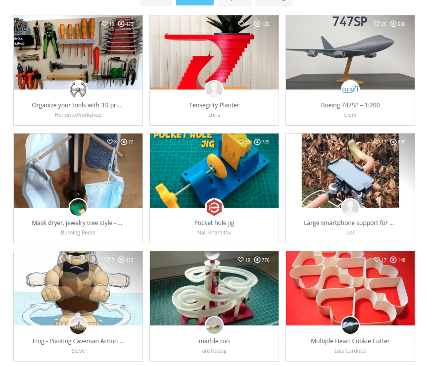

## [Sketchfab](https://sketchfab.com/)

Se trata de un repositorio de modelos de gran calidad, donde muchas Universidades han puesto a nuestra disposición todo tipo de diseño, como este [cráneo de un lobo](https://sketchfab.com/3d-models/wolf-skull-fw2415-1566e56e6a7e47f890b9b389457346a8) 

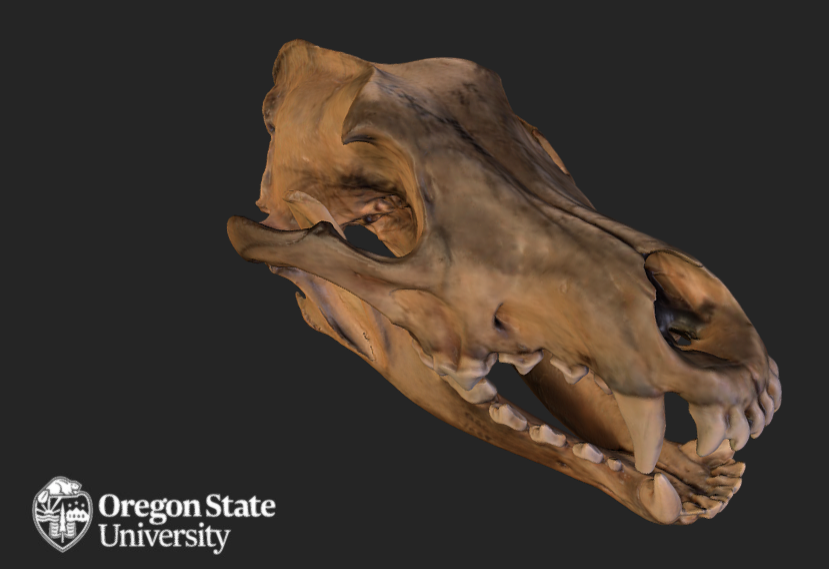

O [este cráneo humano real](https://sketchfab.com/3d-models/skull-complete-with-cap-and-mandible-301405aafb0e4f9ebbebd24b75b537bf)

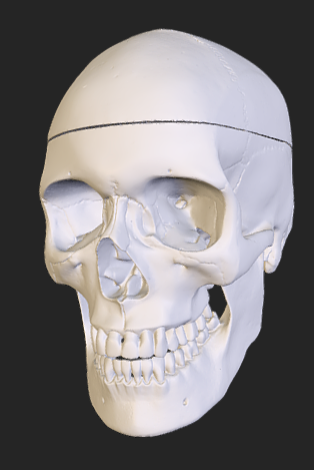

O diseño muy realistas como [este helicóptero ruso](https://sketchfab.com/3d-models/russian-transport-heli-ab981d28f7124a489cd1b1992b2e467b)

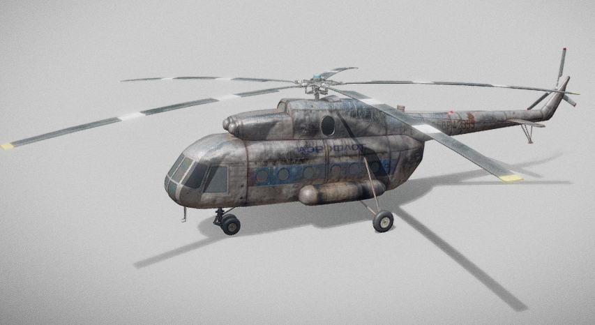

También vamos a encontrar modelos de pago.

Vamos a aprovechar para comentar que no todos los modelos que podemos descargar y que parecen modelos 3D, son aptos para impresión 3D.  

En concreto vamos a ver un ejemplo de algunos de estos modelos Con un aspecto totalmente realista pero que no son aptos para imprimirlos en 3D. Normalmente estos modelos  han sido escaneados con un escáner 3D,  por un lado son una malla de puntos y por otro una textura (como si dijéramos una pintura que se le aplica externamente a la malla) y es lo que le da un resultado fotorealista. Es un proceso similar al que se hace con los videojuegos en los que los personajes 3D tienen un recubrimiento que le da un aspecto más realista. 

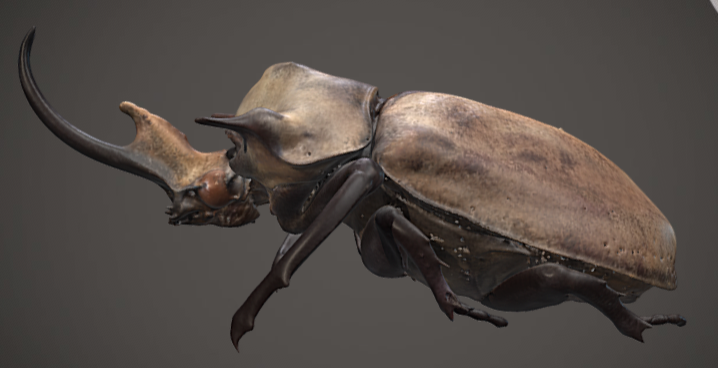

Es lo que ocurre con este [modelo de escarabajo Rinoceronte](https://sketchfab.com/3d-models/rhinoceros-beetle-10d4ecc6b3f3427a9041087314b17ed5)

[Video: 2.1 modelos con errores](https://drive.google.com/file/d/1XzOpe6ED-lRebLQdtTRyXoYzcsFvoXYI/view?usp=sharing)

## [MyMiniFactory](https://www.myminifactory.com/)

Es un repositorio repleto de modelos de gran calidad, un poco orientado al mundo friqui de las maquetas  y juegos de mesa.

Se alteran diseños gratuitos con otros de pago, aunque el precio suele ser bajo (unos pocos euros), eso sí todos suelen ser de gran calidad

En algunos diseños podemos encontrar configuradores que nos permiten configurar el diseño final a partir de componentes. Por ejemplo en este [diseño de un explorador/caballero](https://www.myminifactory.com/customizer/ranger-human-male-85) donde vemos que podemos seleccionar las diferentes armas que empuña en cada mano, o el tipo de cabeza o la base del diseño

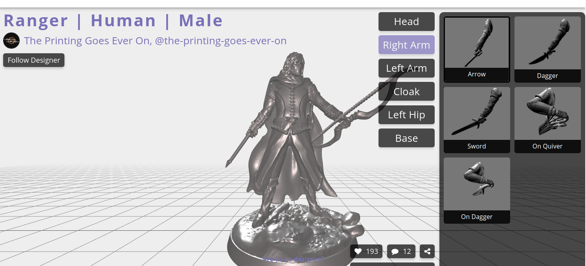

Este repositorio financia y alberga también el proyecto [Scan the World](https://www.myminifactory.com/scantheworld/) dedicado a recoger objetos de museos de todo el mundo escaneados 

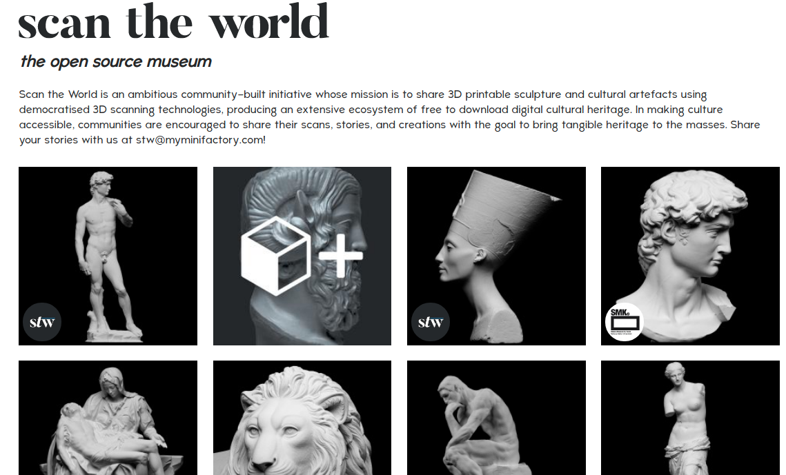

De cualquiera de estos diseños podemos obtener detallados modelos para imprimir

## [Pinshape](https://pinshape.com)

Es un repositorio repleto de contenido de calidad, muchos de ellos de pago (1-5€) pero siempre de mucha calidad. Los diseños están muy bien organizados por temáticas

Con frecuencia suelen publicar concursos donde subir nuestros diseños.

## [Cults3D](https://cults3d.com/)

Se trata de un sitio comercial, donde se publicitan recursos, impresoras, diseños...

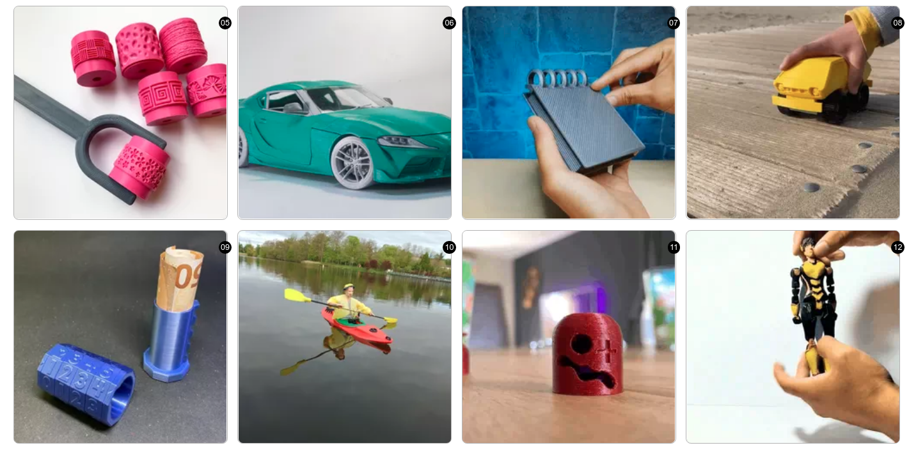

Podemos encontrar diseños tan interesantes como [esta caja de seguridad con combinación](https://cults3d.com/es/modelo-3d/juegos/cryptex-af_inventions)

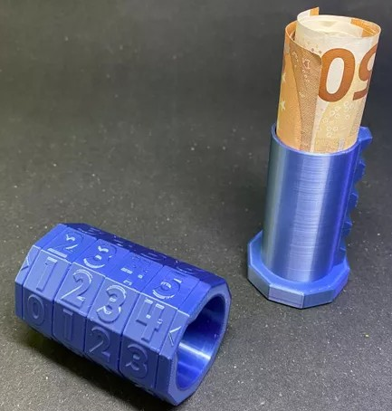

Hay que estar muy pendientes de los concursos que se publican, puesto que tienen muy buenos premios y además dan mucha promoción a los diseñadores.

## [Yeggi](http://www.yeggi.com/) 

Es un metabuscador que nos va a permitir buscar en varios repositorios al mismo tiempo, es decir, cuando buscamos nos proporciona enlaces a modelos en otros repositorios.

Por ejemplo si buscamos [Nasa Rocket](https://www.yeggi.com/q/nasa+rocket/) vamos a encontrar diseños de muy diferentes repositorios, algunos gratuitos, otros de pago....

## [GrabCad](https://grabcad.com/)

Se trata de un repositorio de diseños industriales, los típicos que uno espera cuando trabaja con software CAD. Vamos a encontrar todo tipo de diseños de máquinas, de motores.

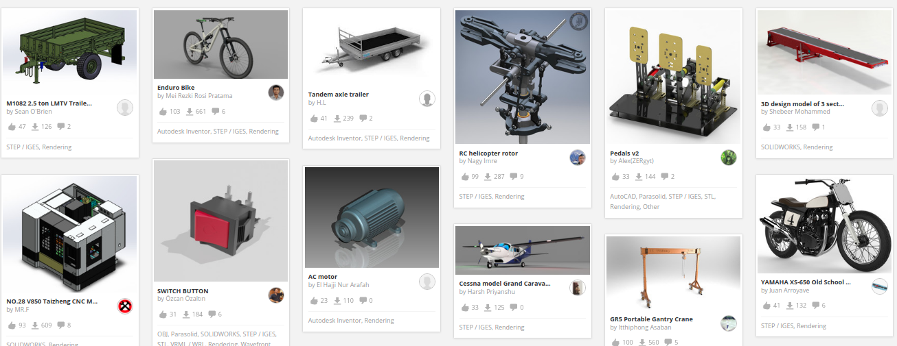

Como todos los anteriores, hay diseños que son de pago.

## [Tinkercad](https://tinkercad.com)

Tinkercad es una aplicación web donde podemos crear diseños en 3D, pero también nos permite explorar las creaciones que publican otros usuarios y descargar ficheros STL para imprimir.

No dejes de buscar [su Galería](https://www.tinkercad.com/things) para ver  sus diseños. En la sección de diseño 3D hablaremos bastante de esta herramienta.

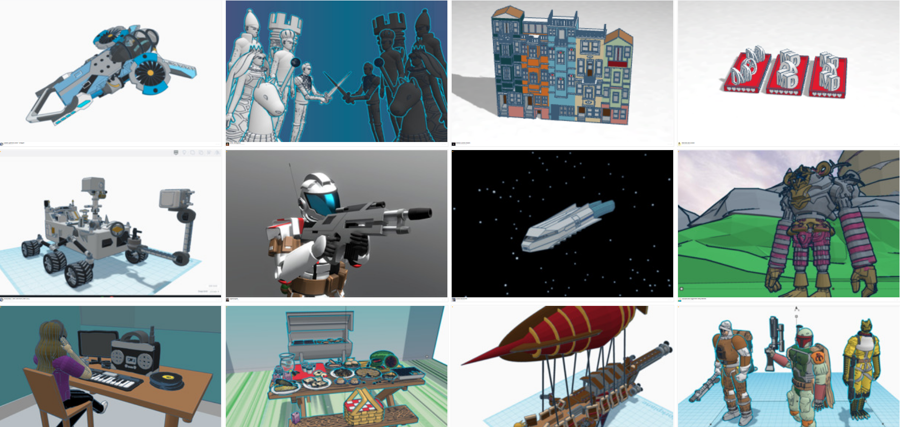

