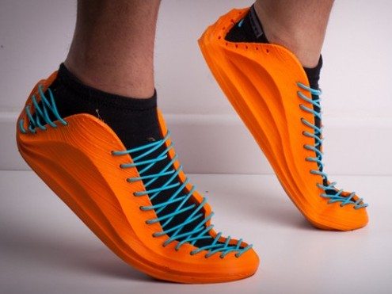

## [Filamentos](http://comohacer.eu/comparativa-impresoras-3d/#Que_materiales_usan)

Tipos
Usos
Calidades y precios

### Proceso de fabricación

No nos cabe ninguna duda de que el filamento es parte esencial del resultado de toda  impresión:  la mejor impresora con un filamento de mala calidad no va a conseguir un resultado satisfactorio.

Veamos cómo se fabrican los filamentos:

Primero se prepara una mezcla con los distintos materiales que formarán el filamento

* Se parte del plástico original que será la base (PLA, ABS, PETG,...) en forma de pellets
* Se le añaden diferentes aditivos, en una proporción mucho menor, para conseguir determinadas propiedades que se van buscando. 
    * conseguir diferentes grados de dureza
    * facilidad de impresión 
    * rigidez o elasticidad
* Se añade un colorante y/o otros aditivos para conseguir el acabado que vamos buscando:
    *  acabado en madera 
    * acabado metalizado
    *  pequeñas partículas de otro material que se verán en el resultado final
* Está mezcla se funde y se comienza a obtener el filamento a alta temperatura a través de una boquilla del diámetro deseado. 

* El filamento resultante se va moviendo y enfriando al mismo tiempo para conseguir bajarlo a una temperatura suficientemente alta para que se pueda bobinar pero suficientemente baja para evitar que pierda las características que estamos buscando y se mantenga a un grosor lo más exacto posible.

* Para ello se hace pasar por determinados baño a diferente temperatura y entre diferentes rodillo que garantizan su grosor

* El último paso es el bobinado en los rollos que nos llegarán a  los usuarios. Este proceso de bobinado es muy importante para conseguir que no se produzcan nudos y que pueda recuperar el filamento y aprovechar hasta el último pedazo fragmento de la bobina

Por el propio funcionamiento de la empresa a veces ocurre que encontramos que entre el cambio de una mezcla a otra con diferentes pigmentos o diferentes propiedades el fabricante decide utilizar ese resto que le queda te material para generar una bobina en las que el filamento no tiene un color homogéneo o no tiene ningún color concreto.  estás bobina suelen vender a un precio inferior la calidad del filamento en la misma pero al no tener un color homogéneo no la hacen apta para todo tipo de impresiones

## Precios

Existen multitud de empresas que venden filamento unas con mayor o con menor calidad,  a veces la encontramos a unos precios y a veces a otro. En cualquier caso tenemos de pensar  que una empresa difícilmente va a perder dinero vendiendo un filamento a un precio muy bajo. Cuando encontramos una oferta de filamento a un precio extremadamente bajo con gran probabilidad estamos ante una empresa  qué quiere eliminar un determinado lote de filamento las razones se nos escapan:
*  puede ser que simplemente quiera eliminar un stock que en ese momento no le interesa almacenar
*  en otras ocasiones puede ser simplemente una oferta puntual que pretende ganar mercado o popularidad
*  también puede ocurrir que estemos ante un filamento de baja calidad que la del que se quieren deshacer 

Características  del filamento

* El grosor,  que puede ser 2.85/3mm o de 1.75mm
* El material, por supuesto, lo que nos va dar una temperatura de fusión y de adherencia a la base

## Calidad del filamento

Son muchos los parámetros a tener en cuenta para juzgar la calidad de un buen filamento:

* La calidad del plástico utilizado: como hemos ya comentado, Se pueden utilizar muchos tipos diferentes de polímeros y distintas mezclas entre ellos para conseguir un filamento con determinadas características. 
* El proceso de creación del filamento.
* La precisión en el grosor es decir cómo se desvía de ese tamaño teórico.
* La antigüedad y conservación del filamento. Con el paso del tiempo el filamento va perdiendo propiedades haciéndose más quebradizo y en muchas ocasiones absorbiendo humedad
* La calidad del bobinado,  es decir que este no presenten  nudos y que facilite completamente  el resultado de la impresión

## Saber el estado del filamento

Una prueba rápida sobre el filamento es intentar doblarlo. Todos los filamentos, aunque no sean flexibles, tienen un cierto grado de flexibilidad que permite que los doblemos: 

* Si el filamento se encuentra en mal estado se romperá fácilmente
* Cuando el filamento  ha absorbido bastante humedad,  al imprimir se oyen pequeños estallidos como de burbujas 

## Problemas provocados por el filamento

### Tipos de filamentos

[Vídeo: 4.0 Tipos y características de filamentos para impresión 3D](https://youtu.be/74VFdfpiIuI)

Cada vez existen más materiales susceptibles de poder usarse en las impresoras.

* PLA: más ecológico y el más utilizado hoy en día
* ABS: es de lo que están hechas las piezas de plástico que nos rodea, con la impresora es complicado de usar para piezas grandes y produce malos olores.
* PETG: ecológico
* HIPS: se disuelve fácilmente
* Nylon: muy duro y semi flexible
* Ninjaflex y Filaflex: muy flexibles
* ...

**DETALLAR MAS LAS CARACTERÍSTICAS**

## Flexibles

## Composites:

* Madera

* Bronce

### Parámetros

* Temperatura extrusor
* Temperatura cama caliente
* Velocidad
* Ventilador de Capa

### Temperatura

Cada material se trabaja a una temperatura diferente, de hecho cada filamento necesita de una temperatura diferente.

* ABS: 240º
* PLA: 190º
* Nylon: 260º
* Filaflex: 220º

## Ejemplos 

#### [Textura Madera Arce](https://sakata3d.com/es/pla-texture/146-texture-madera-de-arce.html)

* Temperatura de la boquilla: 200-255 ºC (*)
* Temperatura de la cama: (50-70 opcional)
* Velocidad del ventilador: 100
* Altura de capa: 0,1-0,3 mm
* Espesor de pared: 0,8mm
* Velocidad de impresión: Hasta 90 mm/s

#### [PLA 850](https://sakata3d.com/es/pla-850/31-pla-850-azul.html)

facilidad de moldeado, impresión y grabado, alta rigidez y baja contracción

* Temperatura de impresión : 190º-220º
* Temperatura cama caliente : no necesaria
* Velocidad de impresión soportadas : hasta 200mm/s

#### [PLA 870](https://sakata3d.com/es/hr-pla-870/59-pla-ingeo-3d870-blanco-super-premium-alto-impacto.html)

 facilidad de moldeado, impresión y grabado, alta rigidez y baja contracción.

* Temperatura recomendada 190º-220º

#### [ABS-E](https://sakata3d.com/es/abs-e/121-abs-natural.html)

muy resistente al impacto

* Temperatura recomendada 220º-245º

#### [PET-G](https://sakata3d.com/es/pet-g/155-pet-g-rubi.html)

facilidad de moldeado, impresión y grabado, alta rigidez y baja contracción

* Temperatura de impresión : 225-245ºC
* Temperatura cama caliente : 60ºC   
* Velocidad de impresión soportadas : hasta 200mm/s

#### [HIPS](https://sakata3d.com/es/hips/147-hips-blanco-natural.html)

El filamento HIPS es un termoplástico con cualidades similares al ABS pero con una alta resistencia a los agentes atmosféricos y una resistencia superior a los rayos UV. Otra aplicación interesante es que se puede emplear como material de soporte, dada su solubilidad en limoneno.

* Temperatura de impresión: 235-245 ºC
* Temperatura cama: >90 ºC

### Flexibles

#### [PLA Flexible X-920](https://sakata3d.com/es/flexibles/182-x-920.html)

 flexible, biodegradable y compostable. Su gran capacidad de absorción a los impactos lo hace ideal para todo aquel proyecto que necesite ser resistente. Fácil de imprimir y con un alta tolerancia a la temperatura. Su textura se parece a la goma de caucho natural

* Temperatura de impresión: 220-235 ºC
* Temperatura cama: 50 ºC

### Otros

[Wood - Roble](https://sakata3d.com/es/pla-texture/151-texture-wood-roble.html)

[Granito](https://sakata3d.com/es/pla-texture/153-texture-granito.html)

### Recursos

[Tipos de materiales](https://bitfab.io/es/materiales-de-impresion-3d-fdm/)

## Cuidados del filamento

La húmedad es una de las causas más frecuentes de deterioro de los filamentos. Pôr eso, cuando no los vayamos a usar debemos guardar los filamentos en bolsas para evitar que cojan humedad, lo que los haría más frágiles y más difíciles de imprimir.

Muchas fabricante incluyen una bolsa con cierre tipo Zip para guardar los filamentos con más garantías.

Esto no quiere decir que cada noche tengamos que guardar el filamento que no estemos usando, pero sí cuando no lo vayamos a usar durante unos días.