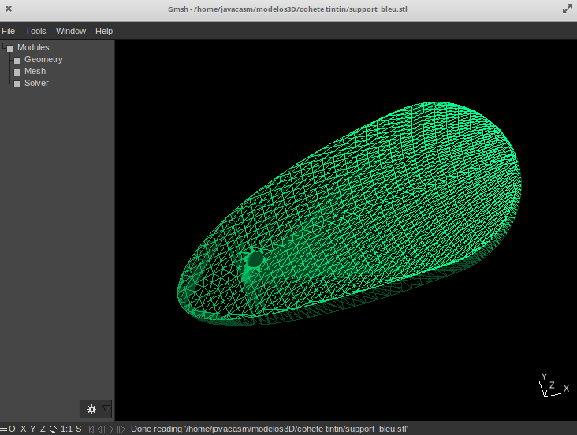

## Visores de modelos

Una vez que tenemos modelos descargados ...

## Visores de modelos online

https://www.viewstl.com/

https://3dviewer.net/

http://vprodage.com/3dp/

## PC

[Gmsh](http://gmsh.info/)

[Documentación](http://gmsh.info//doc/course/general_overview.pdf)

## Android

### 	[Fast STL Viewer](https://play.google.com/store/apps/details?id=com.performance.meshview&hl=es&gl=US)

### [STLView 2.0](https://play.google.com/store/apps/details?id=moduleWorks.STLView2)

## Visualizador de STLs en el explorardor de archivos

https://github.com/unlimitedbacon/stl-thumb

## Recursos

Listado de visualizadores ...

[en all3dp](https://all3dp.com/1/free-stl-viewer-mac-online-stl-file-viewer/)

[en plugnplay3d](https://www.plugnplay3d.com/index.php/customer-resources/open-source-stl-viewers/)