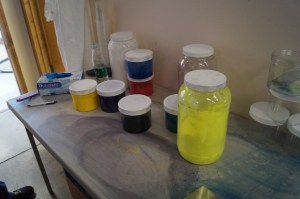

## Filamentos

No nos cabe ninguna duda de que el filamento es parte esencial del resultado de toda  impresión:  la mejor impresora con un filamento de mala calidad no va a conseguir un resultado satisfactorio.

Veamos cómo se fabrican los filamentos:

### Proceso de fabricación

Primero se prepara una mezcla con los distintos materiales que formarán el filamento

* Se parte del plástico original que será la base (PLA, ABS, PETG,...) en forma de pellets

* Se le añaden diferentes aditivos, en una proporción mucho menor, para conseguir determinadas propiedades que se van buscando. 
    * Conseguir diferentes grados de dureza
    * Facilidad de impresión 
    * Rigidez o elasticidad
* Se añade un colorante y/o otros aditivos para conseguir el acabado que vamos buscando:
    * Acabado en madera 
    * Acabado metalizado
    * Pequeñas partículas de otro material que se verán en el resultado final

* Está mezcla se funde y se comienza a obtener el filamento a alta temperatura a través de una boquilla del diámetro deseado. 

* El filamento resultante se va moviendo y enfriando al mismo tiempo para conseguir bajarlo a una temperatura suficientemente alta para que se pueda bobinar pero suficientemente baja para evitar que pierda las características que estamos buscando y se mantenga a un grosor lo más exacto posible.

* Para ello se hace pasar por determinados baño a diferente temperatura y entre diferentes rodillo que garantizan su grosor

* El último paso es el bobinado en los rollos que nos llegarán a  los usuarios. Este proceso de bobinado es muy importante para conseguir que no se produzcan nudos y que pueda recuperar el filamento y aprovechar hasta el último pedazo fragmento de la bobina

Por el propio funcionamiento de la empresa a veces ocurre que encontramos que entre el cambio de una mezcla a otra con diferentes pigmentos o diferentes propiedades el fabricante decide utilizar ese resto que le queda te material para generar una bobina en las que el filamento no tiene un color homogéneo o no tiene ningún color concreto.  estás bobina suelen vender a un precio inferior la calidad del filamento en la misma pero al no tener un color homogéneo no la hacen apta para todo tipo de impresiones

## Características  del filamento

Veamos las características más importantes

* El **material**, por supuesto, tiene sus propias características, y conviene que lo elijamos adecuadamente, para cada proyecto. A la hora de imprimirlo nos va dar recomendar temperatura de fusión y una de adherencia a la base. La mayoría de las impresoras pueden trabajar con distintos materiales.

* El **grosor**,  que puede ser 2.85/3mm o de 1.75mm. El extrusor y por tanto la impresora está diseñado para trabajar con un determinado grosor y no debemos usar otro salvo que adaptemos o cambiemos el extrusor.

## Calidad del filamento

Son muchos los parámetros a tener en cuenta para juzgar la calidad de un buen filamento:

* La calidad del plástico utilizado: como hemos ya comentado, Se pueden utilizar muchos tipos diferentes de polímeros y distintas mezclas entre ellos para conseguir un filamento con determinadas características. 
* El proceso de creación del filamento.
* La precisión en el grosor es decir cómo se desvía de ese tamaño teórico.
* La antigüedad y conservación del filamento. Con el paso del tiempo el filamento va perdiendo propiedades haciéndose más quebradizo y en muchas ocasiones absorbiendo humedad
* La calidad del bobinado,  es decir que este no presenten  nudos y que facilite completamente  el resultado de la impresión

## Saber el estado del filamento

Una prueba rápida sobre el filamento es intentar doblarlo. Todos los filamentos, aunque no sean flexibles, tienen un cierto grado de flexibilidad que permite que los doblemos: 

* Si el filamento se encuentra en mal estado se romperá fácilmente
* Cuando el filamento  ha absorbido bastante humedad,  al imprimir se oyen pequeños estallidos como de burbujas 

## Problemas provocados por el filamento

En primer lugar, si no lo configuramos adecuadamente el filamento vamos a perder tiempo y dinero en impresiones de mala calidad.

Si utilizamos indebidamente un filamento o sin tener en cuenta sus características, podemos dar lugar a **atascos** que nos van a obligar a limpiar los diferentes componentes. Este tema es tan importante que le vamos a dedicar un apartado completo.

### Tipos de filamentos

[Vídeo: 2.5 Tipos y características de filamentos para impresión 3D](https://drive.google.com/file/d/1h-5An52B_O8pozg4yZTWu2kZc23fH1wO/view?usp=sharing)

Cada vez existen más materiales susceptibles de poder usarse en las impresoras.

Vamos a repasar sus características y algunos de sus usos.

* PLA: es un derivado del ácido láctico, más ecológico y el más utilizado hoy en día. Es fácil de imprimir, tiene muy buenas características de dureza. Un punto débil es que  comienza a ablandarse a unos 60-70º con lo que no es adecuado para piezas de exterior.
* ABS: es el plástico del que están hechas las piezas de casi todo lo que nos rodea. Es complicado de imprimir en piezas grandes, puesto que se despega con facilidad y produce malos olores al imprimirse. Tiene una muy buena resistencia y permite que hagamos mecanizados sobre las piezas impresas, como pueden taladros, sin que se deteriore la estructura de las capas.
* PETG: Es un filamento muy ecológico, y una excelente elección para trabajar objetos grandes. Es muy resistente y además tiene una gran ventaja y se le considera seguro para contacto con alimentos.
* HIPS: Una de las características más utilizadas de este filamento es que se deshace fácilmente con determinados líquidos como el Limoneno, de manera que si disponemos de una impresora que permite imprimir con 2 filamentos al mismo tiempo podemos hacer que el material de soporte que tendremos que retirar se imprima en HIPS y la pieza propiamente en PLA o ABS. Al terminar, sumergimos la pieza completa en el líquido y todo el soporte desaparece.

* Nylon: es un material muy duro y a la vez elástico, no es que podamos doblarlo sino que si lo sometemos a golpes, su elasticidad lo va a proteger ante roturas.

* Ninjaflex y Filaflex: son filamento muy flexibles, similares a la silicona o al goma y que además de elásticos y flexibles tiene una gran adherencia, algo que es necesario para muchas piezas, como por ejemplo la parte externa de las ruedas, lo que sería el neumático. Son filamentos más caros, pero que no suelen utilizar en grandes piezas.

Estos filamentos que hemos visto casi nunca vienen de una forma pura, sino que los fabricantes los combinan para mejorar sus características.

## Composites

Son materiales con una base plástica pero al que se añaden partículas u otro componente que le da alguna característica deseada, como puede ser distinto aspecto/acabado, textura metálica, olores, ...

Su precio suele ser bastante más elevado que el de los filamentos "normales".

* Filamento con acabado de madera: como vemos tiene un aspecto totalmente natural, suelen tener partículas de serrín que le dan ese aspecto y podemos conseguirlo en varios tipos de madera. Algunos de ellos, dependiendo de la temperatura de impresión toman diferentes tonos de marrón, con lo que se pueden conseguir acabados con veteados similares a la madera.

* Filamentos con acabado metálico: bronce, dorado u otros metales. Se pueden conseguir acabados muy similares

### Parámetros

Siempre que utilizamos un filamento tenemos que tener claros los parámetros para conseguir una buena calidad de impresión.

Como hemos visto el proceso de impresión consiste en fundir el filamento, depositarlo y enfriarlo para que se solidifique. Podemos regular estas 3 fases controlando los siguientes parámetros:

* **Temperatura del extrusor**: temperatura al que se funde el material. No hay un número exacto y ajustándola adecuadamente podemos conseguir diferentes acabados:
    * Una temperatura más elevada va a producir un acabado más fluido, donde las capas están más fundidas entre sí. El acabado será más "liso"
    * Una temperatura más baja va a conseguir una mayor precisión en la impresión, con el acabado de las capas más preciso.

    Veamos algunas de las temperaturas típicas:
    * ABS: 240º
    * PLA: 190º
    * Nylon: 260º
    * Filaflex: 220º
* **Temperatura de la base**/cama caliente: nos va a permitir conseguir una mejor adhesión de la pieza a la base. Si tenemos mala adhesión, la pieza se moverá y el resultado será malo.
* **Velocidad de impresión**: tenemos que ajustar la velocidad de impresión al material. Para materiales flexibles tenemos que usar una velocidad más baja. De los contrario, debido a la elasticidad del filamento, el resultado será bastante malo, dando lugar a atascos.
* **Ventilador de Capa**: el extrusor tiene un ventilador para enfriar el filamento que sale fundido. Al enfriarlo rápidamente conseguimos que se endurezca inmediatamente. A veces nos interesa que se solidifique al salir (por ejemplo cuando estamos haciendo un parte horizontal que cuelga) y otras queremos lo contrario puesto que si no se enfría se pegará más fácilmente a la otra capa.

## Ejemplos de materiales

Podemos hablar en general de un material, pero lo realmente importante es conocer los parámetros que nos dan el fabricante. De hecho podemos ver cómo un mismo fabricante vende varios materiales, en principio de un mismo tipo, como PLA, pero con diferentes características y acabado.

Vamos a ver algunos de ellos, enlazados a su fabricante:

#### [Textura Madera Arce](https://sakata3d.com/es/pla-texture/146-texture-madera-de-arce.html)

* Temperatura de la boquilla: 200-255 ºC (*)
* Temperatura de la cama: (50-70 opcional)
* Velocidad del ventilador: 100
* Altura de capa: 0,1-0,3 mm
* Espesor de pared: 0,8 mm
* Velocidad de impresión: Hasta 90 mm/s

#### [PLA 850](https://sakata3d.com/es/pla-850/31-pla-850-azul.html)

facilidad de moldeado, impresión y grabado, alta rigidez y baja contracción

* Temperatura de impresión : 190º-220º
* Temperatura cama caliente : no necesaria
* Velocidad de impresión soportadas : hasta 200 mm/s

#### [PLA 870](https://sakata3d.com/es/hr-pla-870/59-pla-ingeo-3d870-blanco-super-premium-alto-impacto.html)

 facilidad de moldeado, impresión y grabado, alta rigidez y baja contracción.

* Temperatura recomendada 190º-220º

#### [ABS-E](https://sakata3d.com/es/abs-e/121-abs-natural.html)

muy resistente al impacto

* Temperatura recomendada 220º-245º

#### [PET-G](https://sakata3d.com/es/pet-g/155-pet-g-rubi.html)

facilidad de moldeado, impresión y grabado, alta rigidez y baja contracción

* Temperatura de impresión : 225-245ºC
* Temperatura cama caliente : 60ºC   
* Velocidad de impresión soportadas : hasta 200 mm/s

#### [HIPS](https://sakata3d.com/es/hips/147-hips-blanco-natural.html)

El filamento HIPS es un termoplástico con cualidades similares al ABS pero con una alta resistencia a los agentes atmosféricos y una resistencia superior a los rayos UV. Otra aplicación interesante es que se puede emplear como material de soporte, dada su solubilidad en limoneno.

* Temperatura de impresión: 235-245 ºC
* Temperatura cama: >90 ºC

### Flexibles

#### [PLA Flexible X-920](https://sakata3d.com/es/flexibles/182-x-920.html)

 flexible, biodegradable y compostable. Su gran capacidad de absorción a los impactos lo hace ideal para todo aquel proyecto que necesite ser resistente. Fácil de imprimir y con una alta tolerancia a la temperatura. Su textura se parece a la goma de caucho natural

* Temperatura de impresión: 220-235 ºC
* Temperatura cama: 50 ºC

## Precios

El precio del filamento varía bastante dependiendo del tipo de material, pero podemos encontrar filamento "normal" (PLA o ABS) de buena calidad en torno a los 20€/Kg. Para otros filamentos con características más especiales, como son los acabados metálicos o los filamentos flexibles suelen ser bastante más caros.

La mayoría de las empresas suelen tener oferta de filamentos en los que la calidad del material es exactamente la misma, pero hay diferencias entre el color del principio de la bobina y el final. En muchas

Existen multitud de empresas que venden filamento unas con mayor o con menor calidad,  a veces la encontramos a unos precios y a veces a otro. En cualquier caso, tenemos que pensar  que una empresa difícilmente va a perder dinero vendiendo un filamento a un precio muy bajo. Cuando encontramos una oferta de filamento a un precio extremadamente bajo con gran probabilidad estamos ante una empresa  que quiere eliminar un determinado lote de filamento las razones se nos escapan:

*  Puede ser que simplemente quiera eliminar un stock que en ese momento no le interesa almacenar
*  En otras ocasiones puede ser simplemente una oferta puntual que pretende ganar mercado o popularidad
*  También puede ocurrir que estemos ante un filamento de baja calidad que la del que se quieren deshacer 

## Cuidados del filamento

La humedad es una de las causas más frecuentes de deterioro de los filamentos. Por eso, cuando no los vayamos a usar debemos guardar los filamentos en bolsas para evitar que cojan humedad, lo que los haría más frágiles y más difíciles de imprimir.

Muchos fabricantes incluyen una bolsa con cierre tipo Zip para guardar los filamentos con más garantías.

Esto no quiere decir que cada noche tengamos que guardar el filamento que no estemos usando, pero sí cuando no lo vayamos a usar durante unos días.

