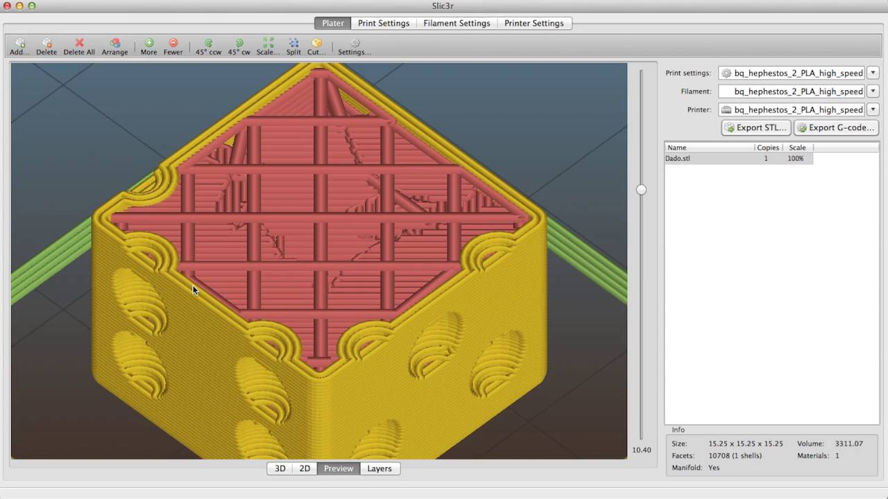

## Laminadores (Slicers)

El **laminado** es el proceso por el cual convertimos nuestro modelo 3D, normalmente en fichero **STL** o **OBJ**, en instrucciones para nuestra impresora en formato **GCODE**. Por tanto en este proceso estamos decidiendo qué tipo de impresora vamos a utilizar, qué filamento vamos a usar y las características de esta impresión.

Existen varios laminadores en el mercado, nosotros nos vamos a centrar en aquellos que son gratuitos y de código abiertos. Vamos a hablar de Ultimaker Cura y de Prusa Slicer. Son sin duda dos de los más utilizados y desde luego algunos de los más avanzados que existen actualmente.

En la imagen podemos ver el resultado de un proceso de laminación, en el que ya se ha organizado una estructura interna de la pieza, donde se muestran las distintas características que tendrá la impresión. Vemos que hay una parte externa reforzada para que la pieza tenga fuerza (**perímetros**) y al mismo tiempo tenemos una parte interior que se ha aligerado para ahorrar filamento y tiempo de impresión (es lo que se llama el **relleno**).

El laminador es el programa que nos va a permitir decidir cómo será la impresión de nuestra pieza y configurar muchas de las características.  La mayoría de los software actuales ya incluyen unas configuraciones bastante afinadas que nos permiten trabajar inicialmente con la configuración por defecto.

[Vídeo: 3.0 Laminadores/Slicers o cómo convertir tus diseños en órdenes para tu impresora 3D](https://drive.google.com/file/d/1Lqf27KnUIUprCZBRGhqm_Ct1KkE9kFTR/view?usp=sharing)

Los laminadores tienen multitud de opciones pero vamos a ver que inicialmente  solo vamos a tener que modificar alguna de ellas para la mayoría de los casos.

* 5 - 6 opciones controlan el 80% del resultado
* 200 opciones, el 20% restante, nos van a permitir ajustar la calidad y se usarán para casos concretos. 
* La configuración depende de:
    * El modelo de impresora
    * El filamento utilizado
    * El modelo a imprimir: su posición, relleno, soporte, adherencia
    * La calidad: altura de capa 
* Si tenemos que hacer pruebas conviene anotar los valores que usamos

Casi todos los laminadores nos permiten tener diferentes perfiles tanto para diferentes impresoras como para diferentes calidades y configuraciones de esta forma una vez establecidos los parámetros correspondientes solo tendremos que seleccionar el perfil para utilizar esa configuración.

Es bastante habitual que tengamos varios modelos de impresoras configuradas en un mismo laminador. Para ello solo tendremos que añadirlas desde el menú de configuración de  impresoras.

