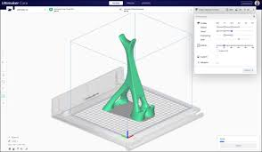

## Slicers/Laminadores

* 5 - 6 opciones controlan el 80% del resultado
* 200 opciones el 20% restante 
* Depende de:
    * El modelo de impresora
    * El filamento utilizado
    * El modelo a imprimir: relleno, soporte, adherencia
    * La calidad: altura de capa 
    * ...
* Si tenemos que hacer pruebas conviene anotar los valores que usamos

### [Ultimaker Cura](https://ultimaker.com/en/products/ultimaker-cura-software)

[Mega tutorial](https://formizable.com/mega-tutorial-de-cura-profundizando-en-cura-3d-slicer/)

### [PrusaSlicer](https://www.prusa3d.es/prusaslicer/)

[Documentación](http://imprimalia3d.com/recursosimpresion3d/gu-configuraci-n-par-metros-slic3r)

[Tutorial](https://bitfab.io/es/blog/prusa-slicer/)

[Problemas con las dimensiones](https://manual.slic3r.org/troubleshooting/dimension-errors)

