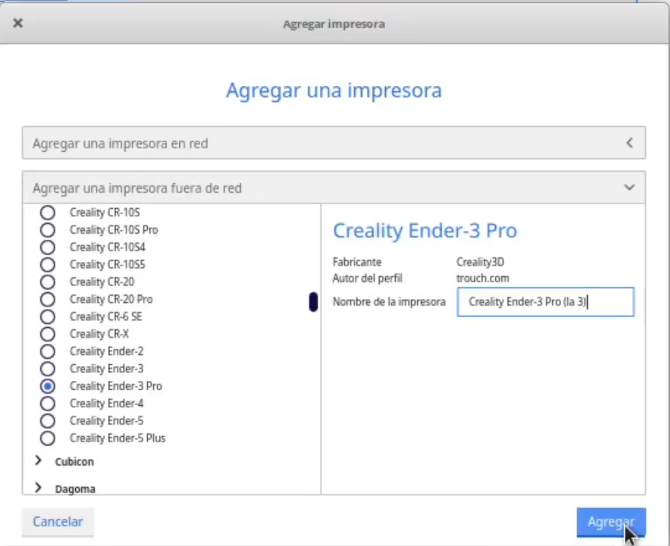
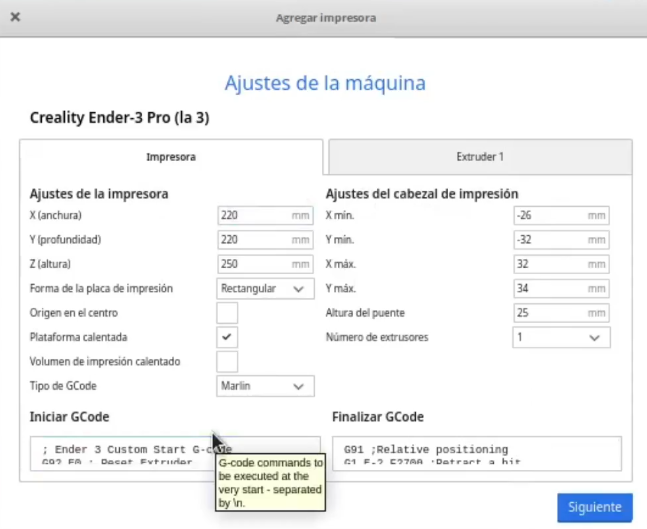
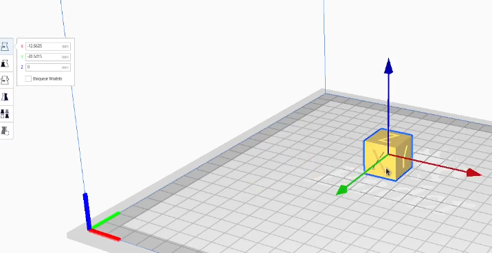
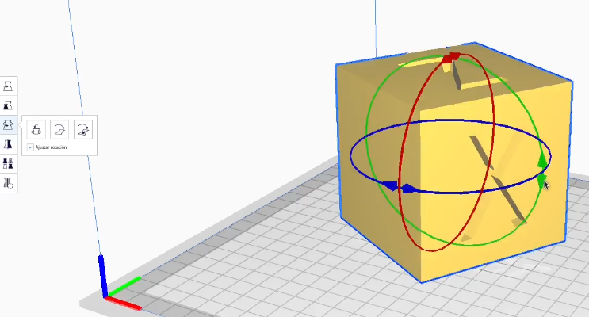
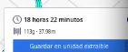
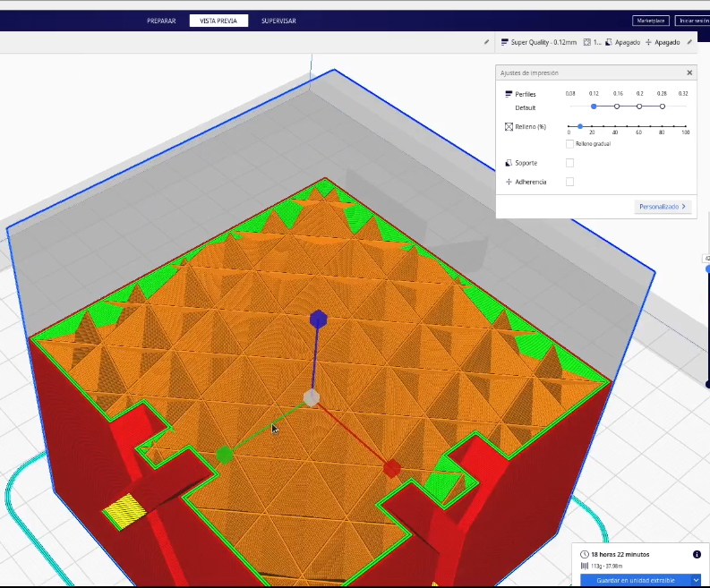

## Slicers/Laminadores

El **laminado** es el proceso por el cual convertimos nuestro modelo 3D, normalmente en fichero **STL** o **OBJ**, en instrucciones para nuestra impresora en formato **GCODE**. Por tanto en este proceso estamos decidiendo qué tipo de impresora vamos a utilizar, qué filamento vamos a usar y las características de esta impresión.

Existen varios laminadores en el mercado, nosotros nos vamos a centrar en aquellos que son gratuitos y de código abiertos. Vamos a hablar de Ultimaker Cura y de Prusa Slicer. Son sin duda dos de los más utilizados y desde luego algunos de los más avanzados que existen actualmente.

En la imagen podemos ver el resultado de un proceso de laminación, en el que ya se ha organizado una estructura interna de la pieza, donde se muestran las distintas características que tendrá la impresión. Vemos que hay una parte externa reforzada para que la pieza tenga fuerza (los perímetros) y al mismo tiempo tenemos una parte interior que se ha aligerado para ahorrar filamento y tiempo de impresión (es lo que se llama el relleno).

El laminador es el programa que nos va a permitir decidir cómo será la impresión de nuestra pieza y configurar muchas de las características.  La mayoría de los software actuales ya incluyen unas configuraciones bastante afinadas que nos permiten trabajar inicialmente con la configuración por defecto.

[Vídeo: 3.0 Laminadores/Slicer o cómo convertir tus diseños en órdenes para tu impresora 3D](https://drive.google.com/file/d/1Lqf27KnUIUprCZBRGhqm_Ct1KkE9kFTR/view?usp=sharing)

Los laminadores tienen multitud de opciones pero vamos a ver que inicialmente  solo vamos a tener que modificar alguna de ellas para la mayoría de los casos.

* 5 - 6 opciones controlan el 80% del resultado
* 200 opciones, el 20% restante, nos a permitir ajustar la calidad y se usarán para casos concretos. 
* La configuración depende de:
    * El modelo de impresora
    * El filamento utilizado
    * El modelo a imprimir: su posición, relleno, soporte, adherencia
    * La calidad: altura de capa 
* Si tenemos que hacer pruebas conviene anotar los valores que usamos

Casi todos los laminadores nos permiten tener diferentes perfiles tanto para diferentes impresoras como para diferentes calidades y configuraciones de esta forma una vez establecidos los parámetros correspondientes solo tendremos que seleccionar el perfil para utilizar esa configuración.

Es bastante habitual que tengamos varios modelos de impresoras configuradas en un mismo laminador. Para ello solo tendremos que añadirlas desde el menú de configuración de  impresoras.

### [Ultimaker Cura](https://ultimaker.com/en/products/ultimaker-cura-software)

[Ultimaker Cura](https://ultimaker.com/en/products/ultimaker-cura-software) es un software open source totalmente gratuito, disponible para Windows, MacOS y Linux, que podemos descargar de la página del fabricante de impresoras Ultimaker.

La instalación es muy sencilla. En caso de que no pudiéramos instalar la última versión disponible (quizás por no tener actualizado nuestros sistema operativo), podemos encontrar versiones más antiguas para probar si funcionan.

Vamos a ver cómo se usa Ultimaker Cura, lo utilizaremos con una pieza sencilla, haciendo todo el proceso hasta generar el fichero gcode que enviaremos a nuestra impresora

Tras instalarlo, tendremos que configurar nuestro modelo de impresora. Existen muchos modelos de diferentes fabricantes y podemos buscar si el nuestro está disponible y seleccionarlo. 

En caso de que no estuviera siempre podemos configurar una impresora standard, estableciendo las características básicas, que serán el tamaño de la base y la configuración del extrusor que podemos encontrar y la documentación de nuestro fabricante:

Tamaño de la base y altura máxima de impresión:

Grosor del filamento y diámetro de la boquilla

Cargaremos los modelos que  previamente hemos descargado,  y dentro del laminador seleccionando el objeto y utilizando las herramientas que aparecen en el lado izquierdo.podemos modificar su posición:

tamaño:

u orientación:

También podemos modificar el punto de vista, es decir, la cámara desde la que estamos viendo nuestro objeto, sin más que pulsar  el botón izquierdo y mover el ratón. 

Si movemos la rueda de scroll del ratón cambiará el  el nivel de zoom acercando o alejando no a la pieza.  Si pulsamos la rueda del ratón y movemos éste se producirá un cambio de punto de vista desplazándose la pieza también.

Una vez configurado lo que es el tamaño posición de la pieza vamos a configurar los parámetros de impresión para ello usaremos los indicadores que aparecen en la parte superior derecha:

Entre ellos encontramos:

* La **altura de capa**, es el parámetro decisivo para configurar la calidad de nuestra impresión: una mayor altura de capa va a hacer que nuestro modelo se  imprima con menor calidad. La altura de capa nos indica el detalle con el que se hace el laminado: un detalle más fino requiere una altura de capa más pequeña. 

    Habitualmente la impresora admite una altura de capa entre 0,05 y 0,3 mm.  una altura de capa más pequeña implica que existen más capas en el laminado y por tanto en la impresión lo que va a hacer que esta sea mucho más lenta.  Al dividir por 2 la altura de capa estamos multiplicando por 2 el número de capas necesarias para alcanzar determinada altura, lo que va a hacer que nuestra impresión tarde más del doble de tiempo.

* **% de relleno**,  que nos va a indicar cómo de maciza es nuestra pieza. El 100% implicaría una pieza totalmente maciza. En la práctica podemos trabajar con niveles de relleno bajos, como el 10-20%, siempre que no requiramos que nuestra pieza sea extremadamente fuerte.  Cuanto más bajo sea el porcentaje de relleno más rápida será nuestra impresión.

* La opción de **soporte** nos va a permitir imprimir piezas en las que alguna parte está levemente colgando del resto. Para ello generará un elemento artificial que sujetará a esa pieza a la hora de imprimirla.

* Otro parámetro fundamental es la **adherencia** que nos va a permitir que nuestra pieza quede bien fijada la base para que no se mueva en toda la impresión el caso en el que se moviera y se desplazará el resultado sería que algunas de las capas no irían encima de las que debieran con la consiguiente pérdida de esa pieza. Para ello también se generará una parte imprimible artificial que añadir a firmeza a la unión entre la pieza y la base

En este nivel de configuración por defecto, algunos de estos parámetros son demasiado simples y solamente podemos configurar si están activos o no. ;ás adelante veremos cómo podemos modificar todas estos parámetros para conseguir un mayor detalle y control en la configuración.

Una vez configurado estos parámetros pulsaremos en el botón azul de segmentación, abajo a la derecha, para proceder al laminado tras terminar este proceso se nos indicará el tiempo estimado de impresión así como el peso de la pieza.  habitualmente el tiempo de impresión suele ser mayor del que Cura nos muestra.

También podemos ver la estructura que Cura va a imprimir utilizando la pestaña **previsualización** y desplazándonos entre las distintas capas usando el control que hay a la derecha.

Veremos que existen distintos tipos de impresión que aparecen indicados con diferentes colores: unos serán los **perímetros** más exteriores, las **capas inferiores** y **capas superiores**, otros serán los **rellenos** los más interiores y también veremos cómo se muestra la parte de **soporte** o de **adherencia**.

Tras este proceso podremos exportar el fichero gcode generado a nuestra tarjeta SD y ya estará listo para imprimirlo desde nuestra impresora.

En este punto conviene que revisemos bien por si se hubiera producido algún error. A veces algunos modelos contienen errores que dan lugar a que el laminado no sea correcto .

[Vídeo: 3.1 Uso de Ultimaker Cura como laminador (slicer) para impresión 3D](https://drive.google.com/file/d/1GNLk_aC2KNEUU8TfVeIBl4H5B1NB5IfW/view?usp=sharing)

Vamos a usar ahora Cura para hacer el laminado de una pieza más compleja que necesita de soporte y de adherencia. 

Veremos el resultado impreso y lo compararemos con el que nos mostraba Cura en la previsualización

[Vídeo: 3.1.3 Usamos Cura con una pieza más compleja que necesita de soporte y de adherencia](https://youtu.be/XUQR765Wtf0)

[Tutorial sobre Cura de los expertos de bitfab.io](https://bitfab.io/es/blog/tutorial-laminado-cura/)

[Mega tutorial](https://formizable.com/mega-tutorial-de-cura-profundizando-en-cura-3d-slicer/)

### [PrusaSlicer](https://www.prusa3d.es/prusaslicer/)

[Documentación](http://imprimalia3d.com/recursosimpresion3d/gu-configuraci-n-par-metros-slic3r)

[Tutorial de los expertos de bitfab.io](https://bitfab.io/es/blog/prusa-slicer/)

[Problemas con las dimensiones](https://manual.slic3r.org/troubleshooting/dimension-errors)

