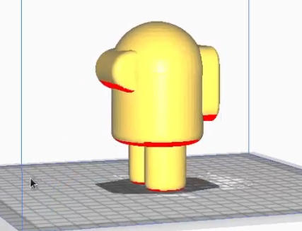

## [Ultimaker Cura](https://ultimaker.com/en/products/ultimaker-cura-software)

[Ultimaker Cura](https://ultimaker.com/en/products/ultimaker-cura-software) es un software open source totalmente gratuito, disponible para Windows, MacOS y Linux, que podemos descargar de la página del fabricante de impresoras Ultimaker.

La instalación es muy sencilla. En caso de que no pudiéramos instalar la última versión disponible (quizás por no tener actualizado nuestro sistema operativo), podemos encontrar versiones más antiguas para probar si funcionan.

Vamos a ver cómo se usa Ultimaker Cura, lo utilizaremos con una pieza sencilla, haciendo todo el proceso hasta generar el fichero gcode que enviaremos a nuestra impresora

Tras instalarlo, tendremos que configurar nuestro modelo de impresora. Existen muchos modelos de diferentes fabricantes y podemos buscar si el nuestro está disponible y seleccionarlo. 

En caso de que no estuviera siempre podemos configurar una impresora standard, estableciendo las características básicas, que serán el tamaño de la base y la configuración del extrusor que podemos encontrar y la documentación de nuestro fabricante:

Tamaño de la base y altura máxima de impresión:

Grosor del filamento y diámetro de la boquilla

Vamos a hacer este primer ejemplo con una pieza que uso mucho: el cubo de calibración:

Se trata de un simple cubo de 20x20x20 mm que tiene en 3 de sus caras un rebaje de las letras "X", "Y" y "Z" y que uso para comprobar el buen funcionamiento de la impresión, para ajustar los parámetros más adecuados para un nuevo tipo de filamento o para cualquier otra prueba. Lo puedes descargar desde [Thingiverse](https://www.thingiverse.com/thing:1278865).

Cargaremos el modelo que previamente hemos descargado, y dentro del laminador seleccionando el objeto y utilizando las herramientas que aparecen en el lado izquierdo.podemos modificar su posición:

tamaño:

u orientación:

También podemos modificar el punto de vista, es decir, la cámara desde la que estamos viendo nuestro objeto, sin más que pulsar  el botón izquierdo y mover el ratón. 

Si movemos la rueda de scroll del ratón cambiará el  el nivel de zoom acercando o alejando no a la pieza.  Si pulsamos la rueda del ratón y movemos éste se producirá un cambio de punto de vista desplazándose la pieza también.

Una vez configurado lo que es el tamaño posición de la pieza vamos a configurar los parámetros de impresión para ello usaremos los indicadores que aparecen en la parte superior derecha:

Entre ellos encontramos:

* La **altura de capa**, es el parámetro decisivo para configurar la calidad de nuestra impresión: una mayor altura de capa va a hacer que nuestro modelo se  imprima con menor calidad. La altura de capa nos indica el detalle con el que se hace el laminado: un detalle más fino requiere una altura de capa más pequeña. 

    Habitualmente la impresora admite una altura de capa entre 0,05 y 0,3 mm.  una altura de capa más pequeña implica que existen más capas en el laminado y por tanto en la impresión lo que va a hacer que esta sea mucho más lenta.  Al dividir por 2 la altura de capa estamos multiplicando por 2 el número de capas necesarias para alcanzar determinada altura, lo que va a hacer que nuestra impresión tarde más del doble de tiempo.

* **% de relleno**,  que nos va a indicar cómo de maciza es nuestra pieza. El 100% implicaría una pieza totalmente maciza. En la práctica podemos trabajar con niveles de relleno bajos, como el 10-20%, siempre que no requiramos que nuestra pieza sea extremadamente fuerte.  Cuanto más bajo sea el porcentaje de relleno más rápida será nuestra impresión.

* La opción de **soporte** nos va a permitir imprimir piezas en las que alguna parte está levemente colgando del resto. Para ello generará un elemento artificial que sujetará a esa pieza a la hora de imprimirla.

* Otro parámetro fundamental es la **adherencia** que nos va a permitir que nuestra pieza quede bien fijada la base para que no se mueva en toda la impresión el caso en el que se moviera y se desplazará el resultado sería que algunas de las capas no irían encima de las que debieran con la consiguiente pérdida de esa pieza. Para ello también se generará una parte imprimible artificial que añadir a firmeza a la unión entre la pieza y la base

En este nivel de configuración por defecto, algunos de estos parámetros son demasiado simples y solamente podemos configurar si están activos o no. Más adelante veremos cómo podemos modificar todas estos parámetros para conseguir un mayor detalle y control en la configuración.

Una vez configurado estos parámetros pulsaremos en el botón azul de **Segmentación** (laminar), abajo a la derecha, para proceder al laminado tras terminar este proceso se nos indicará el tiempo estimado de impresión así como el peso de la pieza.  habitualmente el tiempo de impresión suele ser mayor del que Cura nos muestra:

También podemos ver la estructura que Cura va a imprimir utilizando la pestaña **previsualización** y desplazándonos entre las distintas capas usando el control que hay a la derecha.

Veremos que existen distintos tipos de impresión que aparecen indicados con diferentes colores: unos serán los **perímetros** más exteriores, las **capas inferiores** y **capas superiores**, otros serán los **rellenos** los más interiores y también veremos cómo se muestra la parte de **soporte** o de **adherencia**.

Tras este proceso podremos exportar el fichero gcode generado a nuestra tarjeta SD y ya estará listo para imprimirlo desde nuestra impresora.

En este punto conviene que revisemos bien por si se hubiera producido algún error. A veces algunos modelos contienen errores que dan lugar a que el laminado no sea correcto .

[Vídeo: 3.1 Uso de Ultimaker Cura como laminador (slicer) para impresión 3D](https://drive.google.com/file/d/1GNLk_aC2KNEUU8TfVeIBl4H5B1NB5IfW/view?usp=sharing)

Vamos a usar ahora Cura para hacer el laminado de una pieza más compleja que sí necesita de soporte y de adherencia. Se trata de un [diseño sencillo](https://www.tinkercad.com/things/fBWb6qL99yO) que copia al conocido personaje del juego "Among Us". Si todavía no tienes cuenta en [Tinkercad](https://www.tinkercad.com), puedes descargar el fichero STL [desde aquí](https://github.com/javacasm/Curso3D/raw/main/modelos/Amon%20Us%20Clone.stl).

Veremos el resultado impreso y lo compararemos con el que nos mostraba Cura en la previsualización

Al cargar el modelo en Cura, vemos como el laminador nos resalta algunas partes en rojo, son aquellas en las que se recomienda utilizar soporte, es decir, de imprimirla tal cual pueden descolgarse dando lugar a una impresión defectuosa.

También vemos fácilmente si la superficie en la que el modelo toca a la base de la impresora es suficiente o no para una adherencia firme.  en caso contrario podemos activar la opción de adherencia.

Al cargar el modelo, Seleccionar la herramienta de cambio de tamaño,  aparecen las características físicas del modelo, es decir, su tamaño dando sus  dimensiones en los tres ejes. 

Podemos aprovechar para configurar un tamaño adecuado para que la duración de la impresión no sea excesiva

Procedemos ahora a laminar pulsando el botón **Segmentación** y veremos en la **Vista Previa** el resultado dónde se apreciará en color azul claro la parte del soporte y de mejora de la adherencia.

Moviéndonos por las diferentes capas veremos como el material de soporte sostiene a las capas superiores y el material de adherencia amplía  la zona de contacto entre la base y la pieza.

Tras un buen rato de impresión, obtenemos la pieza impresa,  eliminamos la parte de adherencia, que es una capa muy fina y nos quedamos con la pieza y el soporte que forman un todo. 

Con cuidado hacemos presión en la separación entre ambas utilizando un destornillador fino o una espátula.   Iremos haciendo movimientos para separarlo poco a poco

Al separarlos vemos que la parte superior del soporte no es maciza sino que tiene 1 hueco para así no adherirse demasiado a nuestra pieza.  

Si nos fijamos en la parte donde el soporte estaba  adherido a la pieza, la calidad no es tan buena como en el resto de nuestra impresión, pero aún así es mejor de la tendríamos sin utilizar soporte.

[Vídeo: 3.1.3 Usamos Cura con una pieza más compleja que necesita de soporte y de adherencia](https://drive.google.com/file/d/1rqcAdbqtt6Sq_UtRCHHPHmJmMkXrSUk6/view?usp=sharing)

