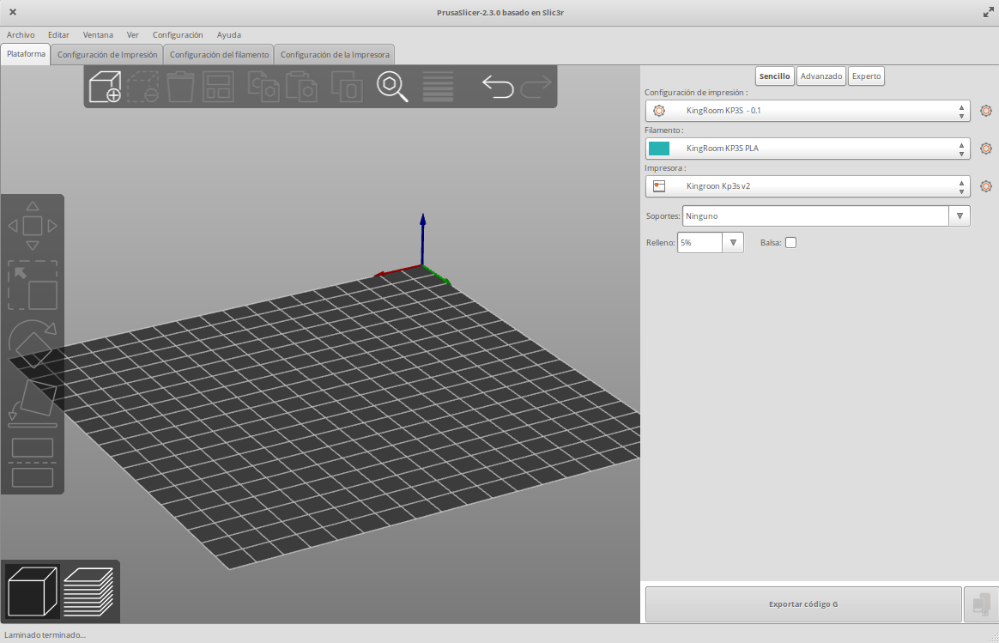
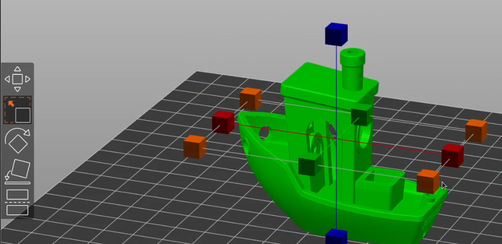
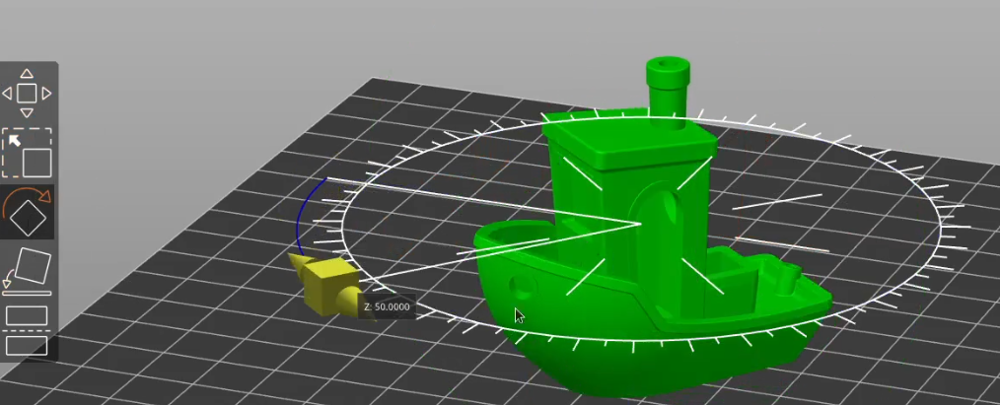

### [PrusaSlicer](https://www.prusa3d.es/prusaslicer/)

La empresa Prusa Research (la de las impresoras Prusa)  está al frente del desarrollo del software de laminación PrusaSlicer. En mi opinión es la mejor opción a día de hoy para comenzar el mundo de la impresión 3D.

Instalamos el software de laminación PrusaSlicer que podemos descargar desde su [página web](https://www.prusa3d.es/prusaslicer/)

La instalación es muy sencilla y rápida y está disponible como buen software OpenSource para cualquiera de las plataformas más utilizadas.

Una vez lo abrimos no encontramos con que tiene las partes a las que estamos acostumbrados en todos los software 3D:

*  Una parte central donde iremos colocando las piezas y que podemos mover utilizando el ratón girando, cambiando la perspectiva y acercando o alejando utilizando la rueda  del ratón.
* En el lateral y en la parte de arriba nos encontramos con una barra de herramienta que iremos utilizando para configurar la impresión y para ir moviendo o ajustando las propiedades del objeto que queremos imprimir.
* A la derecha nos encontramos con una barra lateral dónde iremos seleccionando los distintos perfiles que tenemos disponibles,  tanto de la impresora como del material y de los parámetros de configuración.
*  Arriba a la izquierda tenemos varias pestañas que nos permiten configurar todos los parámetros de estos perfiles. 

Lo primero que haremos será configurar nuestra impresora.  podemos tener varias impresoras configuradas y en cada momento elegir cuál de ellas queremos usar. Por defecto nos muestra la impresora de la de su marca cómo era de esperar:

También podemos elegir entre impresoras de algunas marcas. No están todas pero sí las más utilizadas últimamente. Cada actualización añade nuevas marcas y modelos.

Podemos utilizar el asistente y añadir nueva impresora en cualquier momento,  desde la pestaña de configuración de impresoras.

En el caso de que nuestra impresora no esté, siempre podemos configurar una impresora por defecto. Para ello tenemos que seleccionar algunos detalles que podemos encontrar en la documentación del fabricante:

*  El modelo del firmware,  que normalmente será Marlin
*  El tamaño de la zona de impresión que suele ser de 200 x 200 mm
*  El diámetro del orificio de la boquilla que suele ser 0,4 mm
*  El diámetro del filamento que suele ser 1.75 mm

El asistente también nos solicitará que seleccionemos los filamentos que solemos utilizar indicando por defecto aquello que se llaman “genéricos” que no son propiamente de ninguna marca.

[Vídeo: 3.2.0 Instalación y 1ª configuración de PrusaSlicer](https://drive.google.com/file/d/1-wFyfeIlgSU-dWifCABHxpeCfEjlRg_w/view?usp=sharing)

## Primer laminado con PrusaSlicer

Una vez configurado nuestra impresora y los principales parámetros vamos a hacer un ejemplo de impresión utilizando un clásico de la impresión 3D: [3D Benchy](https://www.thingiverse.com/thing:763622)

Se trata de un modelo muy utilizado para comparar los resultados entre distintas impresoras y para asegurarnos que tenemos una buena configuración. Ha sido diseñado teniendo en mente aquellos apartados más difíciles de imprimir para así poder ajustar nuestros parámetros y obtener una calidad óptima de impresión.  por ejemplo dispone de agujero dentro de su estructura de elementos que están volando  y que nos permiten probar si nuestra configuración es apta para los diseños más exigentes.

Descargamos el fichero STL de la opción más sencilla en la que se imprime como una única pieza y lo incorporamos a Prusa Slicer, pulsando en el botón Añadir  de la barra de herramientas superior.  también podemos arrastrar el fichero desde el Explorador de Archivos:

Podemos probar ahora las distintas herramientas que nos van a permitir moverlo dentro de la base,  cambiarlo de tamaño:

o rotarlo:

También dispone de una herramienta que nos permite seleccionar sobre qué superficie del modelo queremos que descanse en la base, lo que nos va a permitir cambiar la orientación fácilmente. En este caso no tiene mucho sentido puesto que claramente tenemos una parte inferior pero en otro modelo puede ser muy interesante. 

Otra funcionalidad muy interesante es la que nos permite dividir verticalmente nuestro modelo en dos partes.  Para ello podremos seleccionar el plano en el que se realiza el corte y quedarnos con una, con otra parte o con las dos. Esto nos va a permitir que una pieza que sea muy alta la podamos imprimir en nuestra impresora en dos partes.

Prusa Slicer nos permite funcionar en tres modos de complejidad creciente: modo sencillo, avanzado y experto.  A medida que vamos marcando un nivel más elevado aparecerán más opciones disponibles para configuración. 

Nosotros vamos a comenzar evidentemente con el nivel **sencillo** donde tenemos más que suficiente para configurar muchas de las características de nuestra impresión.

En la pestaña de “Configuración de Impresión” vamos a encontrar los principales parámetros para definir la calidad de ésta, por ejemplo la altura de capa. Vamos a establecerla en 0,3 y vamos a guardar este perfil como uno nuevo para así tener la posibilidad de definir diferentes perfiles para diferentes calidades. Para ello pulsaremos sobre el iconito de guardar (que parece un floppy disk).

Seleccionamos el porcentaje de relleno que vamos a  utilizar: 5%  y de momento no vamos a marcar ni soporte ni adherencia que parece indicado como “Balsa”.

Pulsamos el botón de “Laminar ahora”, abajo a la derecha  y se realiza el proceso de laminado. Veremos que este proceso es mucho más rápido que en ultimaker cura.

Inmediatamente que termina el laminado, nos cambia a la vista de capas donde nos muestra cómo quedaría una vez impreso resaltando los distintos tipos de impresión con distintos colores como nos muestra la leyenda que aparece arriba a la izquierda.

Podemos cambiar entre la vista de modelo y la vista de capa sin más que pulsar cualquiera de los dos botones que aparecen abajo a la izquierda:

Pulsando sobre la barra vertical que hay a la derecha de la imagen laminada podemos desplazarnos entre las diferentes capas apreciando así la estructura tan compleja que tiene nuestro modelo al imprimirse:

[Vídeo: 3.2.1 Primera Impresión con PrusaSlicer](https://drive.google.com/file/d/1ELWn36m3yjUkVO2JFTr1BhotZxoJ7hvt/view?usp=sharing)

## Ajustando la altura de capa

Vamos a crear ahora un nuevo perfil de impresión en el que la altura de capa será de 0.1mm y  aprovecharemos para comparar el resultado de la calidad de uno y otro.

Tras laminarlo, veremos que el acabado va a ser más suave: antes teníamos simplemente 6-7 escalones en el  techito y ahora tenemos un buen montón de ellos. Nos encontramos también que el número de capas ha aumentado muchísimo: ahora tenemos más de 500. Prácticamente se ha multiplicado por 3. También el tiempo de impresión ha aumentado en la misma proporción.

Hemos ganado calidad pero a costa de un mayor tiempo de impresión.

Vamos a utilizar el Asistente de Altura de Capa: es un complemento que incluye Prusa Slicer y que analizará nuestra pieza dándonos una opción para ajustar la calidad de la impresión. Estudiará nuestro modelo y en aquellas zonas en las que estime que se puede aumentar la altura de capa para así agilizar la impresión lo hará. también verá si es necesario reducir la altura de capa en aquellas partes donde se requiere un mayor detalle.

Lo activaremos desde la vista de modelo pulsando sobre el icono de “Altura de Capa Variable”

Tras ejecutarlo veremos como nos aparece un diagrama en el que se indica la altura de capa óptima para cada una de las zonas. En este ejemplo en particular vemos como en la parte de arriba de la chimenea establece una altura de capa de 0.3mm mientras que en el resto aconseja una altura de capa de 0,07mm inferior al 0,1 que habíamos estimado.

Por tanto en este caso la recomendación del asistente para que la impresión sea aún más lenta de lo que habíamos previsto pero en cambio será de una mayor calidad.

[Vídeo: 3.2.2 Cambio de altura de capa con PrusaSlicer](https://drive.google.com/file/d/1p2ax9X2wVEu7UHvu6VMZW_Dc4uZefYOV/view?usp=sharing)

## Comparación de los resultados

Hemos hecho 2 impresiones con diferente  altura de capa: una de 0,1mm y otra de 0,3mm.  En la imagen se ve perfectamente la diferencia: el que está más atrás, que tiene una altura de capa de 0,3, tiene como unos escaloncitos, mientras que el que está en un primer plano se le ve mucho más suave. 

La diferencia de altura en la altura de capa tiene como precio la velocidad: el que tienen altura de capa más pequeñita va a tardar el triple en cambio el de 0,3 tiene un acabado bastante bueno y la velocidad a la que se ha hecho esa impresión ha sido el triple.

Para la mayoría de las configuraciones es perfectamente utilizable la altura de capa de 0,3 solo en el caso en que quedamos algo muy sofisticado o que queramos mucho detalle necesitaremos irnos a esa altura y nos compensará el tiempo que tarda
Pero eso lo disfrutemos en cada uno de los casos.

[Vídeo: 3.2.3 Comparación de impresiones con diferente altura de capa con PrusaSlicer](https://drive.google.com/file/d/1YjNU7CbCOkaLs3kTJfpYk3Ehf4T1Zxfa/view?usp=sharing)

