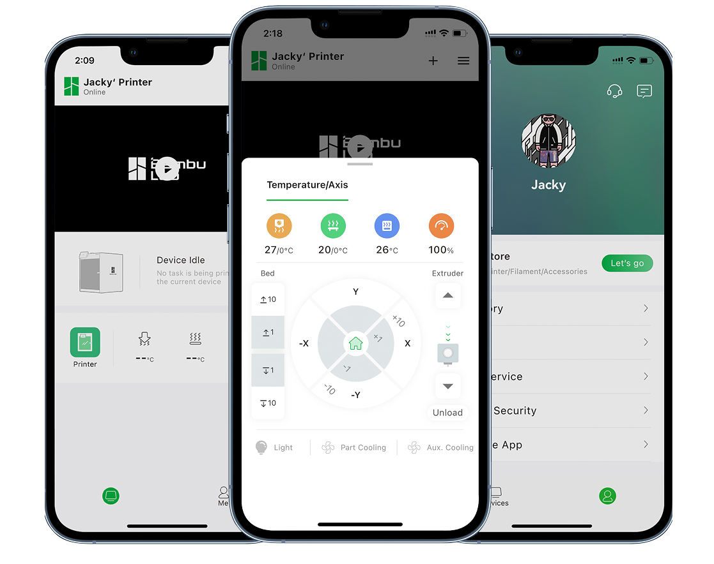
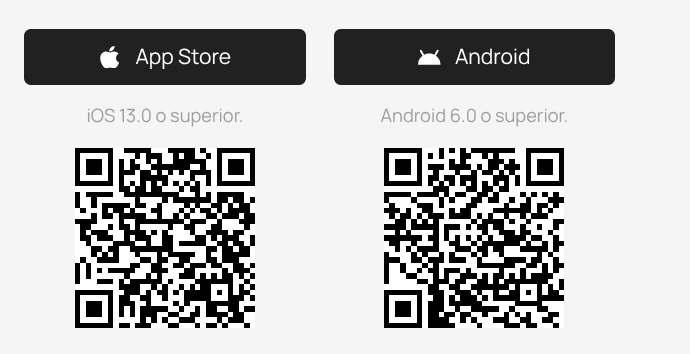
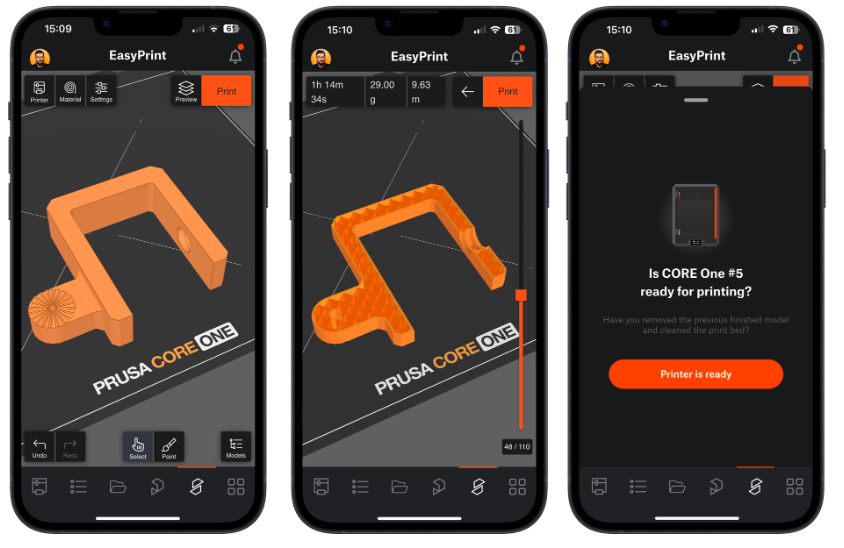

# Herramientas para Controlar Impresoras 3D desde Móviles o Tablets

Si eres un entusiasta de la impresión 3D, sabes que la comodidad de gestionar tu impresora desde un dispositivo móvil o tablet puede transformar tu flujo de trabajo. En lugar de estar atado a un ordenador, puedes monitorear impresiones en tiempo real, iniciar trabajos, ajustar parámetros y hasta rebanar modelos directamente desde tu teléfono. Este tutorial se centra en dos herramientas populares mencionadas: **Bambu Handy** (para impresoras Bambu Lab) y **Prusa EasyPrint** (para impresoras Prusa y compatibles). También incluiré una sección sobre otras opciones relevantes.

Basado en guías oficiales y reseñas actualizadas al 2025, este guía es paso a paso, con capturas conceptuales (imaginadas aquí, pero busca videos en YouTube para visuales). Asumimos que tienes una impresora 3D compatible y conexión Wi-Fi estable. Si no, verifica la compatibilidad en el sitio del fabricante.

## Requisitos Generales
Antes de empezar:
- **Dispositivo**: Smartphone o tablet con Android 8.0+ o iOS 14+.
- **Conexión**: Wi-Fi (2.4 GHz preferido para impresoras) o datos móviles para monitoreo remoto.
- **Cuenta**: La mayoría requiere registro (gratuito).
- **Impresora**: Debe soportar control remoto (ej. vía cloud o servidor local como OctoPrint).
- **Seguridad**: Usa contraseñas fuertes y verifica permisos de cámara/micro para monitoreo en vivo.
- **Apps complementarias**: Descarga desde Google Play o App Store.

**Consejo inicial**: Actualiza el firmware de tu impresora para compatibilidad óptima. Si usas un servidor como OctoPrint, configúralo primero en un Raspberry Pi.

## 1. Bambu Handy: Control Remoto Integral para Impresoras Bambu Lab
Bambu Handy es la app oficial de Bambu Lab, diseñada como una extensión de tu impresora. Permite monitoreo en vivo, control remoto, alertas de errores y hasta impresión directa desde el móvil. Es ideal para usuarios de modelos como X1C o A1, con integración en MakerWorld (su biblioteca de modelos).

### Paso 1: Descarga e Instalación
1. Abre la [**Google Play Store** (Android)](https://play.google.com/store/apps/details?id=bbl.intl.bambulab.com) o [**App Store** (iOS)](https://apps.apple.com/us/app/bambu-handy/id1625671285). 
2. Busca **"Bambu Handy"** y descarga la app oficial de Bambu Lab (gratuita, ~100 MB).
3. Abre la app y acepta los permisos (cámara para vista en vivo, notificaciones para alertas).

### Paso 2: Creación de Cuenta y Vinculación de Dispositivos
1. En la pantalla de inicio, selecciona **"Registrarse"** (o inicia sesión si ya tienes cuenta en Bambu Lab).
2. Ingresa tu email, crea una contraseña y verifica con el código enviado (o usa Google/Apple login).
3. Enciende tu impresora Bambu Lab y conéctala a Wi-Fi (usa la pantalla de la impresora para esto).
4. En la app, ve a **"Dispositivos" > "Añadir impresora"**.
5. Escanea el QR code en la pantalla de la impresora o ingresa el código manualmente.
6. Selecciona el modo: **Cloud** (remoto global) o **LAN-only** (local, sin cloud para privacidad).
7. Espera la confirmación (luz LED parpadea). Si falla, verifica Wi-Fi y reinicia.

**Solución de problemas**: Si no detecta, asegúrate de que la impresora esté en la misma red. Para LAN-only, usa la IP local.

### Paso 3: Monitoreo y Control Remoto
1. En la pestaña **"Inicio"**, verás tu impresora listada con estado (inactiva, imprimiendo, etc.).
2. Toca la impresora para abrir el dashboard:
   - **Vista en vivo**: Transmisión de cámara en tiempo real (resolución HD).
   - **Temperaturas**: Monitorea hotend, cama y cámara; ajusta con deslizadores.
   - **Progreso**: Barra de avance, ETA y velocidad.
   - **Alertas**: Notificaciones push para errores (ej. filamento agotado).
3. Controles: Pausa/para/reanuda impresión, homing (home), o calibra nivel de cama desde la app.
4. Crea timelapses: Activa en ajustes > "Grabar video" para exportar al final.

**Funciones avanzadas**: Multi-impresora (gestiona hasta 10), historial de impresiones y estadísticas (tiempo total, filamento usado).

### Paso 4: Impresión desde la App (Tutorial de Impresión Básica)
Bambu Handy integra slicing en la nube, similar a Bambu Studio.

1. **Encuentra un modelo**:
   - Ve a **"MakerWorld"** en la app (biblioteca integrada).
   - Busca por palabras clave (ej. "soporte teléfono") o explora categorías.
   - Toca un modelo y selecciona **"Añadir a placa"** (o sube tu propio STL desde galería).

2. **Elige perfil de impresión**:
   - Selecciona material (PLA, PETG, etc.) y calidad (rápido, estándar, alto detalle).
   - Ajusta soportes, relleno o altura de capa si es necesario (avanzado).

3. **Previsualiza y rebanado**:
   - Ve a **"Placa de impresión"**: Rota, escala o duplica el modelo con gestos táctiles.
   - Toca **"Rebanar"** (slicing en cloud, ~1-2 min).
   - Previsualiza capas y tiempo estimado.

4. **Inicia la impresión**:
   - Toca **"Imprimir"** y confirma placa (puedes añadir múltiples placas para batch printing).
   - La impresora calienta y empieza automáticamente.
   - Monitorea desde la app; pausa si es necesario.

5. **Impresión multi-placa**:
   - Añade más modelos a nuevas placas virtuales.
   - Rebana todo y envía secuencialmente (la impresora cambia placas sola en modelos AMS).

**Tiempo estimado**: Primera impresión ~5-10 min de setup. Exporta G-code para uso offline.

**Consejos**: Usa "Modo oscuro" en ajustes para baterías. Para privacidad, opta por LAN-only.

## 2. Prusa EasyPrint: Rebanado y Envío Directo en Móvil para Prusa y Más
Prusa EasyPrint es una herramienta web/app gratuita de Prusa Research (lanzada en 2025), enfocada en simplicidad para principiantes. Permite rebanar modelos directamente en móvil/tablet, con integración en Printables.com. Soporta Prusa MK4/S y pronto otros fabricantes (excepto Bambu por restricciones).

### Paso 1: Acceso e Instalación
1. **Web**: Ve a [easyprint.printables.com](https://easyprint.printables.com) en Chrome/Safari móvil.
2. **App**: Descarga **"Prusa"** app de Google Play/App Store (integra EasyPrint).
3. Regístrate con cuenta Prusa (gratuita) o Printables.

### Paso 2: Configuración Inicial
1. En la app/web, ve a **"Configuración" > "Impresoras"**.
2. Conecta tu Prusa vía Wi-Fi (usa Prusa Connect para detección automática).
3. Selecciona modelo (ej. MK4) y material predeterminado.
4. Otorga permisos para detección de dispositivos en red.

**Solución de problemas**: Si no detecta, verifica que la impresora esté en Prusa Connect (app separada).

### Paso 3: Monitoreo y Control Básico
- En la app Prusa: Vista en vivo, progreso y controles (pausa/reanuda).
- EasyPrint se enfoca en preparación, pero envía directamente al monitoreo.

### Paso 4: Rebanado e Impresión desde Móvil (Paso a Paso)
EasyPrint usa cloud para slicing pesado, ideal para dispositivos antiguos.

1. **Busca o sube modelo**:
   - En **"Explorar"**, navega Printables.com (miles de modelos gratuitos).
   - Añade a "Carrito" (sistema de múltiples modelos).
   - O sube STL/3MF desde archivos.

2. **Previsualización interactiva**:
   - Toca **"Vista 3D"**: Gira/zoom con gestos.
   - La app detecta impresora y aplica perfil auto (material, nozzle).

3. **Ajustes de impresión**:
   - Cambia copias, escala (%), rotación o posición.
   - Selecciona material (PLA, ABS) y auto-arregla múltiples objetos en cama virtual.
   - Oculta complejidades: Soporte/relleno auto.

4. **Rebanado en cloud**:
   - Toca **"Rebanar"** (genera G-code en ~30 seg-2 min).
   - Previsualiza capas y estima tiempo/filamento.

5. **Envío a impresora**:
   - Toca **"Imprimir"**: Envía directo si conectada.
   - O descarga G-code para USB/offline.
   - Para batch: Imprime carrito completo secuencial.

Si quieres más detalles lee [el anuncio oficial de easy-print](https://blog.prusa3d.com/prusa_easy_print_on_phone_tablet_110894/).

**Compatibilidad**: Prusa nativa; futuro soporte para Creality/Elegoo. No Bambu.

**Consejos**: Usa en tablet para mejor vista. Integra con PrusaSlicer para avanzados.

## 3. Otras Herramientas Populares
Si tus impresoras no son Bambu/Prusa, considera estas (enfocadas en Android, pero muchas iOS):

| App | Descripción Clave | Compatibilidad | Enlace |
|-----|-------------------|---------------|--------|
| **Obico** | Monitoreo AI con alertas de fallos, control remoto y multi-impresora. Vista en vivo. | OctoPrint/Klipper | [obico.io](https://www.obico.io) |
| **Creality Cloud** | Slicing directo, timelapses y control multi-printer. | Creality ( Ender, K1) | Google Play |
| **Printoid** | Control total (movimientos, temps), video dual-cámara. | OctoPrint | Google Play |
| **AstroPrint Mobile** | Gestión remota vía AstroBox (RPi server). | Cualquiera con Astro | [astroprint.com](https://www.astroprint.com) |
| **Elegoo Matrix** | Gestión multi-printer, simplificado para prosumer. | Elegoo (Neptune) | Google Play |
| **OctoRemote** | Básico: Pausa/para, vista en vivo. | OctoPrint | Google Play |

Para Geeetech (si es tu caso con EasyPrint 3D antigua): Usa app para Wi-Fi module; sube STL, rebanar y control remoto. Tutorial: Conecta module USB, configura en app, importa modelo y print.

## Consejos Avanzados y Mejores Prácticas
- **Seguridad**: Evita clouds si imprimes sensibles; usa VPN para LAN.
- **Eficiencia**: Configura notificaciones solo para errores. Usa baterías externas para monitoreo largo.
- **Integraciones**: Combina con Thingiverse/Printables para modelos. Para DIY, OctoPrint + app móvil es versátil.
- **Actualizaciones**: Revisa app stores mensualmente; firmware impacta compatibilidad.
- **Comunidad**: Únete a Reddit r/3Dprinting o foros Prusa para tips.

¡Con esto, estarás imprimiendo desde la playa en no tiempo! Si tienes una impresora específica, dime para personalizar. Fuentes: Bambu Wiki, Prusa Blog, Obico Guide.