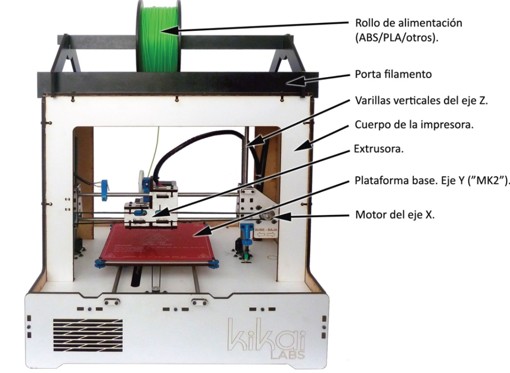
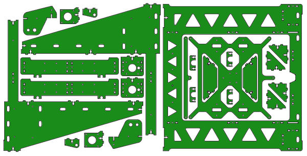
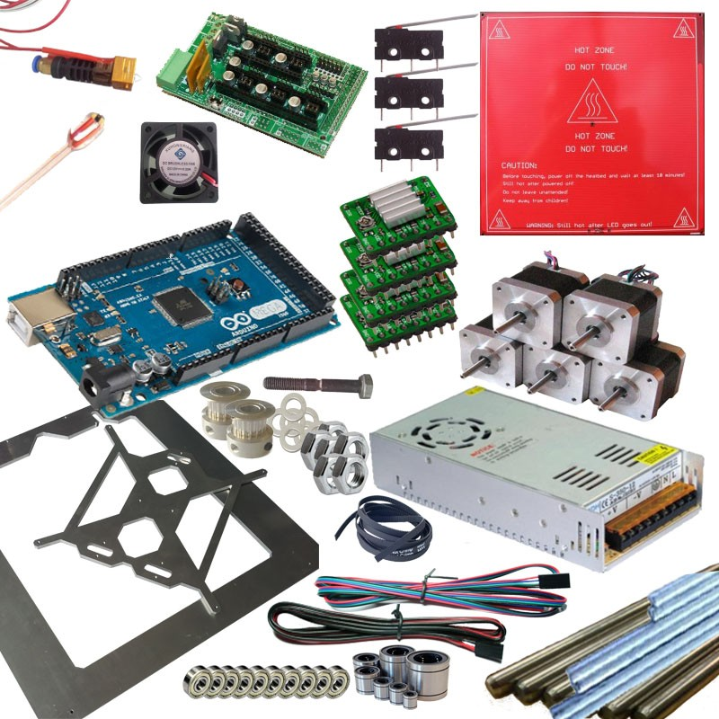

# Estructura de una impresora 3D

[Vídeo: 5.0 Estructurade una impresora 3D](https://youtu.be/6aQbd-1SY_8)

### Impresora 3D

Una impresora 3D no es más que una máquina CNC de control numérico computerizado al aquí colocamos una herramienta de deposición de materiales decir que va depositando un material con una gran precisión integramos la propio en la propia herramienta de deposición de material dentro de SC consiguiendo también una gran precisión en cuanto a la cantidad de material que depositamos en cada punto del espacio

Además de esta precisión en los movimientos tanto de los tres ejes como de extrusor para liberar la cantidad adecuada de filamento se usa también el flujo de aire de unos ventiladores que van a contribuir a unas piezas que controlan la temperatura por un lado vamos a tener los ventiladores que van a contribuir a enfriar el filamento cuando así sea necesario de una forma brusca para conseguir una mayor rigidez y por otro lado vamos a encontrar también una elementos calefactores que van a producir la fusión del filamento a la temperatura requerida

La mayoría de la impresora también incluye un elemento una **base calefactada** con la que podemos ajustar la temperatura de la base, para así graduar la adherencia de la pieza que imprimimos a la superficie.

## Partes

## Extrusor

## Estructura

## Cama caliente

Fundamental para una buena adhesión.

## Mecánica y Electrónica

## Kit completo

