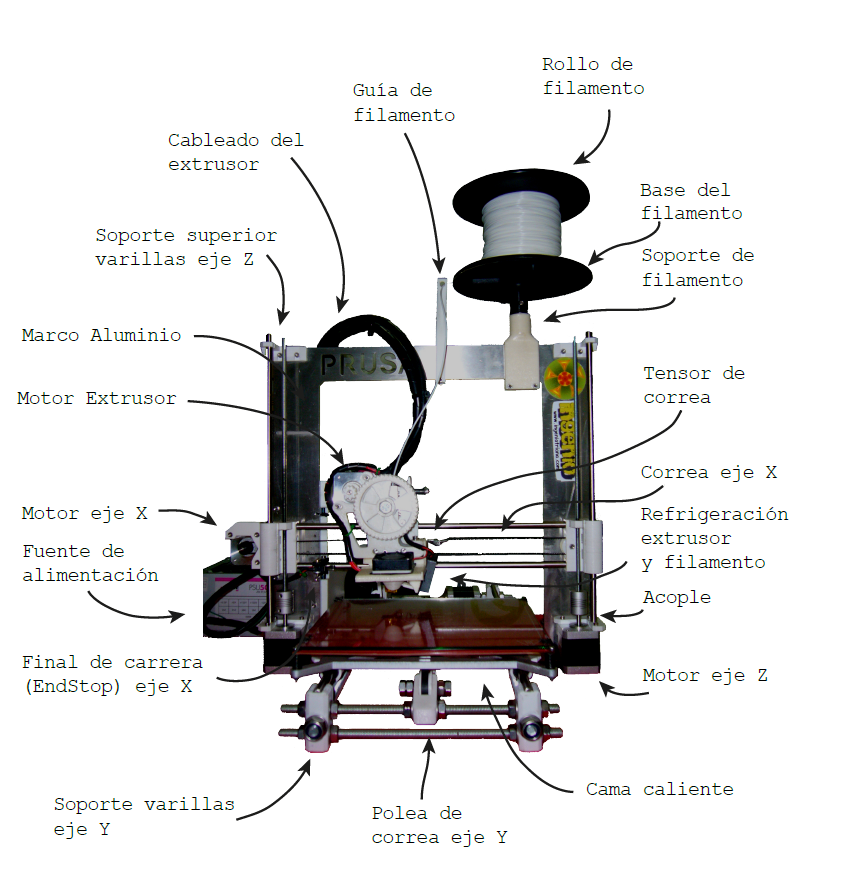

# Estructura de una impresora 3D

En este tema vamos a comenzar hablando sobre la estructura de la impresora, los diferentes componentes para conocerlos mejor antes de empezar a trabajar con ellos, entender el funcionamiento y ver los distintos tipos de impresora que tenemos disponibles.

### ¿Qué hay en una Impresora 3D?

Una impresora 3D no es más que una máquina **CNC** (Control Numérico Computerizado) a la que hemos añadido una herramienta de deposición de materiales, que llamaremos **extrusor**. Con otras palabras: una máquina que va depositando un determinado material con una gran precisión. 

La mayoría de las impresoras tienen una geometría cartesiana es decir se mueven en los tres ejes espaciales XYZ. La nomenclatura habitual de los ejes es la siguiente:

* El eje X representa el movimiento desde la izquierda a la derecha de la impresión
* El eje Y normalmente se refiere a la profundidad,  acercándose o alejándose de nosotros
* El eje Z representa la altura del extrusor frente a la base

Habitualmente se toma como origen de coordenadas, la posición (0,0,0) cuando el extrusor está a la izquierda, con la base atrás del todo y lo más bajo posible.

Como trabajamos con materiales sólidos que queremos fundir, integramos dentro del extrusor, el **fusor**, un componente que derrite el material. Para ello vamos a utilizar unos elementos calefactores que van a producir la fusión del filamento a la temperatura requerida.

Para conseguir buena calidad en la reproducción de los modelos, necesitamos también una gran precisión en el control de la cantidad de material que depositamos en cada punto del espacio.

Además de esta precisión en los movimientos tanto de los tres ejes como de extrusor para liberar la cantidad adecuada de filamento, se usa también el flujo de aire de unos ventiladores para controlar la temperatura del material fundido, usando unos ventiladores que van a contribuir a enfriar el filamento cuando así sea necesario de una forma brusca y  conseguir una mayor rigidez en el resultado.

La mayoría de las impresoras también incluyen  una **base calefactada** con la que podemos ajustar la temperatura de la base, para así graduar la adherencia de la pieza que imprimimos a la superficie.

### Partes de una impresora

Vamos a hacer un rápido recorrido por los diferentes componentes más adelante iremos detallando aquellos que necesitan una mayor explicación.

En esta  imagen vemos una impresora un poco antigua con una estructura hecha en contrachapado de materia pero que nos va a servir para conocer bien los diferentes elementos:

* Arriba del todo se suele colocar el rollo de filamento que está sujeto en un elemento que llamado porta filamento.  Se suele colocar arriba para ahorrar espacio si bien a veces da lugar a vibraciones que desaconsejan ponerlo en esa posición. 
* Para movernos en el eje Z, existen unas varillas verticales lisas, en las que se sujeta el carro del extrusor que está colocado en el eje X y otras varillas roscadas (o husillos) que al girar elevan todo el eje X.  El extrusor se mueve de izquierda a derecha a lo largo de este eje X empleando también rodamientos para facilitar el desplazamiento  que se transmite desde el motor  del eje X  por medio de unas correas flexibles.
*  El movimiento en el eje y  se consigue desplazando la base de impresión adelante atrás,  transmitiendo el movimiento desde el motor del eje por medio de otra correa flexible.
*  En la parte inferior se suele colocar la electrónica y todo aquello relacionado con el control de la impresora.
Vamos a ver ahora un ejemplo un poco más complejo de una impresora algo más actual sería una Prusa i3 dónde se pueden identificar más componentes:

Vamos a ver ahora un ejemplo un poco más complejo de una impresora algo más actual sería una Prusa i3 dónde se pueden identificar más componentes:

* En esta impresora la estructura es un marco metálico en el que se sujetan los diferentes componentes. 
* La unión entre las distintas piezas metálicas se realiza por piezas de plástico,  que sean de haber impreso anteriormente al montaje
* En la parte de abajo está la fuente de alimentación y los componentes de electrónica que están refrigerados por un ventilador.
* Vemos como existe un mazo de cables que conectan la electrónica con el extrusor que se va moviendo a lo largo del eje X.
* Podemos ver la estructura de varillas metálicas roscadas que formaban lo que era el eje Y.
* En esta imagen se puede apreciar perfectamente los diferentes motores de los distintos ejes:
	*  2 motores para  transmitir el movimiento a las dos varillas del eje Z.
	* 1 motor en el eje X situado a la izquierda según se mira.
    * 1 motor para el eje Y que no se ve en la imagen por estar situado detrás.
	* 1  motor para el extrusor.
* También se puede apreciar lo que se conoce como los **finales de carrera**, que son unos microinterruptores que detectan cuando al desplazarse los distintos componentes alcanzan uno de los extremos. Suele haber 3 de ellos, uno por cada eje. Son necesarios para determinar con precisión al menos una posición del extrusor lo que se conoce como el Origen (Home). 

[Vídeo: 4.0 Estructura de una impresora 3D](https://drive.google.com/file/d/116X4DcQJ9mKGwxkV8uY6HhCGbkMwwe8_/view?usp=sharing)

