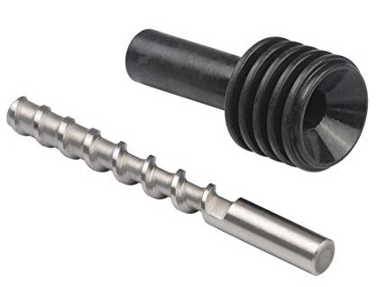

## Componentes de las impresoras 3D

### Sensores

También suelen incluir distintos sensores para facilitar tanto los movimientos de la impresora como lo que sería la medida de la temperatura en diferentes puntos interesantes por ejemplo incluye un sensor de temperatura en la base para saber cuál es la temperatura de esta un sensor de temperatura en el extrusor y diversos sensores para garantizar el correcto posicionamiento del extrusor que es la parte más importante

En las impresoras de gama más baja se suelen utilizar uno pequeño microinterruptores que actúan como **finales de carrera** es decir que detectan una al menos una de las posiciones de los extremos de los ejes.  De esta forma podemos  conocer con gran precisión al menos uno de loa extremos, si ahora movemos con precisión nuestro extrusor y moviendo hablar con los distintos ejes conseguiremos una mayor precisión

Alguna impresora también incluyen **sensores de filamento** que permiten detectar si existe o no filamento, así como el grosor del mismo para conseguir una mayor calidad en la impresión

### Ventiladores

ruido...

### Impresoras más complejas

A medida que se hace más compleja entrenamiento de la impresora incluyendo más motores también se incluyen más sensores para garantizar el correcto funcionamiento por ejemplo si utilizamos un sistema de múltiples herramientas decir la impresora tiene distinto extrusores que puedo utilizar pues necesitaremos de los sensores correspondientes para saber en qué cuál de ellos tenemos colocado y que está correctamente conectado al sistema

También alguna de las impresoras incluyen sistemas para cambio de filamento es decir son capaces de utilizar distintos filamentos de forma alternativa para ello es necesario conocer con precisión todos estos componentes y cuando el filamento está listo para imprimir

El funcionamiento de una extrusor es muy sencillo conceptualmente: se trata simplemente de un motor que es capaz de mover el filamento de una forma precisa al mismo tiempo que lo funde para conseguir que se aporte una cantidad exacta de material

### Tipos de extrusores

Existen diferentes implementaciones del mecanismo de los extrusores

Hablamos de extrusión directa cuando el motor tiene un engranaje que arrastra directamente el filamento de esta forma garantizamos un control muy preciso a cambio necesitamos que el motor tenga una mayor potencia para sierra estar directamente

Otros extrusores utilizan un sistema de engranaje que multiplican la fuerza del motor a cambio de conseguir una mayor complejidad pero consiguiendo una buena calidad y funcionamiento con motores muy de mulhouse potencia

## Impresoras que no utilizan filamento

Existen alguna extrusores que no usan filamento y que pueden trabajar directamente con el plástico en un formato que se suele conocer como *pelets*, que son pequeñas bolitas de plástico con el que se pueden trabajar perfectamente. 

Estos extrusores son algo más complejos ya que suelen incluir una especie de depósito o tolva que van extrayendo la cantidad adecuada de este plástico al mismo tiempo que lo van rompiendo, comprimiendo y fundiendo.

Para ello utilizan una broca especial conectada al motor del extrusor que va moviento el plástico a la velocidad adecuada

## Estructura del extrusor

La parte más sencilla es la boquilla, en la parte final y no garantiza que el la extrusión del firmamento va a tener un tamaño controlado normalmente están hechas de latón y sufre un gran desgaste en contra de Nenuco podría pensar el plástico fundido la paga estando en necesario cambiar la consideran un elemento fungible

La parte central del fusor dónde se funde realmente el filamento está formada por una cilindro largo que al mismo tiempo tiene que tener por un extremo una temperatura alta que dónde se produce propiamente la fundición del plástico y por el otro extremo debe tener la temperatura lo más baja posible de ahí que en esta parte se suele incluir unos elementos disipadores para que la temperatura sea baja en la zona adecuada.

La cabeza calefactora suele ser un componente un bloque en el que tenemos por un lado un elemento calefactor suele ser una resistencia cerámica que es la responsable de alcanzar la temperatura alta necesaria para fundir el filamento y un sensor que suele ser una resistencia en etc o etc que mide la temperatura con precisión con el fin de ajustar el ciclo de control

Dentro de este cilindro o barrel se suele incluir un tubo de un material conocido como PTFE que tiene una un gran coeficiente de deslizamiento y que permite que el filamento fluya este elemento conocido también como teflón nos permite que el filamento se mueva con facilidad y al mismo tiempo no se adhiera en el caso de que esté fundido

También se considera un elemento fungible y que tenemos que reparar que cambiar cada cierto número de hora de i.presionmisión

Los extrusores suelen incluir en la parte de fuera del disipador un ventilador que contribuye a que la temperatura del esta parte del extrusor sea lo más baja posible

## Estructura de la base

La base suele incluir una superficie lisa dónde imprimiremos y un componente calefactor que sin carga de que se alcance la temperatura adecuada en la base

También suelen incluir un sistema de tornillo y de muelles para ajustar y calibrar la horizontalidad dile a base es fundamental que el estusor se mueva de una forma cuanto más paralela mejor a toda la estructura de la base de ahí la necesidad de nivelar de calibrar

## Electrónica de una impresora 3D

Hasta hace muy poco la mayoría de las impresoras 3D incluyan simplemente una placa Arduino Mega mas  un SHIELD qué contenía unos  drivers para manejar los motores y toda la electrónica necesaria para controlar la potencia necesaria para manejar la temperatura del extrusor y de la base de la impresora este tipo de placas se solía conocer como una RAMPs

Al ser un diseño libre, Open Source, en principio todas las RAMPs eran prácticamente iguales había varias versiones pero todas eran bastante similares en cambio era muy diferente la calidad de los distintos componentes dando lugar a muchos problemas si utilizamos la de un precio más bajo en el mercado

Es fácil de entender si tenemos en cuenta que estos componentes de necesitan de manejar los calefactores o elementos calefactores que son de mayor potencia y una mala calidad podría dar lugar a problemas de funcionamiento

Un elemento muy crítico también de estas placas eran los conectores una mala conexión con un plástico de mala calidad puede dar lugar a un sobrecalentamiento a una pequeña chispa que se van produciendo y desencadenar el qué plástico se derrita incluso que la impresora arda son bastante conocidos los casos de impresoras que acaban ardiendo por una mala conexión de los cables

A estas placas teníamos que añadir los drivers de los motores paso a paso, que se suelen incluir en unos módulos independientes que posibilitaban cambiarlos en caso de que se estropearan.

Este componente se calienta, con lo que normalmente tiene un disipador.

También suelen incluir un potenciómetro para ajustar la cantidad de potencia que transmite al motor.

### Drivers

Clásicos

Silenciosos

Número de pasos

#### Electrónica 32 bits

Hoy en día existen diferentes tipos de placas cada vez más potentes que además de controlar la impresora no permiten manejar la de una forma mucho más sencilla integrando pantalla de visualización gráfica a color incluso conexiones remotas como puede ser con Wi-Fi

A día de hoy la mayoría de la impresora utilizan una placa de control de 32 bits con una potencia de sobra para manejar la impresora, consiguiente un movimiento mucho mas suave y silencioso de los motores.

### Fuente de alimentación

La fuente de alimentación es un elemento fundamental de la impresora puesto que tiene que ser capaz de proporcionar una alimentación lo más estabilizada posible a todo el sistema.

La fuente de alimentación es un elemento fundamental de la impresora puesto que tiene que ser capaz de proporcionar una alimentación lo más estabilizada posible a todo el sistema