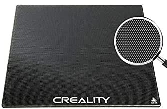
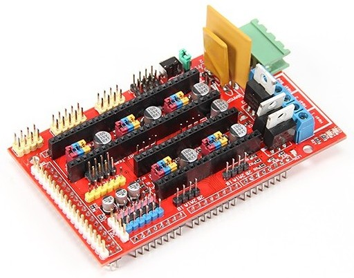
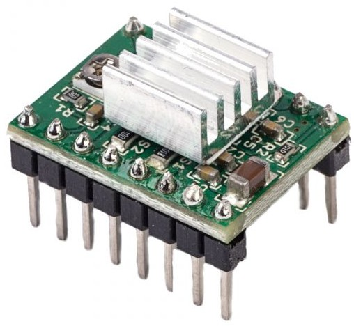

## Componentes de las impresoras 3D

## Extrusor + fusor (HotEnd)

Una de las partes fundamentales de toda impresora es el conjunto extrusor + fusor (HotEnd).  En muchas ocasiones, por abuso del lenguaje, se llama extrusor al conjunto de los dos componentes,  pero hablando con propiedad debemos distinguirlos puesto que tienen roles muy distintos:
*  el extrusor es la parte mecánica  que mueve el filamento y que alimenta al otro componente
*  el fusor donde el plástico se funde y desde el que se deposita en la base

El funcionamiento de una extrusor es muy sencillo conceptualmente: se trata simplemente de un motor que es capaz de mover el filamento de una forma precisa al mismo tiempo que lo funde para conseguir que se aporte una cantidad exacta de material.

 

Este componente es tan importante que le vamos a dedicar una parte en exclusiva.

## Estructura de la base

La base es la superficie lisa dónde imprimiremos. Suele incluir un componente calefactor que la calienta para mejorar la adherencia de la pieza mietnras se imprime.

Habitualmente  incluyen un sistema de tornillos y de muelles para ajustar  la horizontalidad de la base. Esto es fundamental para que el extrusor se mueva de una forma cuanto más paralela mejor a toda la estructura de la base de ahí la necesidad de calibrar

La base se desplaza, normalmente en el eje Y, por medio de un motor que suele estar en la parte de atrás, transmitiendo el movimiento con unas correa.

Encima de la base se suele colocar una superficie  bien para mejorar la adherencia o  bien para mejorar el acabado.  Esta superficie puede ser:

* Una superficie magnética,  que se adhiere firmemente a la base y nos facilita enormemente el retirar las piezas ya impresas 

*  Un cristal o espejo,  con el que se consiguen acabado súper lisos,  aunque  dependiendo del tipo de cristal a veces tenemos que recurrir a añadir algún producto, como la laca, para mejorar la adherencia

* Un cristal con recubrimiento adherente

Los cristales/espejos se suelen fijar con clips a la base.

En las impresoras más modernas para ajustar el nivelado/calibración se incuyen unas ruedas de gran tamaño que hacen más sencillo el ajustar los tornillosusan

## Electrónica de una impresora 3D

La electrónica es una parte esencial de toda impresora 3D. Es la que gestiona el control de los diferentes motores, nos permite controlarla desde el interfaz del usuario, la comunicación con el PC, la lectura de  los ficheros GCODE desde la tarjeta y la medida de todos los diferentes sensores. De alguna forma en la que une todos los componentes y nos permite el funcionamiento final de nuestra impresora.

Hasta hace muy poco la mayoría de las impresoras 3D incluían simplemente una placa Arduino Mega mas un SHIELD que contenía unos drivers para manejar los motores y toda la electrónica de potencia necesaria para controlar la temperatura del extrusor y de la base de la impresora. Este tipo de placas se solía conocer como una RAMPs

Al ser un diseño libre, Open Source, en principio todas las RAMPs eran prácticamente iguales.  Podíamos encontrar en cambio placas de diferente calidad debido a la calidad de los distintos componentes dando lugar a muchos problemas si utilizamos las de precio más bajo que se podían encontrar en el mercado.

Es fácil de entender si tenemos en cuenta que estos componentes  necesitan manejar los elementos calefactores que son de mayor potencia y una mala calidad podría dar lugar a problemas de funcionamiento

Un elemento muy crítico también de estas placas eran los conectores de los cables. Una mala conexión con un plástico de mala calidad puede dar lugar a un sobrecalentamiento, a una pequeña chispa que se van produciendo, pudiendo desencadenar el que el plástico se derrita, llegando incluso a que la impresora arda. Son bastante conocidos los casos de impresoras que acaban ardiendo por una mala conexión de los cables.

A estas placas teníamos que añadir los drivers de los motores paso a paso, que se suelen incluir en unos módulos independientes que posibilitaban cambiarlos en caso de que se estropearan.

Este componentes se calienta, con lo que normalmente incluyen un disipador.

También suelen incluir un potenciómetro para ajustar la cantidad de potencia que transmite al motor.

De la calidad de los driver depende que el movimiento de nuestra impresora sea más suave o que haga más o menos ruido.

A esta placa también se conectan los diferentes sensores que miden la temperura en la base y en el fusor y los finales de carrera para posicionar con precisión el extrusor.

Un esquema típico de conexión sería el siguiente

#### Electrónica 32 bits

Hoy en día existen diferentes tipos de placas cada vez más potentes que además de controlar la impresora no permiten manejar la de una forma mucho más sencilla integrando pantalla de visualización gráfica a color incluso conexiones remotas como puede ser con Wi-Fi.

A día de hoy la mayoría de la impresora utilizan una placa de control de 32 bits con una potencia de sobra para manejar la impresora, consiguiente un movimiento mucho mas suave y silencioso de los motores.

### Fuente de alimentación

La fuente de alimentación es un elemento fundamental de la impresora puesto que tiene que ser capaz de proporcionar una alimentación lo más estabilizada posible a todo el sistema.

Suelen estar sobredimensionadas, para garantizar potencia de sobra.

### Motores

En el 99.99 % de las impresoras se utilizan motores paso a paso para conseguir la precisión necesaria y casi siempre del formato nema17

### Sensores

También suelen incluir distintos sensores para facilitar tanto los movimientos de la impresora como lo que sería la medida de la temperatura en diferentes puntos interesantes por ejemplo incluye un sensor de temperatura en la base para saber cuál es la temperatura de esta un sensor de temperatura en el extrusor y diversos sensores para garantizar el correcto posicionamiento del extrusor que es la parte más importante

En las impresoras de gama más baja se suelen utilizar uno pequeño microinterruptores que actúan como **finales de carrera** es decir que detectan una al menos una de las posiciones de los extremos de los ejes.  De esta forma podemos  conocer con gran precisión al menos uno de loa extremos, si ahora movemos con precisión nuestro extrusor y moviendo hablar con los distintos ejes conseguiremos una mayor precisión

Alguna impresora también incluyen **sensores de filamento** que permiten detectar si existe o no filamento, así como el grosor del mismo para conseguir una mayor calidad en la impresión

### Impresoras más complejas

A medida que se hace más compleja entrenamiento de la impresora incluyendo más motores también se incluyen más sensores para garantizar el correcto funcionamiento por ejemplo si utilizamos un sistema de múltiples herramientas decir la impresora tiene distinto extrusores que puedo utilizar pues necesitaremos de los sensores correspondientes para saber en qué cuál de ellos tenemos colocado y que está correctamente conectado al sistema

También alguna de las impresoras incluyen sistemas para cambio de filamento es decir son capaces de utilizar distintos filamentos de forma alternativa para ello es necesario conocer con precisión todos estos componentes y cuando el filamento está listo para imprimir

