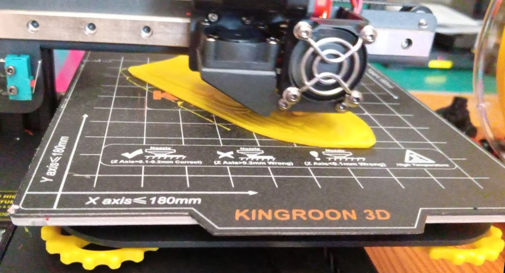
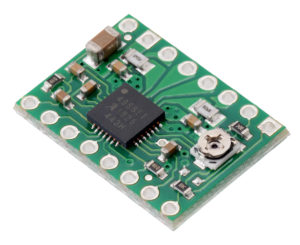
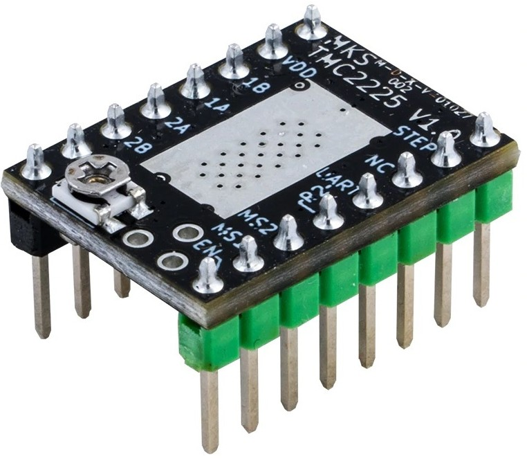
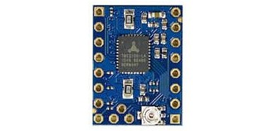
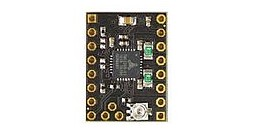
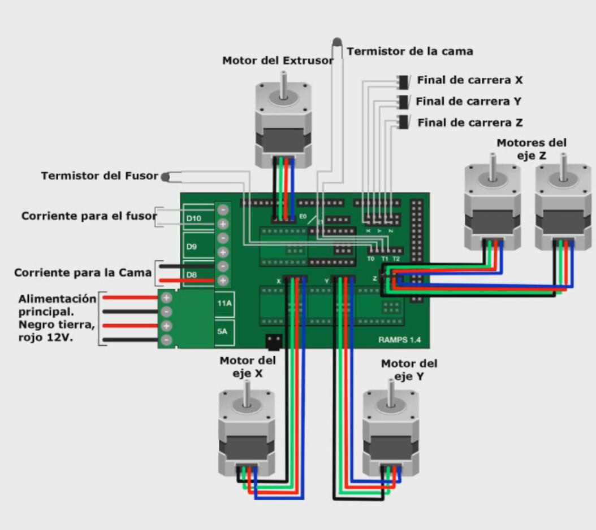
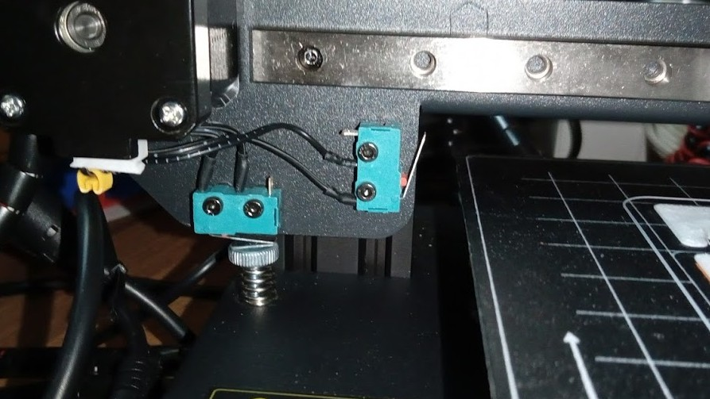
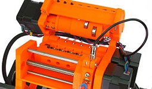

## Componentes de las impresoras 3D

En este módulo vamos a ver los diferentes componentes de las impresoras 3D. Muchos de ellos son módulos genéricos que podemos encontrar en otros equipos. Al hablar de algunos de ellos usaremos su nombre en inglés para facilitar la búsqueda de información en internet si fuera necesario.

## Extrusor + fusor (HotEnd)

Una de las partes fundamentales de toda impresora es el conjunto extrusor + fusor (HotEnd).  En muchas ocasiones, por abuso del lenguaje, se llama extrusor al conjunto de los dos componentes,  pero hablando con propiedad debemos distinguirlos puesto que tienen roles muy distintos:

* El extrusor es la parte mecánica  que mueve el filamento y que alimenta al otro componente
* El fusor donde el plástico se funde y desde el que se deposita en la base

El funcionamiento de una extrusor es muy sencillo conceptualmente: se trata simplemente de un motor que es capaz de mover el filamento de una forma precisa al mismo tiempo que lo funde para conseguir que se aporte una cantidad exacta de material.

 

Este componente es tan importante que le vamos a dedicar una parte en exclusiva.

## Estructura de la base

La base es la superficie lisa donde imprimiremos. Suele incluir un componente calefactor que la calienta para mejorar la adherencia de la pieza mientras se imprime.

Habitualmente  incluyen un sistema de tornillos y de muelles para ajustar  la horizontalidad de la base. Esto es fundamental para que el extrusor se mueva de una forma cuanto más paralela mejor a toda la estructura de la base de ahí la necesidad de calibrar

La base se desplaza, normalmente en el eje Y, por medio de un motor que suele estar en la parte de atrás, transmitiendo el movimiento con unas correa.

Encima de la base se suele colocar una superficie  bien para mejorar la adherencia o  bien para mejorar el acabado.  Esta superficie puede ser:

* Una superficie magnética,  que se adhiere firmemente a la base y nos facilita enormemente el retirar las piezas ya impresas 

*  Un cristal o espejo,  con el que se consiguen acabado súper lisos,  aunque  dependiendo del tipo de cristal a veces tenemos que recurrir a añadir algún producto, como la laca, para mejorar la adherencia

* Un cristal con recubrimiento adherente

Los cristales/espejos se suelen fijar con clips a la base.

En las impresoras más modernas para ajustar el nivelado/calibración se incluyen unas ruedas de gran tamaño que hacen más sencillo el ajustar los tornillos.

## Electrónica de una impresora 3D

La electrónica es una parte esencial de toda impresora 3D. Es la que gestiona el control de los diferentes motores, nos permite controlarla desde el interfaz del usuario, la comunicación con el PC, la lectura de  los ficheros GCODE desde la tarjeta y la medida de todos los diferentes sensores. De alguna forma en la que une todos los componentes y nos permite el funcionamiento final de nuestra impresora.

Hasta hace muy poco la mayoría de las impresoras 3D incluían simplemente una placa Arduino Mega mas un SHIELD que contenía unos drivers para manejar los motores y toda la electrónica de potencia necesaria para controlar la temperatura del extrusor y de la base de la impresora. Este tipo de placas se solía conocer como una RAMPs.

Al ser un diseño libre, Open Source, en principio todas las RAMPs eran prácticamente iguales.  Podíamos encontrar en cambio placas de diferente calidad debido a la calidad de los distintos componentes dando lugar a muchos problemas si utilizamos las de precio más bajo que se podían encontrar en el mercado.

Es fácil de entender si tenemos en cuenta que estos componentes  necesitan manejar los elementos calefactores que son de mayor potencia y una mala calidad podría dar lugar a problemas de funcionamiento.

Un elemento muy crítico también de estas placas eran los conectores de los cables. Una mala conexión con un plástico de mala calidad puede dar lugar a un sobrecalentamiento, a una pequeña chispa que se van produciendo, pudiendo desencadenar el que el plástico se derrita, llegando incluso a que la impresora arda. Son bastante conocidos los casos de impresoras que acaban ardiendo por una mala conexión de los cables.

A estas placas teníamos que añadir los controladores (drivers) de los motores paso a paso, que suelen ser módulos independientes para así poder cambiarlos en caso de que se estropeen.

Este componentes se calienta, con lo que normalmente incluyen un disipador.

También suelen incluir un potenciómetro para ajustar la cantidad de potencia que transmite al motor.

Existen diferentes marcas y versiones, unos consiguen un movimiento de los motores más silencioso que otros. De la calidad de los driver depende que el movimiento de nuestra impresora sea más suave o que haga más o menos ruido.

Casi todos tienen

**Pololu A4988** 16 micropasos 

**Pololu DRV8825** 

* 32 micropasos
* Hasta 45v y 2.2A
* 3.3 y 5 V

**TMC2225**

* 256 micropasos
* 36V y 2A

**Trinamic 2100**

* 256 micropasos
* 46V y 2.5A
* Modo de bajo consumo cuando el motor está parado

**Trinamic 2208**

* 36V y 1.4A

A esta placa también se conectan los diferentes sensores que miden la temperatura en la base y en el fusor y los finales de carrera para posicionar con precisión el extrusor.

Un esquema típico de conexión de una placa Ramps sería el siguiente:

Otros componentes fundamentales en las impresoras 3D son aquellas que nos permiten controlarla:  la pantalla de visualización y los controles del usuario. 

Inicialmente las pantallas eran de texto (lcd) y los controles solían ser unos botones o bien un mando giratorio que nos permitía movernos entre las diferentes opciones del menú.

A día de hoy casi todas las impresoras disponen de controladores de pantalla gráfica en color muchas de ellas táctiles

#### Electrónica 32 bits

A día de hoy la mayoría de la impresora utilizan una placa de control de 32 bits con una potencia de sobra para manejar la impresora, consiguiendo un movimiento mucho más suave y silencioso de los motores.

Hoy en día existen diferentes tipos de placas cada vez más potentes que además de controlar la impresora no permiten manejar la de una forma mucho más sencilla integrando pantalla de visualización gráfica a color incluso conexiones remotas como puede ser con Wi-Fi.

### Fuente de alimentación

La fuente de alimentación es un elemento fundamental de la impresora puesto que tiene que ser capaz de proporcionar una alimentación lo más estabilizada posible a todo el sistema.

Suelen estar sobredimensionadas, para garantizar potencia de sobra.

La mayoría de las impresoras actuales incluyen una fuente estándar, como la de la imagen de una impresora Kingroon KP3s de 24V y 15A (360W)

### Motores

En el 99.99 % de las impresoras se utilizan motores paso a paso para conseguir la precisión necesaria y casi siempre del formato Nema 17:

Internamente un motor paso a paso tienen varias bobinas que nos permiten hacer los movimientos con precisión:

De la calidad de los motores va a depender la velocidad y la precisión que consigamos en nuestra impresiones.

### Sensores

Las impresoras 3D, como máquinas de precisión que son, también incluyen distintos tipos de sensores para garantizar los movimientos precisos de los motores y  para controlar la temperatura en diferentes puntos. Por ejemplo incluye un sensor de temperatura en la base para saber cuál es su temperatura y otro sensor de temperatura en el fusor. 

Para garantizar el perfecto posicionamiento del extrusor se suelen utilizar unos pequeños microinterruptores que actúan como **finales de carrera**, es decir, que detectan al menos una de las posiciones de los extremos de los ejes. De esta forma podemos controlar con gran precisión su posición.

Algunas impresoras también incluyen **sensores de filamento** que permiten detectar si existe o no filamento, así como el grosor del mismo para conseguir una mayor calidad en la impresión

### Ventiladores

Los ventiladores son los responsables de conseguir un buen enfriamiento del filamento y de todas aquellas partes de la electrónica susceptibles de calentarse durante el funcionamiento.

Podemos encontrar ventiladores en las siguientes partes de una impresora 3D:

* En la fuente de alimentación para evitar calentamiento cuando estamos utilizando la máxima potencia
* En la caja dónde está la electrónica para conseguir que esta no se sobrecaliente y evitar malfuncionamientos.
* En la parte del disipador del fusor para conseguir que esta parte del mismo no se sobrecaliente.
* Apuntando hacia la boquilla para conseguir un enfriamiento rápido del filamento cuando sea necesario.  Es conocido como ventilador de capa.

En la siguiente imagen se puede ver los diferentes ventiladores de un extrusor:

* A izquierda y derecha están los ventiladores de capa.
* En el centro el ventilador que enfría la parte superior del fusor.

Algunos de estos ventiladores están funcionando todo el tiempo y son los responsables de la mayor parte del ruido, otros como el ventilador de capa se encienden sólo cuando es necesario.

Algunas impresoras son especialmente ruidosas y podemos mejorar reducir el volumen de su ruido cambiando por unos ventiladores más silenciosos, eso sí, seguro que son más caros que los originales.

### Impresoras más complejas

A medida que se hace más complejo el equipamiento de la impresora, se necesitan más motores y también más sensores para garantizar el correcto funcionamiento. Por ejemplo, si utilizamos un sistema de múltiples cabezales o herramientas, necesitaremos los sensores correspondientes para saber cuál de ellos tenemos colocado y que está correctamente conectado al sistema.

También algunas de las impresoras incluyen sistemas para cambio de filamento es decir son capaces de utilizar distintos filamentos de forma alternativa para ello es necesario conocer con precisión todos estos componentes y cuando el filamento está listo para imprimir.

