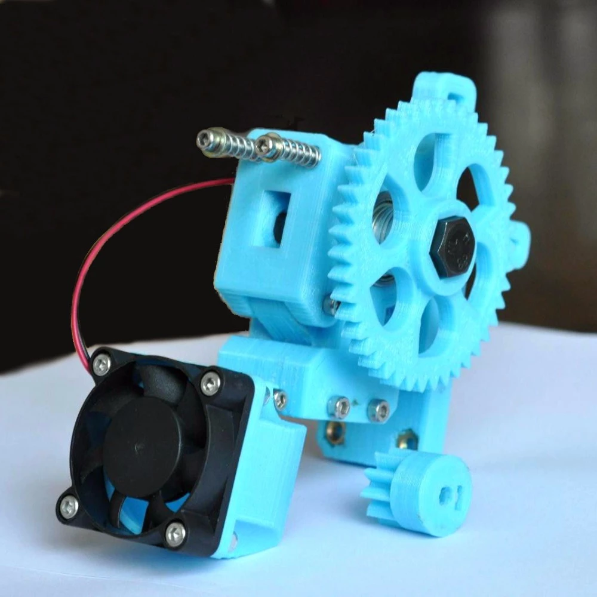
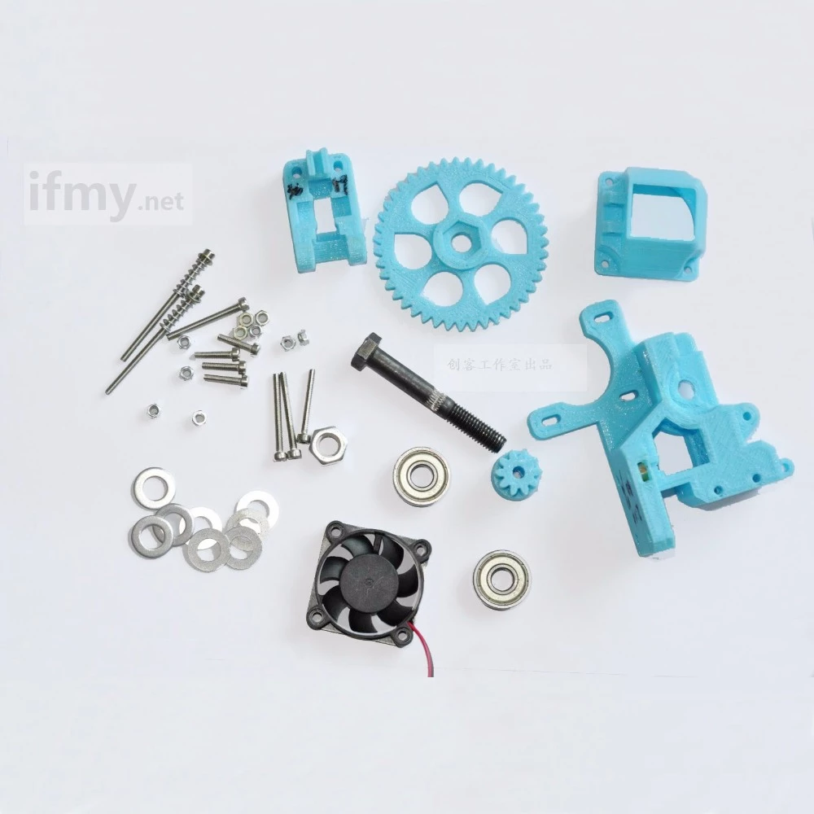
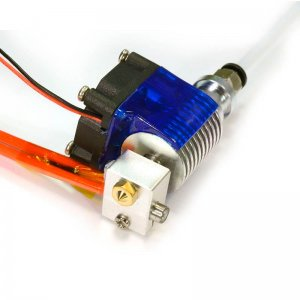

#   Tipos de extrusores

Tenemo

### Tipos de extrusores

Existen diferentes implementaciones del mecanismo de los extrusores

Hablamos de extrusión directa cuando el motor tiene un engranaje que arrastra directamente el filamento de esta forma garantizamos un control muy preciso a cambio necesitamos que el motor tenga una mayor potencia para sierra estar directamente

Otros extrusores utilizan un sistema de engranaje que multiplican la fuerza del motor a cambio de conseguir una mayor complejidad pero consiguiendo una buena calidad y funcionamiento con motores muy de mulhouse potencia

## Estructura del extrusor

La parte más sencilla es la **boquilla** (A), en la parte final y no garantiza que el la extrusión del firmamento va a tener un tamaño controlado normalmente están hechas de latón y sufre un gran desgaste en contra de Nenuco podría pensar el plástico fundido la paga estando en necesario cambiar la consideran un elemento fungible

La parte central del fusor dónde se funde realmente el filamento está formada por una cilindro largo que al mismo tiempo tiene que tener por un extremo una temperatura alta que dónde se produce propiamente la fundición del plástico y por el otro extremo debe tener la temperatura lo más baja posible de ahí que en esta parte se suele incluir unos elementos disipadores para que la temperatura sea baja en la zona adecuada.

La **cabeza calefactora** (B) suele ser un componente un bloque en el que tenemos por un lado un elemento calefactor suele ser una resistencia cerámica que es la responsable de alcanzar la temperatura alta necesaria para fundir el filamento y un sensor que suele ser una resistencia en etc o etc que mide la temperatura con precisión con el fin de ajustar el ciclo de control

Dentro de este cilindro o barrel se suele incluir un tubo de un material conocido como PTFE que tiene una un gran coeficiente de deslizamiento y que permite que el filamento fluya este elemento conocido también como teflón nos permite que el filamento se mueva con facilidad y al mismo tiempo no se adhiera en el caso de que esté fundido

También se considera un elemento fungible y que tenemos que reparar que cambiar cada cierto número de hora de impresión.

Los extrusores suelen incluir en la parte de fuera del disipador un ventilador que contribuye a que la temperatura del esta parte del extrusor sea lo más baja posible

### Diámetro de la boquillas

¿cuál usar?

Dependiendo de si queremos extruir mucho plástico o queremos más precisión

## Extrusor i3 Mendel

son complejos

[modelo](https://www.thingiverse.com/thing:961630)

[modelo 2](https://www.thingiverse.com/thing:362217)

## Extrusor barato

## Extrusor barato 2

## Extrusor E3D v6.1

TODO: explicar partes

## Extrusor Unibody Bq

Extrusor compacto

## Bowden

## Impresoras que no utilizan filamento

Existen alguna extrusores que no usan filamento y que pueden trabajar directamente con el plástico en un formato que se suele conocer como *pelets*, que son pequeñas bolitas de plástico con el que se pueden trabajar perfectamente. 

Estos extrusores son algo más complejos ya que suelen incluir una especie de depósito o tolva que van extrayendo la cantidad adecuada de este plástico al mismo tiempo que lo van rompiendo, comprimiendo y fundiendo.

Para ello utilizan una broca especial conectada al motor del extrusor que va moviento el plástico a la velocidad adecuada

