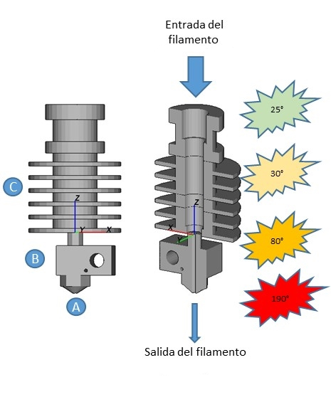
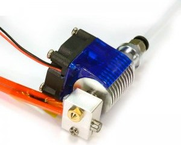
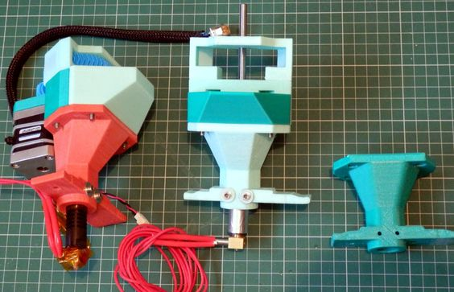

#   Tipos de extrusores

La mayoría de las impresoras y extrusores actuales solamente son capaces de trabajar con un filamento al mismo tiempo, aunque cada vez existen más impresoras capaces de trabajar con varios de ellos al mismo tiempo. En este capítulo vamos a tratar sobre aquellos que solamente funcionan con un filamento.

Podemos hacer una primera división  según el extrusor y el fusor estén juntos o  separados y conectados entre sí  por medio de un tubo.  En el primer caso hablaremos de **extrusores directos** y  en el segundo de **extrusores Bowden**. El conducto  que los une habitualmente es de un material conocido como PTFE (teflón).

Cada tipo tiene sus ventajas:

*  En el extrusor Bowden al separar el motor del extrusor del fusor  podemos hacer todo el cabezal de impresión más ligero puesto que el motor del extrusor queda fijo en la estructura y solo necesitamos mover el fusor.  de esta forma conseguimos  una mayor velocidad puesto que es más fácil mover el fusor.
*  En el extrusor directo, el que extrusor difusor estén juntos hace más sencillo el movimiento del filamento evitándonos atascos y facilitando la impresión de  algunos tipos de filamentos como los elásticos y flexibles.

Como hemos dicho antes vamos a distinguir entre el **extrusor** propiamente dicho, qué es el mecanismo que mueve el filamento, y el **fusor** que es aquella parte donde éste se funde. 

### Tipos de extrusores

Existen muchas implementaciones del mecanismo de los extrusores, una más sencillas y otra más complejas, Cada una de ellas con diferentes ventajas, fortalezas y debilidades.  el objetivo de toda ella es conseguir fundir y depositar la mayor cantidad posible de filamento por segundo,  eso sí manteniendo una alta calidad. 

Hablamos de **extrusión directa** cuando el motor tiene un engranaje que arrastra directamente el filamento. De esta forma garantizamos un control muy preciso. A cambio necesitamos que el motor tenga una mayor potencia.

Otros extrusores utilizan un sistema de engranajes que multiplican la fuerza del motor a cambio de conseguir una mayor complejidad pero consiguiendo una buena calidad y funcionamiento con motores muy de mulhouse potencia

Este 2º engranaje tiene firmemente fijado un tornillo (llamado Hobbed Bolt)que dispone de muescas en la zona en la que roza el filamento para conseguir un buen agarre del filamento y así arrastrarlo firmemente.

Este modelo es conocido como el extrusor i3 Mendel y es el que originalmente llevaba las  primeras impresoras Prusa.  ventaja de que muchas de las piezas son impresas, originalmente era complicado encontrar estos componentes para comprar.
Extrusor i3 Mendel

Son complejos y necesitan de muchas piezas impresas y otros componentes mecánicos.

La gran ventaja es que tenemos disponibles distintos modelos como [éste](https://www.thingiverse.com/thing:961630) y [este](https://www.thingiverse.com/thing:362217) que podemos descargar  para reparar o adaptar.

Todos tienen en común el que utilizan unos muelles para  conseguir una buena tracción del filamento.  habitualmente es necesario ajustar la tensión de estos muelles para evitar un exceso de presión o una falta de  agarre.

## Estructura del fusor

La parte más sencilla es la **boquilla**  o nozzle (A), está en la parte final y nos garantiza que la extrusión del filamento va a tener un tamaño controlado. Normalmente están hechas de latón y sufre un gran desgaste. En contra de lo que uno podría pensar, el plástico fundido es capaz de desgastarla, y es necesario cambiarla cada cierto tiempo.

La parte central del fusor está formada por una cilindro largo que tiene que tener al mismo tiempo una temperatura alta por un extremo, que dónde se producirá propiamente la fundición del plástico y por el otro extremo debe tener la temperatura lo más baja posible, para conseguir que el filamento se deslice y no pegue. De ahí que en esta parte se suele incluir unos elementos disipadores y un ventilador para que la temperatura sea baja en la zona adecuada.

La **cabeza calefactora** (B) suele ser un bloque metálico en el que tenemos por un lado un **elemento calefactor** que suele ser una resistencia cerámica y que es la responsable de alcanzar la temperatura alta necesaria para fundir el filamento y un **sensor de temperatura** que suele ser una resistencia PTC que mide la temperatura con precisión con el fin de ajustar el proceso de control de la temperatura de función del filamento.

Dentro de este cilindro o **barrel** se suele incluir un tubo de un material conocido como PTFE que tiene una un gran coeficiente de deslizamiento y que permite que el filamento se deslice con facilidad. Este elemento, conocido también como teflón, nos permite que el filamento se mueva con facilidad y al mismo tiempo no se adhiera en el caso de que esté fundido.

También se considera un elemento fungible y que tenemos que  reemplazar cada cierto número de horas de impresión.

Los fusores suelen incluir en la parte de fuera del disipador un ventilador que contribuye a que la temperatura del esta parte del extrusor sea lo más baja posible

Algo habitual es utilizar boquillas de diferente diámetro, dependiendo de si queremos extruir mucho plástico o queremos más precisión y un mayor detalle

La diferencia en cuanto a tiempo de impresión y a calidad entre diferentes boquillas es enorme:

Aunque la estructura del fusor de la impresora está preparado para cambiar de boquilla con relativa facilidad, es un proceso en el que tenemos que ser muy cuidadosos y no está recomendado si no tenemos cierta experiencia, porque de no hacerlo bien y no ajustarla adecuadamente  podemos dar lugar a atascos.

## Extrusor barato

## Extrusor barato 2

## Extrusor E3D v6.1

TODO: explicar partes

## Extrusor Unibody Bq

Extrusor compacto

## Impresoras que no utilizan filamento

Existen alguna extrusores que no usan filamento y que pueden trabajar directamente con el plástico en un formato que se suele conocer como *pelets*, que son pequeñas bolitas de plástico con el que se pueden trabajar perfectamente. 

Estos extrusores son algo más complejos ya que suelen incluir una especie de depósito o tolva que van extrayendo la cantidad adecuada de este plástico al mismo tiempo que lo van rompiendo, comprimiendo y fundiendo.

Para ello utilizan una broca especial conectada al motor del extrusor que va moviento el plástico a la velocidad adecuada

