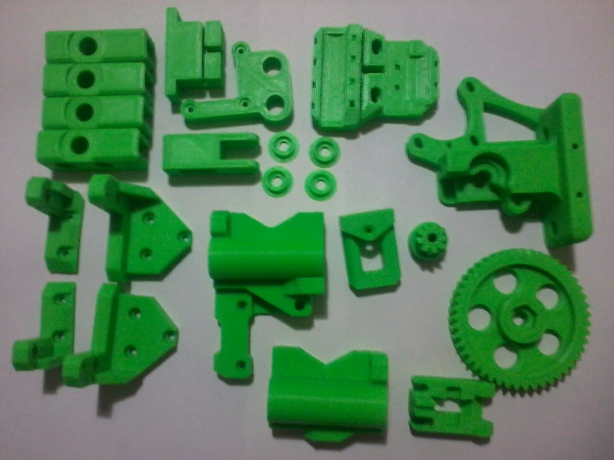
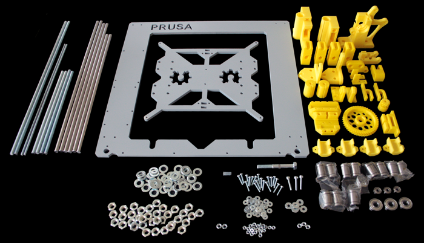
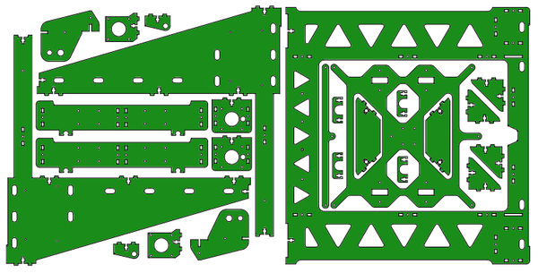
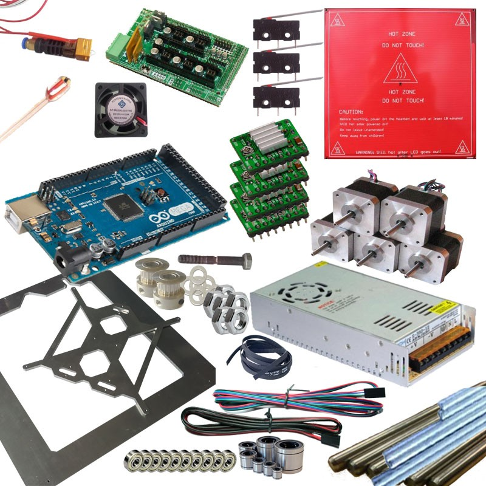
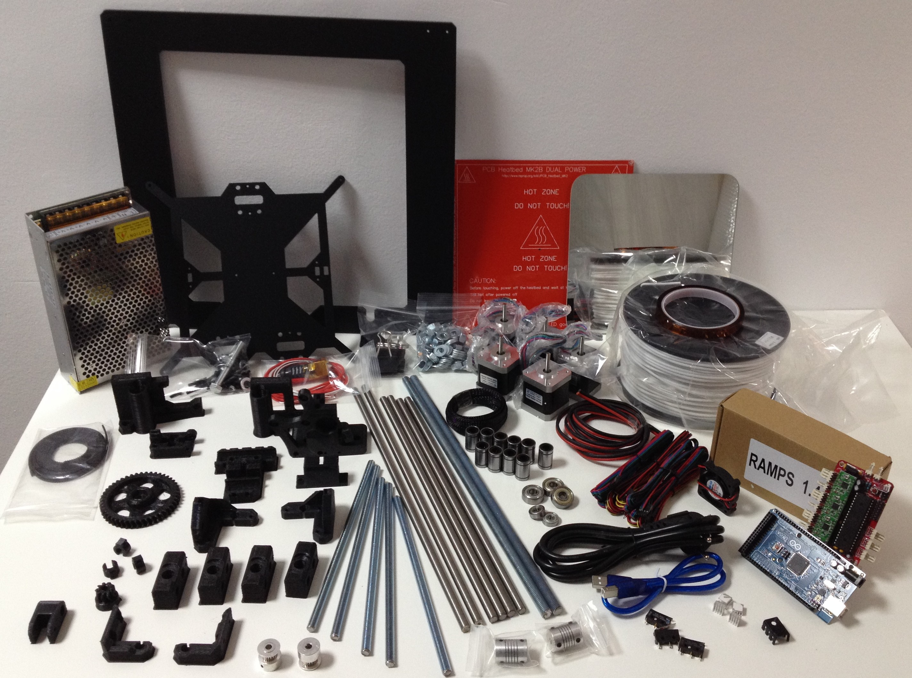

## Componentes de los Kits

Habitualmente los kits están formados por todas las piezas que necesitamos para montar nuestra impresora:

*  Piezas plásticas que unen entre sí los diferentes elementos de la estructura.  Estructuralmente son complejas y por tanto no se pueden encontrar en los comercios de ahí la importancia de poder imprimirlas.

*  Piezas mecánicas: tornillos, tuercas, arandelas, varillas, husillos, rodamientos, ...

También existen impresoras que utilizan una estructura completamente metálica, sin necesidad de piezas impresas en plástico. Conseguimos una mayor rigidez de la estructura, lo que nos permite alcanzar mayores velocidades a costa de tener que adquirir estas piezas puesto que no podemos imprimir las con ninguna otra impresora. A este tipo de impresoras se las conocía como Prusa Steel.

Si incluimos todos los componentes de la electrónica, los del extrusor...

Y si ahora juntamos todas las piezas...

No te asustes, a día de hoy las impresoras en kits suelen tener muchas menos piezas, y la mayoría de las comerciales vienen semimontadas al 80-90%.

