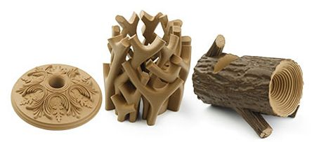

## [Filamentos](http://comohacer.eu/comparativa-impresoras-3d/#Que_materiales_usan)

Cada vez existen más materiales susceptibles de poder usarse en las impresoras.

* PLA
* ABS
* PETG
* HIPS
* Nylon
* Ninjaflex
* Filaflex
* ...

## Flexibles

## Composites:

* Madera

* Bronce

### Parámetros

* Temperatura extrusor
* Temperatura cama caliente
* Velocidad
* Ventilador de Capa

### Temperatura

Cada material se trabaja a una temperatura diferente, de hecho cada filamento necesita de una temperatura diferente.

* ABS: 240º
* PLA: 190º
* Nylon: 260º
* Filaflex: 220º

## Ejemplos 

#### [Textura Madera Arce](https://sakata3d.com/es/pla-texture/146-texture-madera-de-arce.html)

* Temperatura de la boquilla: 200-255 ºC (*)
* Temperatura de la cama: (50-70 opcional)
* Velocidad del ventilador: 100
* Altura de capa: 0,1-0,3 mm
* Espesor de pared: 0,8mm
* Velocidad de impresión: Hasta 90 mm/s

#### [PLA 850](https://sakata3d.com/es/pla-850/31-pla-850-azul.html)

facilidad de moldeado, impresión y grabado, alta rigidez y baja contracción

* Temperatura de impresión : 190º-220º
* Temperatura cama caliente : no necesaria
* Velocidad de impresión soportadas : hasta 200mm/s

#### [PLA 870](https://sakata3d.com/es/hr-pla-870/59-pla-ingeo-3d870-blanco-super-premium-alto-impacto.html)

 facilidad de moldeado, impresión y grabado, alta rigidez y baja contracción.

* Temperatura recomendada 190º-220º

#### [ABS-E](https://sakata3d.com/es/abs-e/121-abs-natural.html)

muy resistente al impacto

* Temperatura recomendada 220º-245º

#### [PET-G](https://sakata3d.com/es/pet-g/155-pet-g-rubi.html)

facilidad de moldeado, impresión y grabado, alta rigidez y baja contracción

* Temperatura de impresión : 225-245ºC
* Temperatura cama caliente : 60ºC   
* Velocidad de impresión soportadas : hasta 200mm/s

#### [HIPS](https://sakata3d.com/es/hips/147-hips-blanco-natural.html)

El filamento HIPS es un termoplástico con cualidades similares al ABS pero con una alta resistencia a los agentes atmosféricos y una resistencia superior a los rayos UV. Otra aplicación interesante es que se puede emplear como material de soporte, dada su solubilidad en limoneno.

* Temperatura de impresión: 235-245 ºC
* Temperatura cama: >90 ºC

### Flexibles

#### [PLA Flexible X-920](https://sakata3d.com/es/flexibles/182-x-920.html)

 flexible, biodegradable y compostable. Su gran capacidad de absorción a los impactos lo hace ideal para todo aquel proyecto que necesite ser resistente. Fácil de imprimir y con un alta tolerancia a la temperatura. Su textura se parece a la goma de caucho natural

* Temperatura de impresión: 220-235 ºC
* Temperatura cama: 50 ºC

### Otros

[Wood - Roble](https://sakata3d.com/es/pla-texture/151-texture-wood-roble.html)

[Granito](https://sakata3d.com/es/pla-texture/153-texture-granito.html)

### Recursos

[Tipos de materiales](https://bitfab.io/es/materiales-de-impresion-3d-fdm/)
