## Geometrías de impresoras 3D

Vamos a ver ahora algunas geometrías distintas de impresoras.

### Cartesianas

La típica estructura x y z llamada **cartesianas** por motivo obvio. Cumple el cometido de calidad y de velocidad perfectamente, al mismo tiempo que ganamos una gran sencillez en el montaje uso y mantenimiento si encontramos un error obviamente sé es fácil de encontrar en qué parte de la impresora está el problema

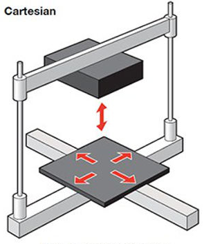

### Core XY

Otra típica arquitectura es la llamada **Core XY** que se refiere a un sistema de movimiento simétrico en los ejes que proporciona una mayor velocidad y una mayor estabilidad. El costo es una mayor complejidad en la calibración y en el montaje lo que hace que la mayoría de estas impresoras están reservadas para un usuario más especializado:

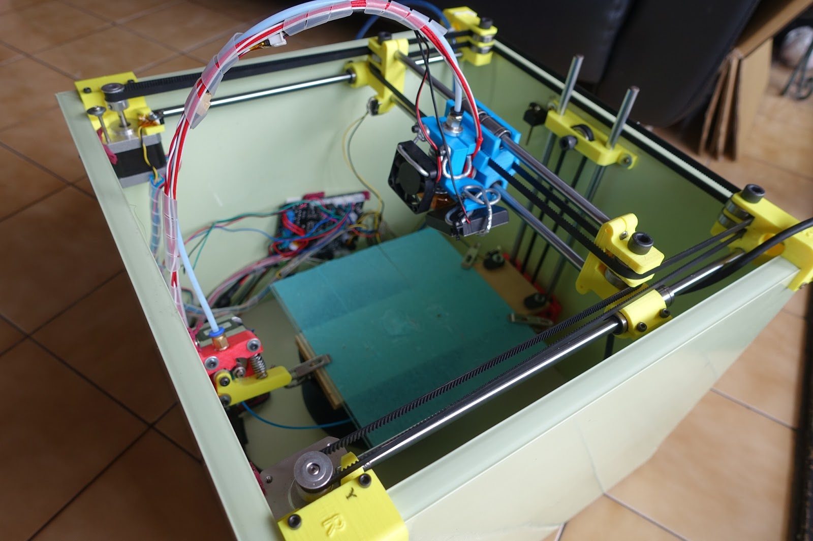

Si utilizamos una mecánica más compleja como la core xy nos podemos encontrar que reparar alguno de los típicos problemas sea más complicado para el usuario medio.

## Impresoras Delta

Las impresoras de arquitectura  **Delta** tienen simetría cilíndrica y permiten conseguir una gran velocidad dado fractura además están muy pensadas para trabajar con pieza con simetría cilíndrica y permiten escalar fácilmente la altura para conseguir un tamaño de impresión en el eje z muy elevado. 

Veamos un modelo antiguo para entender la complejidad. En este caso hay un motor en cada uno de los 3 ejes que mueve una varilla roscada para deslizar verticalmente el patín.

Veamos un modelo comercial donde se utilizan patines que deslizan por la estructura de los ejes que está hecha con perfiles de aluminio:

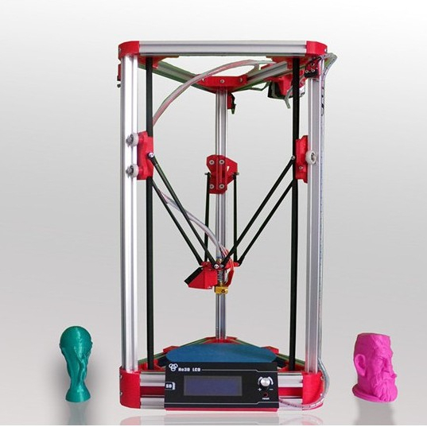

El movimiento del extrusor se consigue mediante movimientos paralelos de 3 patines por cada uno de los ejes verticales. La diferencia entre la altura de ellos da lugar a los desplazamientos en el plano XY del extrusor.

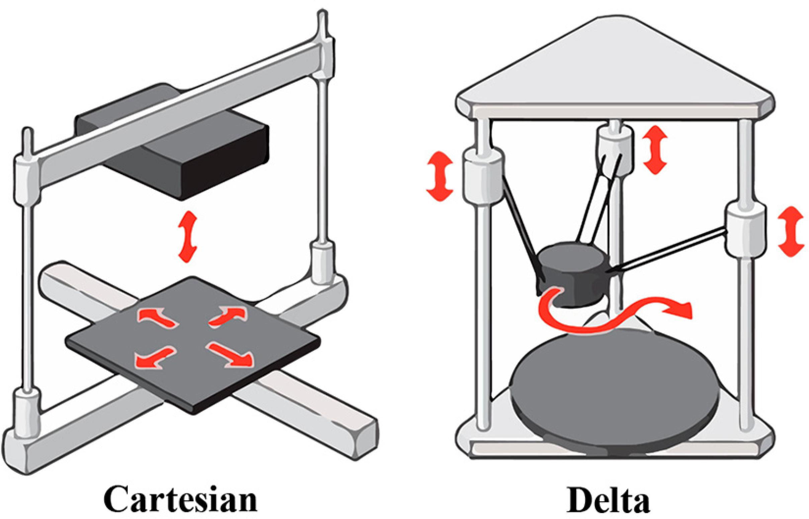

Estas impresoras consiguen una gran velocidad de impresión, pero el proceso de calibrado es bastante más complejo que las cartesianas.

## Impresoras colgantes

HangPrinter o impresora colgante: se trata de una impresora sin estructura, que está suspendida con unas cuerdas que están fijadas en el exterior, como por ejemplo en las paredes y techo de la habitación. La  impresora, que no es más que el extrusor suspendido y un conjunto de poleas y motores que enrollan o liberan cuerda, se va moviendo para depositar el material fundido:

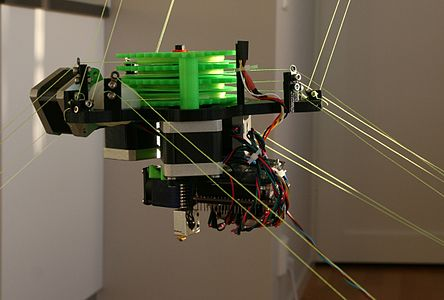

La impresora colgada y fijada a distintos puntos.

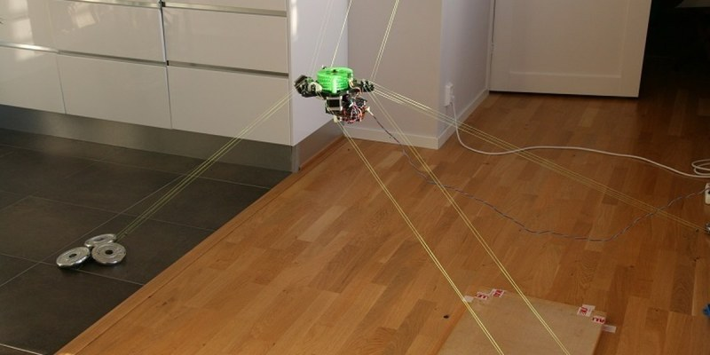

El calibrado se consigue ajustando las distancias de las cuerdas.

El límite para el tamaño de las piezas a imprimir es el espacio dónde hayas colgado la impresora ¡y la cantidad de filamento de que dispongas!, como puedes ver en esta torre de 4m de alta:

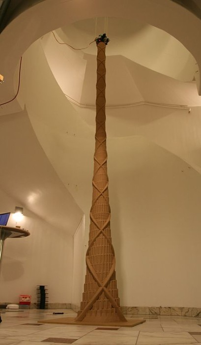 

### Impresoras de caja cerrada

Las impresoras de caja cerrada tienen varias ventajas:

* Por un lado conseguimos una mayor seguridad dado que no se puede acceder a los componentes que están a alta temperatura
* Por otro lado conseguimos también una mayor estabilidad de la temperatura consiguiendo de esta forma evitar que el filamento no se produzcan separaciones y fisuras entre capas.

## Brazos robótico que imprimen

Últimamente estamos viendo la aparición de impresoras que no somos otra cosa que un brazo robótico al que se le coloca una herramienta en el extremo que es un fusor u otro dispositivo que deposita algún material (hormigón, chocolate,...) 

De esta forma aprovechamos la precisión y la velocidad de movimiento del brazo robótico para conseguir una impresora 3D que puede conseguir muy buenos resultados:

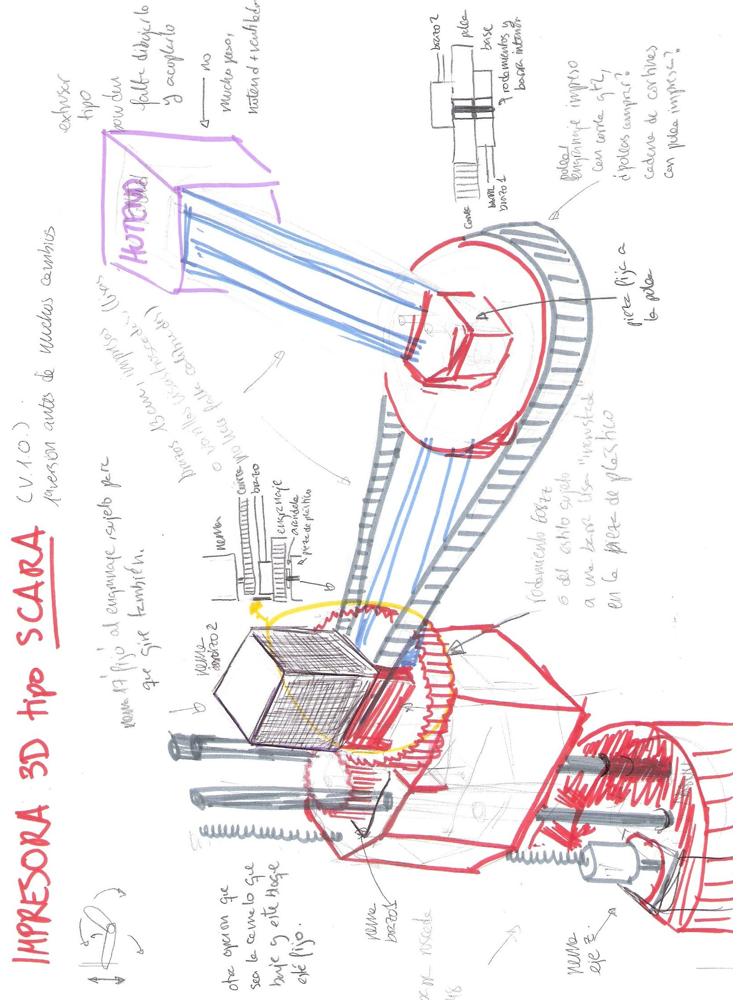

Otro ejemplo cada vez más habitual es utilizar impresoras 3D en el mundo de la construcción:

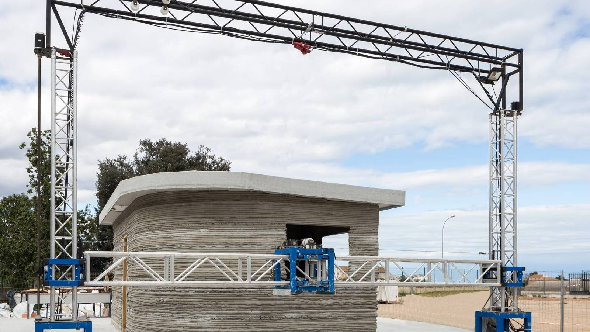

Ya se pueden encontrar comercialmente estos equipos:

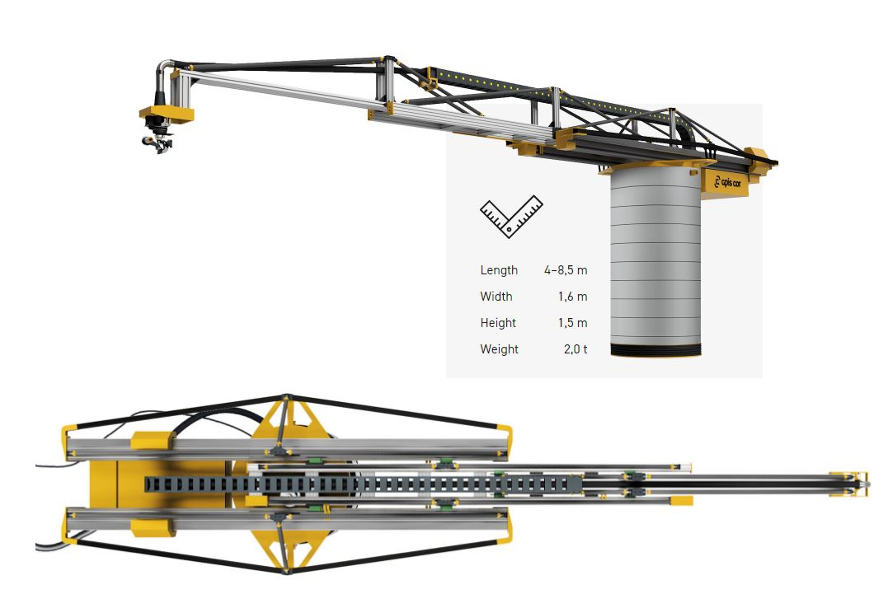

También podemos encontrar impresoras que imprimen alimentos, como por ejemplo esta impresora de chocolate

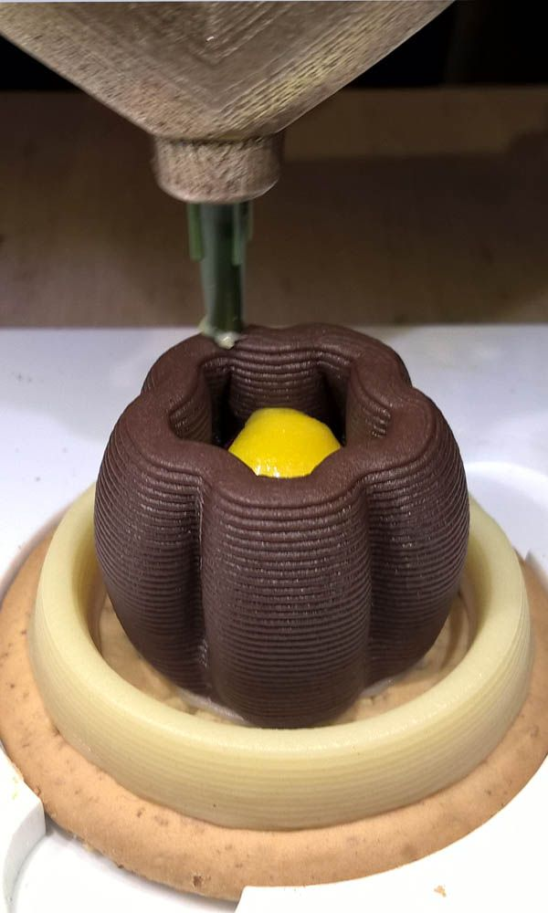

