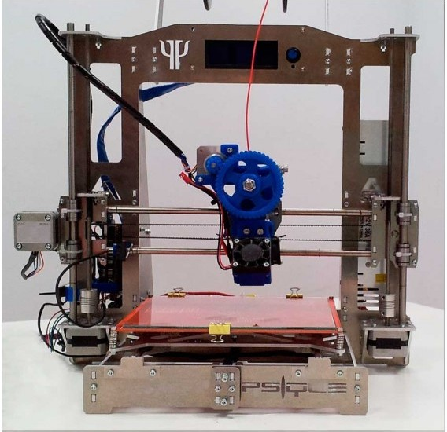

# Impresora Prusa i3

(Modelo Psyque de Createc 3D)

Se trata de una variante de la clásica impresora Prusa i3 a la que se le ha sustituido la estructura de varillas por un conjunto de elementos metálicos consiguiendo así una gran rigidez que nos permite alcanzar grandes velocidades.

