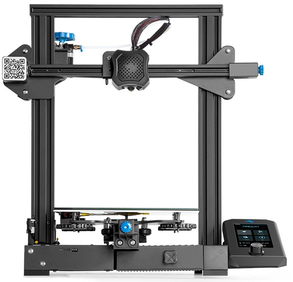

## Impresora Creality Ender 3 v2

El modelo Creality Ender V2, es una actualización del éxito de ventas Ender 3 de creality.

Dispone de una pantalla a color que no es táctil y que podemos controlar con el típico mando rotatorio. Dispone de una base de impresión magnética de muy buena adherencia.

El montaje es rápido y se puede tener lista la impresora en menos de 1 hora obtienéndose resultados de bastante calidad. 

Se trata de impresora de batalla, capaz de imprimir durante bastantes horas con muy buen funcionamiento.

