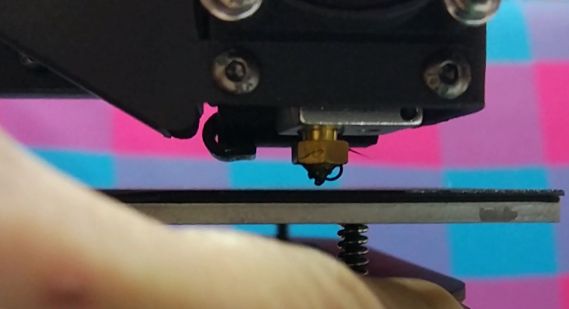

## Impresora: Kingroon KP3s

[Tienda KingRoom](https://es.aliexpress.com/store/1905393)

[KingRoom KP3S](https://es.aliexpress.com/item/4001279175159.html?spm=a2g0o.store_home.singleImageText_6000324340063.0)

Es una impresora ideal cuando tienes pocos espacio y la superficie de impresión es de 180 x 180mm. El único pero es que el ventilador del extrusor es muy ruidoso

Me gusta mucho la calidad de la impresora KingRoon KP3s  porque viene perfectamente cableada, los cables están muy bien protegidos y además incluye una cinta que nos permiten hacer que el tubito para el filamento se adapte perfectamente a la posición de nuestro rollo de filamento.

El diseño es bastante elegante y robusto

Tiene una estructura muy sólida basada en T-slot e incluye guías lineales

También incluye repuestos, unos metros de filamento y todas las herramientas necesarias para el montaje y uso.

Zona de impresión : 180 x 180 x 180mm
Resolución de impresión: 0,05 - 0,3mm
Tamaño de la máquina: 280 x 285 x 370mm
Fuente de alimentación: 24V 15A 360W

Tiene un extrusor directo que viene completamente montado

## Calibración

Sólo necesitamos calibrar el eje Z y que la base esté nivelada en todas las esquinas.

1. Ajustamos que la boquillas se quede muy cerca de la base (que podamos deslizar una hoja de papel entre ambas)

En la imagen se puede ver una distancias excesiva

Para reducirla ajustamos con el tornillo del eje Z   que ajusta el punto en el que el motor Z se para al tocar el final del carrera del eje Z

Vamos haciendo Home del eje Z desde la opción "Homming" del menú, hasta que la boquilla está muy cerca de la base.

2. Una vez lo hemos acercado vamos a comprobar el nivelado de la base, para ello entramos en menú "Leveling", donde iremos comprobando el ajuste de la altura de la boquilla en cada uno de los 5 puntos, ajustándolo con las ruedas de cada esquina.

[Vídeo: Calibrado del eje Z de la impresora Kingroon  KP3s](https://youtu.be/W9fHBA8sDYU)

## Configuración de Slicers

### Configuración de Ultimaker Cura

[Vídeo: Configuración de Ultimaker  Cura  para la impresora 3D Kingroon KP3s](https://youtu.be/svuQmR8ayqE)

### Configuración de Prusa Slicer

[Vídeo: Configuración de PrusaSlicer para Impresora 3D Kingroon KP3s](https://youtu.be/_o9P8IFTHUI)

## Menú de uso

[Vídeo: Menú de la impresora 3D Kingroon KP3S](https://youtu.be/0mlIJfO5uq0)

### Despegando una pieza

La impresora dispone de una superficie magnética que mejora la adherencia al mismo tiempo que nos facilita el separar las piezas

[Vídeo: Despegando una pieza impresa en Kingroon KP3s](https://youtu.be/qTbd1WMmKlg)

## Mejoras

[Vídeo: Mejoras a la impresora 3D Kingroon KP3s](https://youtu.be/4o_p7YZYxN8)

[Soporte fuente](https://www.thingiverse.com/thing:4740318)

[Soporte fuente de alimentación vertical](https://www.thingiverse.com/thing:4671163)

[Portarollo sobre la fuente de alimentación](https://www.thingiverse.com/thing:4611818)

[Portarollo sobre el eje Z](https://www.thingiverse.com/thing:4600120)

[Portarollos sobre el eje Z](https://www.thingiverse.com/thing:4783450)

## Referencias

[Review detallada](https://3dprintbeginner.com/kingroon-kp3s-review/)