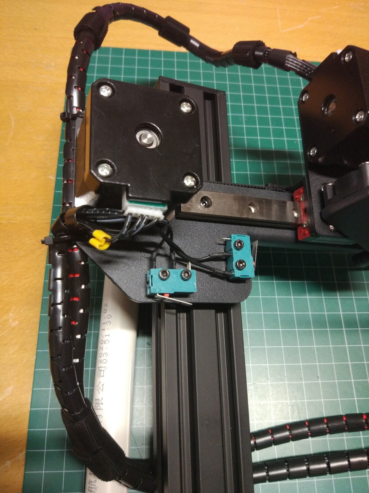
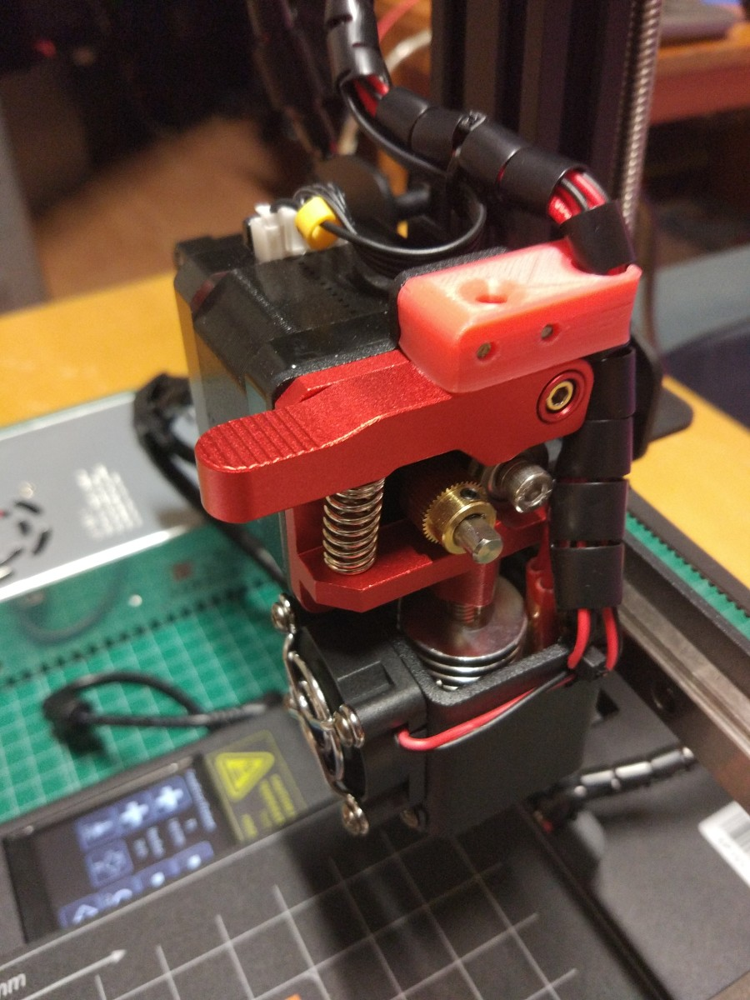

## Impresora: Kingroon KP3s

La impresora Kingroon KP3s es una impresora ideal cuando tienes poco espacio. A pesar de ello sigue teniendo una superficie de impresión de 180 x 180mm. El único pero es que el ventilador del extrusor es muy ruidoso.

Me gusta mucho la calidad de la impresora KingRoon KP3s  porque viene perfectamente cableada, los cables están muy bien protegidos y además incluye una cinta que nos permiten hacer que el tubito para el filamento se adapte perfectamente a la posición de nuestro rollo de filamento.

El diseño es bastante elegante y robusto con un eje Z que utiliza un perfil de aluminio de 40x20mm.

Tiene una estructura muy sólida basada en T-slot e incluye guías lineales, que le dan un movimiento muy suave.

También incluye repuestos, unos metros de filamento y todas las herramientas necesarias para el montaje y uso.

Zona de impresión : 180 x 180 x 180mm
Resolución de impresión: 0,05 - 0,3mm
Tamaño de la máquina: 280 x 285 x 370mm
Fuente de alimentación: 24V 15A 360W

Tiene un extrusor directo que viene completamente montado

