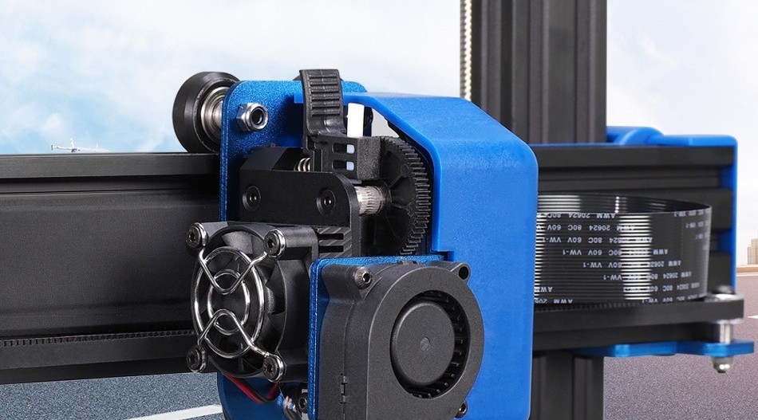

## Impresora [Artillery Genius](https:/artillery3d.es/artillery-genius/)

Se trata de una impresora robusta (y por tanto pesada) y del típico formato cartesiano. Según el fabricante es ultrasilenciosa.

En la documentación aparece que el tamaño máximo de impresión es 220x220x250 mm, ocupando un espacio de 430x390 mm.

El rollo de filamento se coloca encima de la impresora. Cuenta con un sensor de filamento, junto al rollo, que detiene la impresión si el filamento se acaba o rompe.

La impresora tiene un muy buen acabado y muy robusto lo que nos va a permitir alcanzar una buena velocidad de impresión:

Estas son las características según la documentación del fabricante:

La impresora tiene unas muy buenas características:

Según el fabricante viene montada en un 95% lo que hace muy rápido el ensamblado. Tiene un buen sistema de integración de cables que deja un montaje muy limpio.

Para acceder a los ficheros gcode podemos utilizar una tarjeta SD o un pendrive USB.    

Usa un extrusor directo Titan Extruder, sin duda una garantía de calidad.

Dispone de una base de material cerámico con aparentemente muy buena adherencia:

