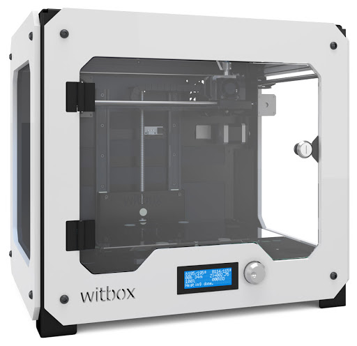

# Bq Witbox

Dimensiones de impresión: X: 295mm/ Y220mm/ Z200mm

Cama fría, es decir no podemos calentar la base.

Podemos abrir la carcasa con unos tornillos para liberar el metacrilato de arriba.

Usa un extrusor de doble engranaje (muy adecuado para flexible) (no es bowden)

Incluye un sensor capacitivo para autonivelado

La cama se puede retirar  y está fijada por imanes

Extrusor unibody con tornillo para ajustar la presión del filamento en el extrusor (necesario ajustar para el flexible)

Utiliza una placa de electrónica propia

Tarjeta junto a la pantalla

[Perfil witbox 2 para cura](https://github.com/bq/printing-profiles/archive/BQ_Witbox_2.zip) ([Soporte Bq](https://www.bq.com/es/support/witbox-2/support-sheet))

