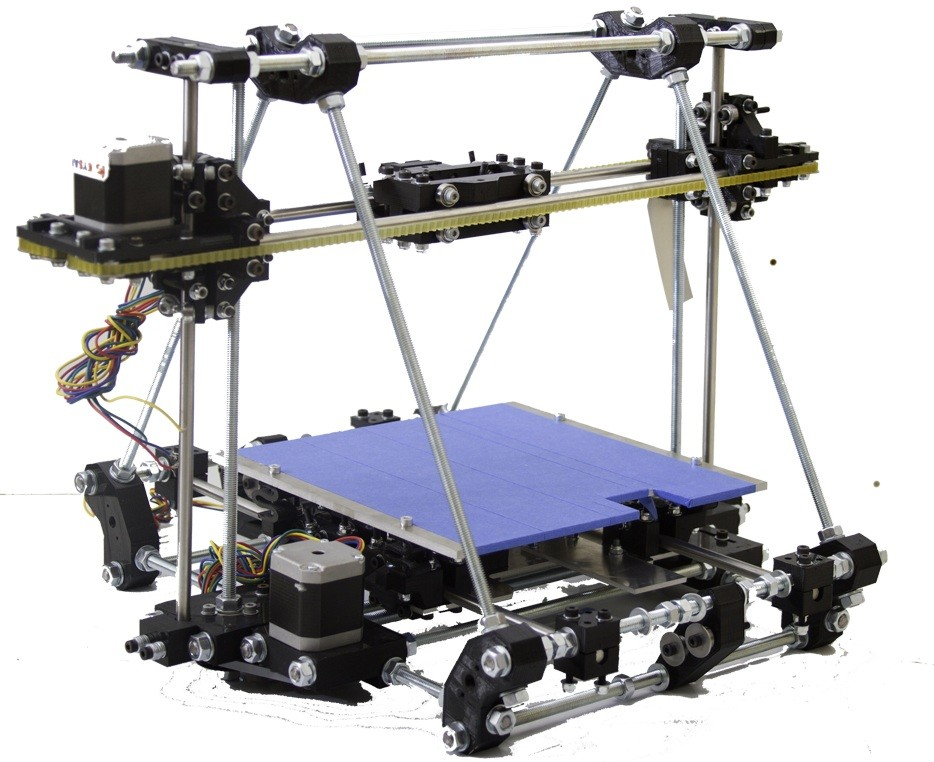

[Comparativa de impresoras 3D](http://comohacer.eu/comparativa-impresoras-3d/#Comparativa_de_impresoras_3D)

[Otra comparativa](http://buenosybaratos.es/electronica/impresora-3d/las-mejores-impresoras-3d/)

### Modelos comerciales

* Makerbot
 

* ultimaker

* bq: witbox

### Kits

