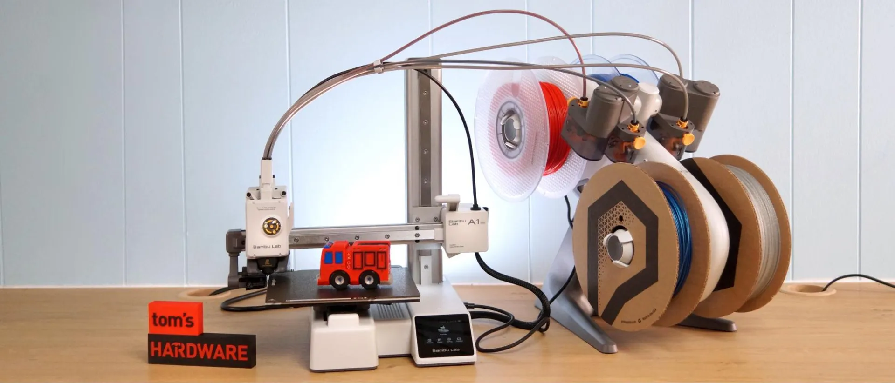

## Análisis de las impresoras Bambu Lab A1, A1 Mini y el sistema AMS

Bambu Lab ha revolucionado el mercado de las impresoras 3D con sus modelos A1 y A1 Mini, dirigidos a usuarios que buscan velocidad, facilidad de uso y capacidades avanzadas como la impresión multicolor. Además, su sistema AMS (Automatic Material System) añade una capa extra de funcionalidad al permitir la impresión con múltiples materiales o colores. A continuación, exploraremos las características, ventajas e inconvenientes de estas impresoras y su comparación con modelos populares como la Creality Ender 3.

(Imágenes cortesía de @impresoen3dmx)

---

### **Bambu Lab A1**

**Características principales**:
- **Volumen de construcción**: 256 x 256 x 256 mm.
- **Materiales soportados**: PLA, PETG, TPU (hasta 300 °C).
- **Velocidad máxima**: 500 mm/s.
- **Nivelación automática de la cama**.
- **Placa de construcción flexible con recubrimiento PEI**.
- **Sistema Direct Drive para mayor precisión en materiales flexibles**.
- **Pantalla táctil a color de 2.4 pulgadas**.
- **Conectividad WiFi y MicroSD**.

**Ventajas**:
1. **Velocidad y precisión**: Es una de las impresoras cartesianas más rápidas del mercado, alcanzando hasta 500 mm/s con una aceleración de 10,000 mm/s²[1].
2. **Compatibilidad con AMS Lite**: Permite impresión multicolor con hasta 4 colores, ideal para proyectos creativos[1][3].
3. **Facilidad de uso**: Interfaz intuitiva y montaje sencillo (95% preensamblada)[1].
4. **Precio competitivo**: Disponible desde $399 sin AMS y $559 con AMS Lite, ofreciendo alta calidad a un precio razonable[1].

**Inconvenientes**:
- **Espacio ocupado por el AMS Lite**: Aunque útil, el sistema ocupa mucho espacio en el escritorio[1].

- **Desperdicio en cambios de color**: Durante los cambios de color, el AMS flinge material purgado, generando desechos[1][5].

---

### **Bambu Lab A1 Mini**

**Características principales**:
- **Volumen de construcción reducido**: 180 x 180 x 180 mm.
- **Materiales soportados similares al A1**, pero no recomendada para materiales más técnicos como ABS o ASA[2].
- **Velocidad máxima y aceleración iguales al modelo A1 (500 mm/s)**.
- **Cámara integrada para monitoreo remoto y timelapses**.
- Incluye calibración automática avanzada y control de flujo activo para mejorar la calidad de impresión[5].

**Ventajas**:
1. **Compacta y silenciosa**: Ideal para espacios pequeños y con cancelación activa del ruido del motor[2][5].
2. **Fácil instalación y uso inmediato**: Llega completamente ensamblada y lista para imprimir en minutos[5][6].
3. **Precio accesible**: Desde $299 sin AMS Lite, es una opción económica para principiantes que buscan calidad profesional[5][6].
4. **Multicolor asequible**: Con AMS Lite (opcional), permite impresión multicolor a bajo costo[5].

**Inconvenientes**:
- **Volumen limitado de construcción**: No es adecuada para proyectos grandes; los objetos deben imprimirse en partes separadas[5].
- **AMS Lite exclusivo del modelo Mini**, limitando su compatibilidad futura si se opta por otras impresoras Bambu Lab más grandes[6].

---

### **Sistema AMS (Automatic Material System)**

El AMS es un accesorio opcional que mejora significativamente la experiencia al permitir la impresión multicolor o multimaterial sin interrupciones.

#### Ventajas del AMS:
1. **Impresión sin interrupciones**: Cambia automáticamente entre filamentos cuando uno se agota, reduciendo desperdicios[3][4].
2. **Manejo inteligente del filamento**: Detecta enredos o humedad en el filamento, evitando fallos en la impresión[3][4].
3. **Compatibilidad amplia con materiales comunes como PLA, PETG o ABS**, aunque requiere configuración manual para filamentos no oficiales de Bambu Lab[3].
4. **Secado del filamento integrado**, manteniéndolo en condiciones óptimas para mejores resultados[3][4].

#### Inconvenientes del AMS:
- Ocupa espacio adicional en el escritorio.
- Genera residuos durante los cambios de color debido al purgado del material[4][5].

---

### Comparativa con Creality Ender 3

| Característica                | Bambu Lab A1 / A1 Mini          | Creality Ender 3                     |
|-------------------------------|----------------------------------|---------------------------------------|
| Volumen de construcción       | A1: 256x256x256 mm / Mini: 180x180x180 mm | 220x220x250 mm                      |
| Velocidad máxima              | Hasta 500 mm/s                 | ~60 mm/s                              |
| Nivelación automática         | Sí                             | Solo en modelos mejorados (Ender 3 V2 Neo) |
| Facilidad de uso              | Muy alta (calibración automática) | Baja (requiere ajustes manuales)     |
| Precio inicial                | $299-$399                      | Desde ~$200                          |
| Impresión multicolor          | Con AMS                        | No compatible                        |
| Comunidad y soporte           | Menor comunidad                | Amplia comunidad                     |

La Creality Ender 3 sigue siendo una opción económica y versátil para quienes buscan personalización y aprendizaje técnico. Sin embargo, las impresoras Bambu Lab destacan por su facilidad de uso, velocidad superior y capacidades avanzadas como la impresión multicolor.

---

### Conclusión

Las Bambu Lab A1 y A1 Mini son opciones sobresalientes para quienes desean una experiencia sencilla pero potente en impresión 3D. Mientras que la A1 es ideal para proyectos más grandes o usuarios avanzados, la Mini está diseñada para principiantes o quienes priorizan un equipo compacto. El sistema AMS añade valor significativo al permitir impresiones multicolor sin complicaciones.

Aunque más caras que la Creality Ender 3, las impresoras Bambu Lab justifican su precio con características modernas que eliminan muchas frustraciones comunes en la impresión 3D tradicional.

(Resumen elabora con la ayuda de perplexity.ia)

Citations:
[1] https://www.tomshardware.com/3d-printing/bambu-lab-a1-review
[2] https://us.store.bambulab.com/products/a1-mini
[3] https://eu.store.bambulab.com/products/ams-multicolor-printing
[4] https://shop3d.ca/products/bambu-lab-ams-automatic-material-system
[5] https://3dprinteracademy.com/blogs/3d-printers/bambu-lab-a1-mini-pros-and-cons
[6] https://www.cnet.com/tech/computing/bambu-lab-a1-mini-combo-3d-printer-review-color-printing-at-a-fantastic-price/