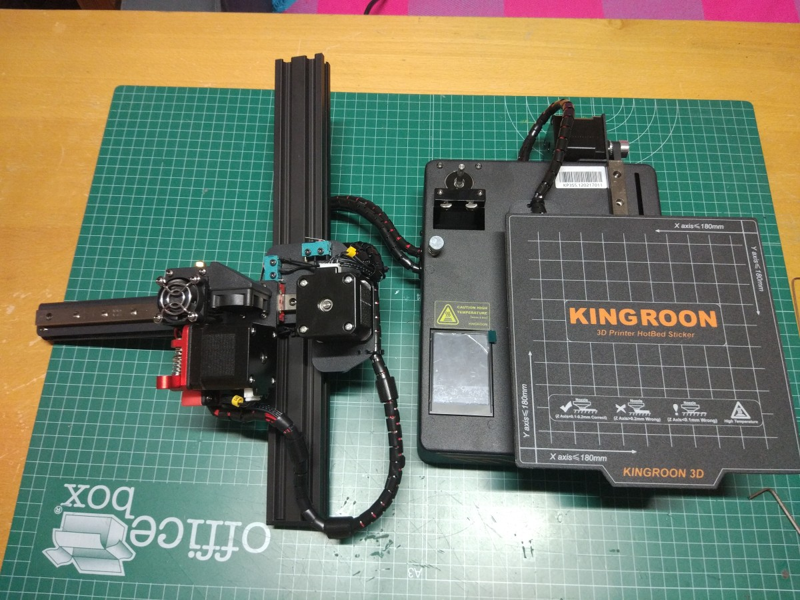
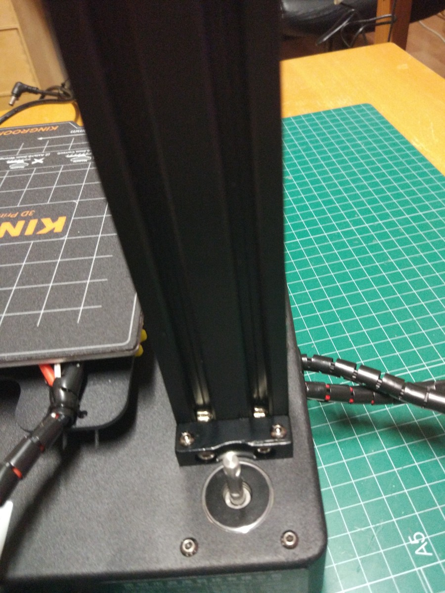
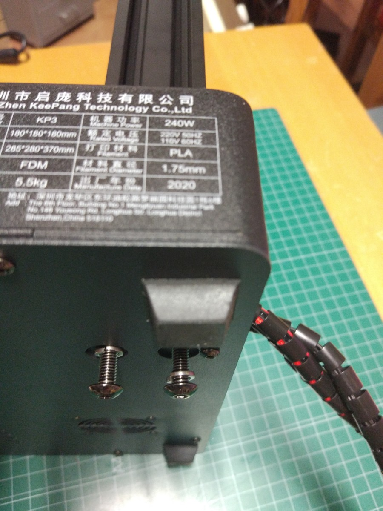
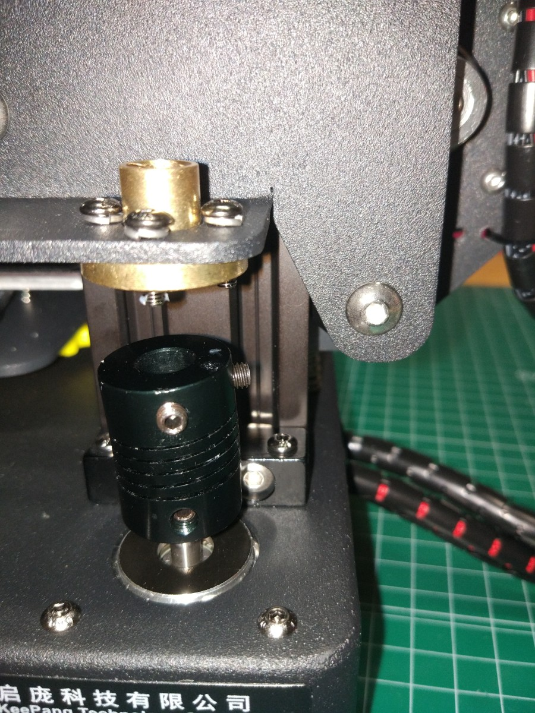

## Montaje KingRoon KP3s

El montaje de la impresora quien room kp13 es muy sencillo:

El cableado viene completamente hecho, además de excelentemente protegido

Lo único que tenemos que hacer es conectar el eje z colocarlo en el hueco que viene dispuesto para ello.

Fijarlo con unos tornillos por la parte de abajo 

Colocamos el adaptar del motor y el husillo, atornillando la parte más estrecha del lado del motor

Colocamos el usillo pasándolo por la rosca brazo X

Y atornillamos el adaptador

Y una vez que lo hemos terminado de colocar calibrar la impresora se puede realizar todo el trabajo en menos de 10 minutos
