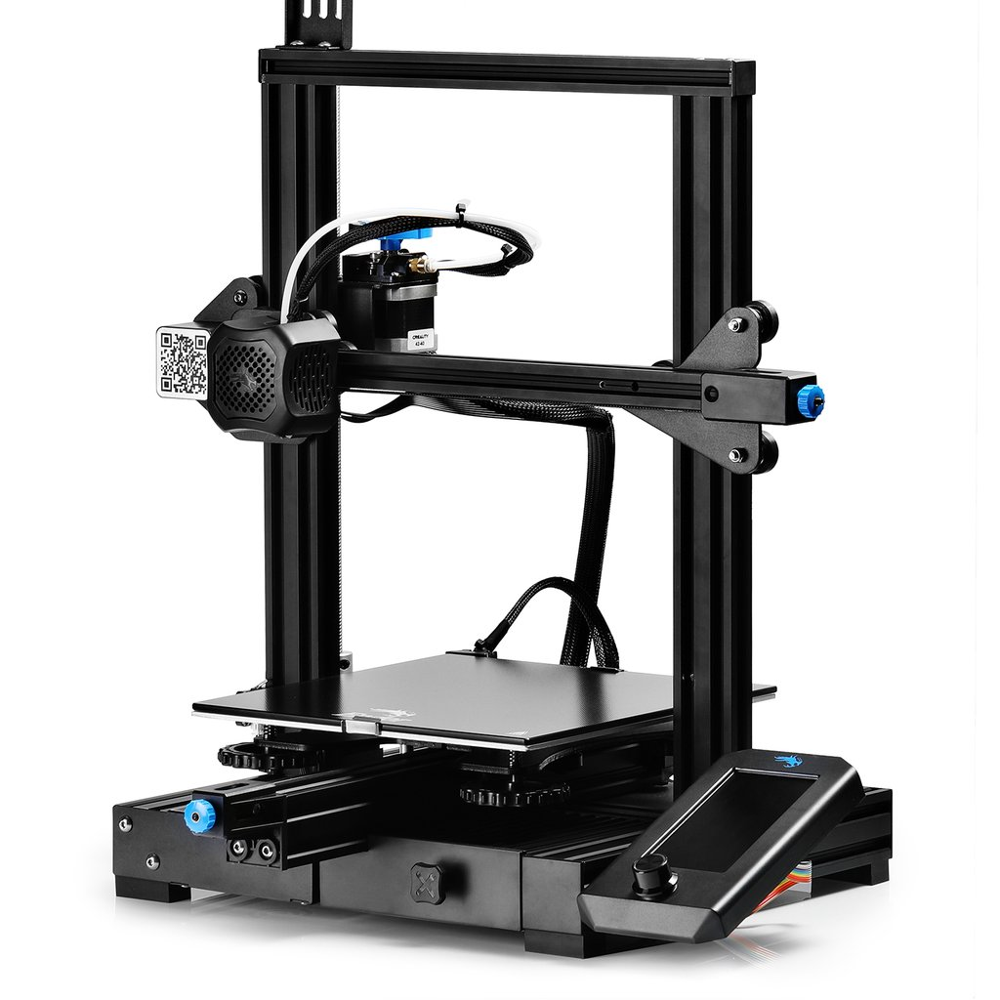

## Montaje de una impresora Creality Ender 3 V2

Vamos a realizar el montaje de una impresora modelo Creality Ender 3 v2

Hemos preparado unos vídeos con el proceso de montaje:

1. Contenido del paquete

[Vídeo: 1. Contenido del paquete - Creality Ender 3 v2](https://drive.google.com/file/d/1-lhwVZF7cd9wMKN4AqcSH6OzOWoak-Kp/view?usp=sharing)

2. Montaje de la estructura del eje Z

Mientras montamos la impresora la estructura debemos de dejar los tornillos un poquito suelto hasta que esté todo montado y luego damos un apretón general si lo apretamos desde el principio podemos dar lugar a malas geometría.

[Vídeo: 2.  Montaje de la estructura del eje z - Creality Ender 3 v2](https://drive.google.com/file/d/1w3ZYrGTweIu_09Ysh6e0dXp_q7yvPwIX/view?usp=sharing)

3. Montaje del motor y husillo (varilla) eje Z

[Vídeo: 3. Montaje del motor y husillo (varilla) eje z - Creality Ender 3 v2](https://drive.google.com/file/d/1aj4GZhFyhrI-gl7gg6bAS73_CsX3sDp2/view?usp=sharing)

4. y 5. Montaje del eje X 

[Vídeo: 4. Montaje del eje X - Creality Ender 3 v2](https://drive.google.com/file/d/1Wl0T8hapBZB23pSYAxj1JK-AwVcdsc14/view?usp=sharing)

6.  Montaje de la parte superior marco y 7. Colocación del soporte de la pantalla 

[Vídeo: 6.  Montaje de la parte superior marco - Creality Ender 3 v2](https://drive.google.com/file/d/1kGopw4pjZAy1JeWtiGvaLSh8E62OVaWp/view?usp=sharing)

8. Montaje del tubo de filamento y 9. conexión de la toda la electrónica

[Vídeo: 8. Montaje del tubo de filamento y 9. conexión de la toda la electrónica](https://drive.google.com/file/d/1W0YuAXXjN3YvCB5Hqzw3JQiCm3oVmkZm/view?usp=sharing)

