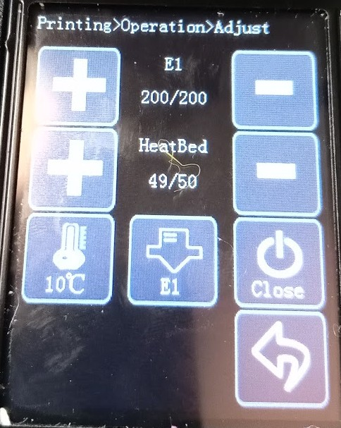
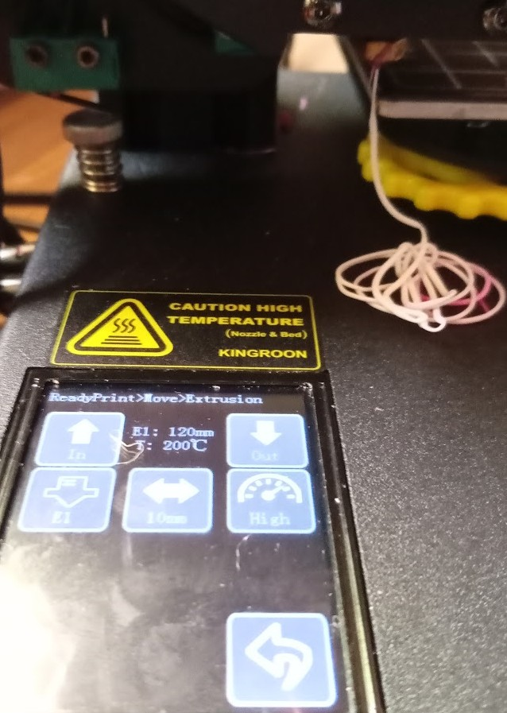

## Uso habitual de una impresora 3D

A lo largo de este módulo vamos a ver las distintas acciones que haremos en nuestro uso diario de la impresora:

* Menús de la impresora
* Calibración
* Configuración de Cura y Prusa Slicer
* Impresión de piezas
* Cambio de filamento
* Adherencia a la placa

También veremos como resolver algunos de los problemas más frecuentes como son los atascos.

En la parte práctica veremos cómo hacerlo en 3 impresoras distintas:

* Prusa I3 clónica
* Creality Ender 3 v2
* Kingroom KP3S

### Menús

En casi todas las impresoras las opciones del menú suelen dividirse en estos tipos:

* Preparar (Prepare): opciones para usar **antes** de imprimir
    * Precalentar (Preheat)
    * Movimientos de los ejes: donde podemos mover los motores de todos los ejes y el extrusor, seleccionando la dirección y el paso (1mm, 5mm y 10mm)
    
    * Ir al origen o AutoHome
    * Apagar motores: los desbloquea para que podamos mover libremente los ejes.
* Control: configuración de la impresora
* Menú SD: para seleccionar lo que queremos imprimir
* Ajustes/configuración

También hay opciones que se activan mientras imprimimos:

* Parar(Stop)/Pause: parar o pausar la impresión. Normalmente al hacerlo el extrusor se retira hasta la posición de Home.

* **Ajustes**: para modificar algunos parámetros. Podemos modificarlos y los cambios tendrán efecto inmediatamente, modificando los valores con los que estaba configurada anteriormente. Estos valores sólo tienen efecto en la impresión actual. 
    * **Temperatura**, tanto de la base como del extrusor:
    
    * **Velocidad** (speed), que nos permite acelerar los movimientos de la impresora.
    * **Flujo** (flow) es un % que indica la cantidad de filamento que se deposita. Si es mayor que 100 veremos que se deposita más filamento y al contrario, si es menor que 100 se deposita una cantidad menor.
    Si tenemos que ajustar este parámetros es que o bien tenemos un problema de atasco o hemos configurado mal la impresión.

## Calibración de la base y el eje Z

La calibración es el proceso por el conseguimos que la boquilla del extrusor está nivelada con la base, consiguiendo que mantenga la misma distancia con esta en todos los puntos.

La calibración es un proceso que haremos con cierta frecuencia y que nos permite ajustar la altura a la que la impresora imprime su primera capa, de que esta capa esté bien adherida a la base dependerá que la pieza no se mueva a lo largo de toda la impresión.

No tenemos que hacerlo siempre, pero si cuando veamos que no hay buena adherencia o hayamos movido la impresora (por ejemplo en coche durante unos Kms, te sorprenderías de cómo las vibraciones pueden sacar un tornillo bien apretado). Es algo que tenemos que hacer de vez en cuando y sobre todo cuando veamos que la primera capa no está todo lo perfecta que debería. También ocurre que a veces el simple uso y los movimientos y vibraciones hacen que se vayan aflojando los tornillos de la base y se pierde la calibración.

Para obtener un resultado lo más preciso debemos hacerlo con la impresora calentada a la temperatura a la solemos imprimir, puesto que la base y el resto de materiales se dilata con la temperatura.

Para hacerlo sólo necesitamos una hoja de papel normal, no demasiado grueso. 

Ajustaremos la separación entre la boquilla del extrusor y la base para que podamos mover el papel pero notando un poco de resistencia.

Como repetiremos el proceso en las cuatro esquinas, necesitamos que los motores estén liberados (Disable steppers / Motor off).

## Cambio de filamento

Es un proceso que tendremos que hacer con mucha frecuencia:

1. Calentamos el extrusor hasta la temperatura correcta del filamento actual
1. Liberamos el extrusor para poder mover el filamento libremente.
1. Empujamos un poco el filamento para que extruya un poco de plástico (y evitar que queden fragmentos) y lo sacamos con decisión.
1. Calentamos el extrusor hasta la temperatura del nuevo filamento
1. Cortamos el filamento nuevo en bisel para que entre más fácilmente.

1. Introducimos el filamento manualmente, empujando hasta que vuelva a salir plástico.
1. Nos vamos a la opción de Movimientos y vemos si al accionar el motor del extrusor el filamento sale con facilidad. 

1. Si al salir filamento vemos que quedan restos del anterior, purgamos hasta que no se aprecien restos.

### Adherencia a la placa

Dependiendo del tipo de base que tengamos conseguiremos más o menos adherencia. 

Si usamos una base magnética rugosa o un cristal con textura, casi seguro que conseguiremos buena adherencia de las piezas.

Podemos añadir laca al cristal de la impresora para mejorar la adherencia, no es necesario encharcarlo, basta con una capa fina.

En mi experiencia la laca normal de peluquería funciona bien (por ejemplo la de la marca Nely).Podemos usar laca especial para impresoras, pero es la misma salvo que no tiene ese olor tan característico.

Las bases se van gastando con el uso y acaban quedando más lisas, con lo que pierden agarre.

### Primera impresión

Vamos a ver el proceso de impresión:

1. Ponemos a precalentar la impresora con el tipo de filamento que tenemos preparado (este paso no es necesario pero ahorra tiempo, mientras seleccionamos el modelo a imprimir)
1. Seleccionamos el fichero de la tarjeta SD que ya hemos colocado en la impresora y pulsamos Print
1. Si queremos modificar alguna de las características, podemos hacerlo desde el menú "Control"

### Atascos

Normalmente un atasco se produce porque se queda un resto de filamento en la parte más fría del interior del extrusor, que al enfriarse no deja pasar al filamento.

1. Calentamos por encima de la temperatura normal del filamento (pero sin excedernos del límite del extrusor)
1. Liberamos el filamento
1. Empujamos con un trozo de filamento cortado plano hasta intentar liberar los restos
1. Si no se sueltan podemos apagar el ventilador durante unos segundos para que se calienten los restos de plástico
1. Si no podemos limpiarlo podemos introducir un elemento metálico pero del grosor del plástico
1. En caso de que siga sin liberarse habría que desmontar el extrusor y hacer una limpieza a fondo.

Más adelante lo veremos en más detalle.
