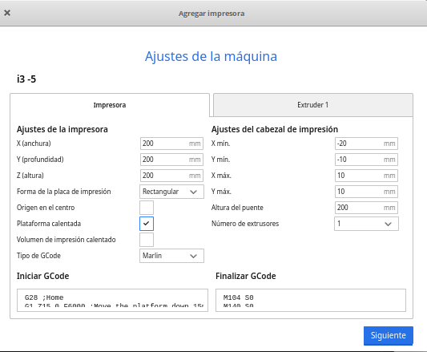

# Impresora Prusa i3

Vamos a poner en práctica lo visto en una impresora Prusa i3 más o menos estándar.

## Calibración

Para comprobarlo hacemos lo siguiente:

* Llevamos la impresora a su zona de reposo (Home) desde el menú Preparar-> Llevar al origen (Autohome). 
* El extrusor se irá a la esquina delantera izquierda de la base.
* Comprobamos que la boquilla está pegada a la base pero sin presionarla. Se suele decir que debe caber un papel en medio de las dos sin holgura, pero que tampoco esté muy suelto.

* Ahora liberamos los motores con la opción Preparar -> Apagar Motores y movemos el extrusor y la base para comprobar que la nivelación es igual en las 4 esquinas.
* Si vemos que necesitamos mover toda la base ajustaremos el tornillo que tenemos a la izquierda y que presiona el final de interruptor (final de carrera). Girando el tornillo en sentido horario bajamos la boquilla

* Si vemos que el ajuste es mejor en algunas de las esquinas, podemos ajustarlas individualmente.
* Un caso especial es cuando vemos que es el eje X, donde está el extrusor el que está inclinado. Esto ocurre por el uso o por un golpe o por diferencias entre los motores del eje Z. En este caso, con la impresora apagada, podemos hacer girar los motores del eje z manualmente.

[Vídeo: Ajuste de la nivelación del Eje X de una impresora 3D](https://drive.google.com/file/d/1hdoaiAw9J7qbV0AeS2yqRSdhrLy2Ouyj/view?usp=sharing)

## Menús de la impresora

Vamos a ver las opciones del menú más normales de las impresoras del tipo Prusa i3 (basadas en el firmware más usual: Marlin)

Tenemos los siguientes menús:

* Preparar: donde están las opciones para usar antes de imprimir
    * Precalentar
    * Movimientos
    * Ir al origen o AutoHome
    * Apagar motores
* Control: configuración de la impresora
* Menú SD: para seleccionar lo que queremos imprimir

[Vídeo: Menú de las impresoras Prusa i3 (marlin)](https://drive.google.com/file/d/1KXyxlH83L3mQCmyTu7MTxeaeZCdLO2pE/view?usp=sharing)

## Configuración de Ultimaker Cura para Prusa i3

Para configurar Cura haremos como cuando no está nuestro modelo de impresora:

1. En el menú Ajustes -> Impresoras seleccionamos Agregar Impresora
1. Seleccionamos "Agregar impresora fuera de red"
1. Seleccionamos Custom 
1. Seleccionamos Custom FFF
1. Ponemos el nombre y pulsamos Agregar
1. Configuramos el tamaño de la base y la altura (normalmente 200x200x200) y marcamos "Plataforma calentada"

1. En las opciones del extrusor marcamos el diámetro del filamento (puede ser 2.85 o 1.75mm) y el tamaño de la boquilla (normalmente 0.4)

[Vídeo: Configuración del laminador Ultimaker Cura para impresora Prusa i3](https://drive.google.com/file/d/1YI5kZu9cMVhiNSxFTa-ahqYI6PfHqR11/view?usp=sharing)

## Imprimiendo

Ya tenemos todo listo para imprimir, sólo tenemos que:

* Cargamos/importamos el modelo (fichero STL) que queremos imprimir
* Ajustamos tamaño/orientación
* Configuramos la impresión con nuestro laminador según necesitemos:

    * Modelo de impresora correcto
    * Tipo de filamento 
    * Soporte 
    * Adherencia a la base
    * % de relleno
    * Altura de capa.
* Laminamos
* Exportamos el fichero gcode a la tarjeta SD
* Ponemos la tarjeta SD en la impresora
* Desde el menú Tarjeta SD seleccionamos el fichero a imprimir

[Vídeo: Primera impresión 3D](https://drive.google.com/file/d/1ztGjMEmhPzFBuUmf5Ndr-q9rQk-kRdwm/view?usp=sharing)

Durante el proceso de impresión podemos modificar algunos parámetros y también podemos pausarlo o detenerlo definitivamente.

[Vídeo: Opciones de menú  durante la impresión (Prusa i3 Marlin)](https://drive.google.com/file/d/11eAYBx6ajirKTMayUV_MHDQaf65Nx1fF/view?usp=sharing)

Si todo va bien, la pieza se irá formando

[Vídeo: Imprimiendo](https://drive.google.com/file/d/1P8GpwKp4btxu2TcGBAl80A_R6lnMWEK7/view?usp=sharing)

## Cambio de filamento

El procedimiento es bastante estándar:

1. Calentamos el extrusor hasta la temperatura correcta del filamento actual
1. Soltamos los tornillos del extrusor que hacen presión en el filamento (idler)
1. Empujamos un poco el filamento para que extruya un poco de plástico (y evitar que queden fragmentos) y lo sacamos con decisión.
1. Calentamos el extrusor hasta la temperatura del nuevo filamento
1. Cortamos el filamento en bisel para que entre más fácilmente
1. Introducimos el filamento manualmente hasta que vuelva a salir plástico.
1. Volvemos a poner los tornillos y ajustamos la presión.
1. Movemos la rueda del extrusor para ver que el filamento fluye.

[Vídeo: Cambio de filamento impresora Prusa i3](https://drive.google.com/file/d/1Iwclf34BvFaDn8aw9BqJuZZHvk7NSwyw/view?usp=sharing)

### Adherencia a la placa

Podemos añadir laca al cristal de la impresora para mejorar la adherencia, no es necesario encharcarlo, basta con una capa fina.

A medida que la vayamos usando esa capa habrá que limpiarla pues puede llegar a ensuciar la base de las piezas, sobre todo si son oscuras.

[Vídeo: Mejorando la adherencia de la base de cristal usando laca](https://drive.google.com/file/d/1H12kx0T3WUeSj0Q8LaNFslAUjGHGRzZj/view?usp=sharing)

## Cómo transportar la impresora

Para transportar la impresora,  lo mejor es cogerla por la parte superior del marco que es dónde estructuralmente tiene más fuerza. De esa manera no vamos a estropear el calibrado.

Si hacemos un transporte en el que lleva bastante tiempo en coche hola estamos moviendo por un sitio que hay muchos botes muchos baches y que convendría hacerle una recalibración.

## Resolución de problemas

Vamos a ver algunos de los más frecuentes.

### Atascos

Normalmente un atasco se produce porque se queda un resto de filamento en la parte más fría del interior del extrusor, que al enfriarse no deja pasar al filamento.

1. Calentamos por encima de la temperatura normal del filamento (pero sin excedernos del límite del extrusor)
1. Liberamos el filamento
1. Empujamos con un trozo de filamento cortado plano hasta intentar liberar los restos
1. Si no se sueltan podemos apagar el ventilador durante unos segundos para que se calienten los restos de plástico
1. Si no podemos limpiarlo podemos introducir un elemento metálico pero del grosor del plástico
1. En caso de que siga sin liberarse habría que desmontar el extrusor y hacer una limpieza a fondo.

[Vídeo: Limpiando un atasco en el extrusor](https://drive.google.com/file/d/1zHWpmBLXWb0npZbdsPAwD9CHN5-iAS-e/view?usp=sharing)

## Símbolo raros en la pantalla 

En las versiones más antiguas ocurría que la pantalla de la impresora pierde los caracteres y se llena de símbolos extraños. Lo que tenemos que hacer es pulsar el botoncito y se repinta.

