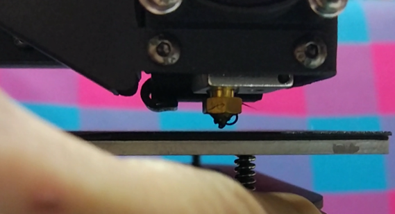
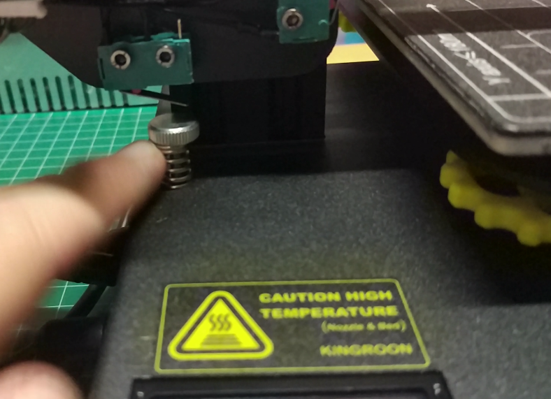
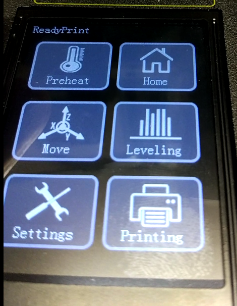

## Impresora Kingroon KP3S

La mayoría de los procesos son muy similares a los vistos anteriormente.

## Calibración

Sólo necesitamos calibrar el eje Z y que la base esté nivelada en todas las esquinas.

1. Ajustamos que la boquillas se quede muy cerca de la base (que podamos deslizar una hoja de papel entre ambas)

En la imagen se puede ver una distancias excesiva

Para reducirla ajustamos con el tornillo del eje Z   que ajusta el punto en el que el motor Z se para al tocar el final de carrera del eje Z

Vamos haciendo Home del eje Z desde la opción "Homming" del menú, hasta que la boquilla está muy cerca de la base.

2. Una vez lo hemos acercado vamos a comprobar el nivelado de la base, para ello entramos en menú "Leveling", donde iremos comprobando el ajuste de la altura de la boquilla en cada uno de los 5 puntos, ajustándolo con las ruedas de cada esquina.

[Vídeo: Calibrado del eje Z de la impresora Kingroon  KP3s](https://youtu.be/W9fHBA8sDYU)

### Configuración de Ultimaker Cura

Vamos a ver cómo configura Ultimaker Cura para imprimir con la impresora Kingroon KP3s:

[Vídeo: Configuración de Ultimaker  Cura  para la impresora 3D Kingroon KP3s](https://youtu.be/svuQmR8ayqE)

### Configuración de Prusa Slicer

Vamos a ver cómo configura Prusa Slicer para imprimir con la impresora Kingroon KP3s:

[Vídeo: Configuración de PrusaSlicer para Impresora 3D Kingroon KP3s](https://youtu.be/_o9P8IFTHUI)

## Menú de uso

Los menús son muy similares a los ya vistos:

[Vídeo: Menú de la impresora 3D Kingroon KP3S](https://youtu.be/0mlIJfO5uq0)

### Despegando una pieza

La impresora dispone de una superficie magnética que mejora la adherencia al mismo tiempo que nos facilita el separar las piezas

[Vídeo: Despegando una pieza impresa en Kingroon KP3s](https://youtu.be/qTbd1WMmKlg)

