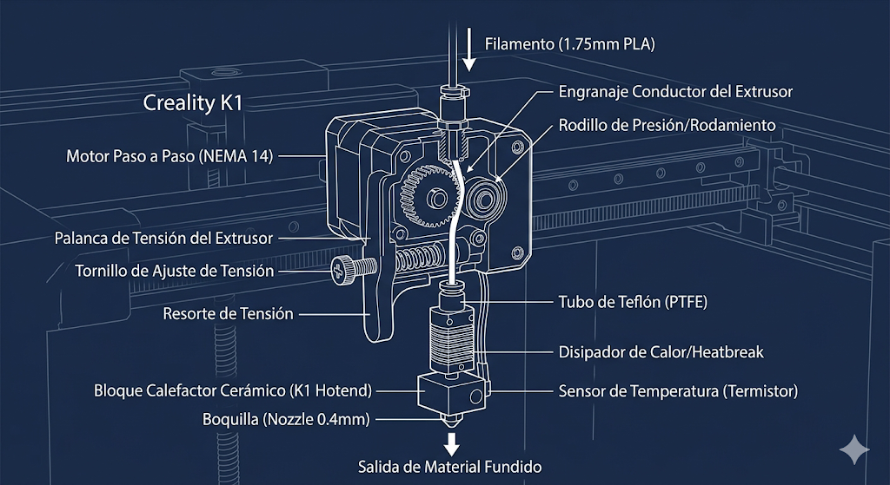
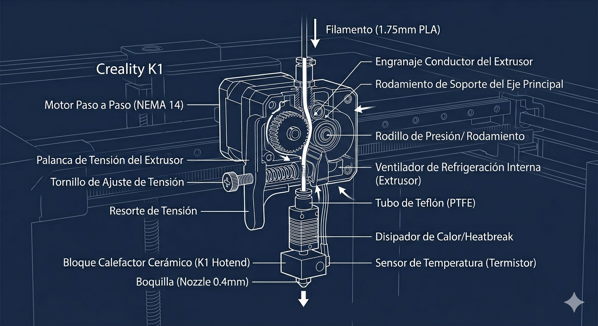
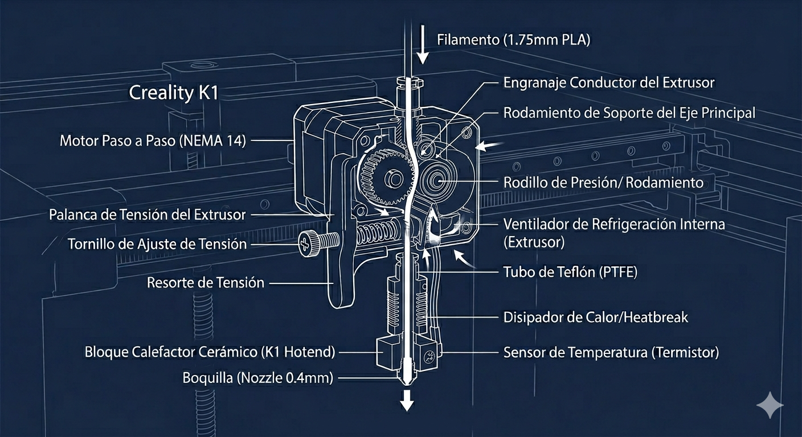
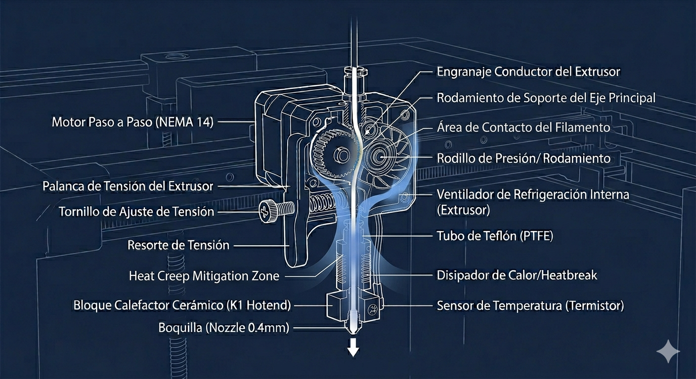

# Guía Completa de Uso: Creality K1

La Creality K1 es una impresora moderna, de arquitectura CoreXY de alta velocidad y conectada a la red. Esta guía cubre desde el primer encendido hasta la optimización de tus impresiones.

## 1. Puesta en Marcha y Calibración Inicial

Antes de lanzar tu primera impresión, es vital asegurar que la máquina esté correctamente nivelada y configurada.

- Desembalaje y Retirada de Tornillos: Asegúrate de haber retirado los 3 tornillos de seguridad de la cama (marcados con etiquetas amarillas) que evitan que se mueva durante el transporte.
    
- Autocalibración: En la pantalla táctil, ve a Settings > Self-check. Selecciona "Auto-leveling" e "Input Shaping". Esto compensará las vibraciones a altas velocidades y mapeará la superficie de la cama.
    

## 2. Carga y Cambio de Filamento

El sistema de extrusión directa de la K1 requiere un manejo específico:

1. Coloca el carrete en el soporte trasero o lateral.
    
2. Introduce el filamento por el sensor de agotamiento hasta que llegue al extrusor.
    
3. En la pantalla, selecciona Extrude/Retract.
    
4. Mueve la palanca del extrusor a la posición "Unlock" (desbloqueado), empuja el filamento hasta que no avance más y vuelve a poner la palanca en "Lock" (bloqueado).
    
5. Pulsa Extrude en la pantalla. La boquilla se calentará y empezará a purgar el material.
    

## 3. Preparación de Archivos (Slicing)

Para aprovechar la velocidad de la K1, es recomendable usar Creality Print o Orca Slicer con los perfiles específicos de la K1.

|Parámetro|Valor Sugerido (PLA)|
|---|---|
|Velocidad de impresión|300 - 600 mm/s|
|Temperatura Boquilla|220°C - 230°C (para flujo alto)|
|Temperatura Cama|45°C - 60°C|

## 4. Interfaz Web y Control Remoto

La K1 incluye conectividad Wi-Fi. Puedes gestionar la impresora desde tu navegador:

- Busca la dirección IP en Settings > Network.
    
- Introduce esa IP en tu navegador para acceder a Creality OS (basado en Klipper).
    
- Desde aquí puedes subir archivos, ver la cámara en tiempo real y ajustar parámetros sobre la marcha.
    

## 5. Consejos para el Éxito

- Puerta y Tapa: Para imprimir PLA, mantén la tapa superior quitada o la puerta abierta para evitar atascos por calor excesivo (heat creep). Para ABS/ASA, mantén todo cerrado.
    
- Adhesión: Si las piezas se despegan, aplica una capa fina de pegamento en barra (incluido) o limpia la placa PEI con agua y jabón neutro.
    
- Ventilación: La K1 tiene un ventilador lateral muy potente. Asegúrate de que esté configurado correctamente en el laminador para evitar que las esquinas de las piezas se levanten (warping).
    

## Atascos

La Creality K1 es una máquina rápida y potente, pero su sistema de extrusión directa puede ser un poco intimidante cuando algo se queda trabado. Para una sesión de nivel básico, el truco está en perderle el miedo a "abrir" la máquina sin llegar a desarmarla por completo innecesariamente.

Aquí tienes una propuesta de estructura para la sesión:

---

## 🛠️ Sesión: Mantenimiento y Resolución de Atascos en la K1

### 1. Anatomía del Extrusor y el Hotend

Antes de tocar tornillos, hay que entender qué pasa dentro. La K1 utiliza un sistema de **Extrusión Directa**.

- **El Extrusor:** Los engranajes que empujan el filamento.
    
- **El Hotend:** La zona de calor donde el filamento se funde.
    
- **El Tubo de Teflón (PTFE):** El camino que guía el filamento.
    

> **Dato Clave:** La mayoría de los "atascos" en la K1 no son en la boquilla, sino en el espacio entre los engranajes del extrusor debido al calor excesivo (heat creep).

---

### 2. Identificación del Problema: ¿Dónde está el atasco?

Enseñaremos a los alumnos a diagnosticar mediante la observación:

- **Atasco en la Boquilla (Nozzle):** Sale poco filamento o sale muy fino y rizado.
    
- **Atasco en el Extrusor:** Se escucha un "clac-clac-clac" (salto de pasos) o el filamento está mordido y no se mueve.
    
- **Atasco por "Heat Creep":** El filamento se ablanda antes de llegar a la boquilla y se ensancha, bloqueando el paso.
    

---

### 3. Protocolo de Reparación (Paso a Paso)

#### Nivel 1: El "Cold Pull" (Tirón en frío)

Es la técnica menos invasiva. Consiste en calentar la boquilla, dejar que se enfríe ligeramente y tirar del filamento con fuerza para que se lleve consigo la suciedad interna.

#### Nivel 2: Limpieza con aguja

Utilizar la aguja de acero inoxidable (incluida en el kit de la K1) mientras la boquilla está a **240°C** para desobstruir la punta.

## El extrusor

### Componentes Clave del Extrusor (Diagrama Visual)

Este diagrama es fundamental para explicar los atascos:

- **Engranaje Conductor:** El engranaje principal que muerde y empuja el filamento. Aquí es donde el filamento puede "morderse" si hay demasiada resistencia.
    
- **Rodillo de Presión:** El rodamiento opuesto que mantiene el filamento contra el engranaje conductor. La tensión aquí es ajustable.
    
- **Palanca de Tensión y Resorte:** Estos componentes controlan cuánta fuerza aplican los engranajes al filamento. Explicarás cómo ajustarlo en clase.
    
- **Tubo PTFE:** El pequeño tubo guía que lleva el filamento desde los engranajes hacia el hotend. Es un punto crítico donde el filamento puede atascarse debido al calor (heat creep).
#### Nivel 3: Desmontaje del Extrusor (El "corazón" de la clase)

Aquí los alumnos aprenderán a:

1. Retirar la carcasa frontal (magnética/tornillos).
    
2. Liberar el tubo Bowden.
    
3. **Abrir el extrusor:** Quitar los 3 tornillos que lo sujetan para retirar trozos de filamento roto que impiden el paso.
    

---

### 4. Problemas comunes del día a día (Tips Pro)

|**Problema**|**Causa probable**|**Solución rápida**|
|---|---|---|
|**Primera capa no pega**|Cama sucia o Z-Offset alto|Limpiar con alcohol isopropílico.|
|**Hilos (Stringing)**|Filamento húmedo|Secar el filamento o bajar 5°C la temp.|
|**La tapa de cristal choca**|Tubo PTFE muy rígido|Instalar clips para guiar el tubo.|

---

### 5. Práctica guiada

Para cerrar la sesión, cada alumno debería realizar un cambio de boquilla simulado, asegurándose de apretarla **en caliente** (fundamental para evitar fugas de plástico que arruinen el hotend).

---

## 📸 Guía Visual: Cambio de Boquilla y Mantenimiento K1

### 1. Identificación del Cabezal (Sin Carcasa)

Antes de empezar, los alumnos deben reconocer qué piezas son delicadas.

- **A:** Conector del tubo PTFE (¡No tirar sin presionar el anillo!).
    
- **B:** Bloque calefactor cerámico (Muy frágil, no presionar con fuerza lateral).
    
- **C:** Boquilla (Nozzle).
    
---

### 2. El Calcetín de Silicona y el Bloque

Es el primer paso real. Muchos principiantes olvidan quitarlo o lo rompen.

- **Tip:** Se debe retirar con pinzas porque a 240°C la silicona quema y puede estar pegada por residuos de plástico.
    
---

### 3. Sujeción Correcta (Evitar Roturas)

Este es el error más común: girar la boquilla sin sujetar el bloque. En la K1, el "heatbreak" es un tubo muy fino que puede doblarse o partirse si el bloque gira.

- **Correcto:** Sujetar el bloque con una llave fija o alicates mientras se gira la boquilla.
    
---

### 4. El "Gap" o Espacio de Fuga

Visualiza por qué apretamos en caliente. Si hay una separación entre el tubo interno y la boquilla, el plástico saldrá por los lados.

- **Rojo:** Filamento fundido.
    
- **Azul:** Boquilla y conducto alineados tras el apriete en caliente.
    
---

### 5. Resultado de un Mal Apriete (Lo que queremos evitar)

Mostrar esto en clase es vital. Se llama "el monstruo de plástico" o "bloque de la muerte".

- Si esto ocurre, la solución suele ser calentar el bloque a 250°C e intentar retirar el plástico con mucho cuidado o, en el peor de los casos, sustituir el hotend completo.
    

---

### 📝 Resumen del proceso

1. **Calentar** a 240°C.
    
2. **Retirar** calcetín.
    
3. **Sujetar** bloque (¡No soltar!).
    
4. **Aflojar** boquilla vieja.
    
5. **Roscar** boquilla nueva.
    
6. **Apretar** firme (sin ser una bestia) **mientras sigue caliente**.
    
## Mantenimiento

### Cuidados básicos y Mantenimiento K1

* Limpieza regular de la base con alcohol isopropílico.
* Lubricación de los ejes X/Y y husillo Z.
* Tensado de correas (sin excederse para evitar desgaste).
* Secado del filamento (especialmente PETG y TPU).
* Limpieza de ventiladores de capa y de electrónica.
* Comprobación de tornillos del extrusor.
* Uso de aire comprimido para retirar restos de filamento.

# Tutorial de Mantenimiento y Cuidados para Creality K1

Este tutorial detalla los procedimientos necesarios para mantener tu impresora 3D K1 en óptimas condiciones, garantizando impresiones de alta calidad y prolongando la vida útil de los componentes.

## 1. Cuidados Básicos y Mantenimiento Periódico

La consistencia en el mantenimiento preventivo es la clave para evitar fallos catastróficos.

|Tarea|Frecuencia|Procedimiento|
|---|---|---|
|Limpieza de la base|Antes de cada impresión|Limpiar con un paño de microfibra y alcohol isopropílico para eliminar grasa de dedos y restos de filamento.|
|Lubricación de ejes|Mensual / 100 horas|Limpiar el polvo viejo. Aplicar grasa de litio en el husillo Z y lubricante seco (tipo PTFE) en los ejes X/Y.|
|Tensado de correas|Trimestral|Aflojar los tornillos de tensión traseros, mover el cabezal para asentar y volver a apretar (no excederse).|
|Limpieza de ventiladores|Mensual|Usar aire comprimido o un pincel suave para retirar pelusas del ventilador de capa y de la electrónica.|

## 2. Gestión de Filamentos y Calidad

- Secado: Filamentos como PETG, TPU o Nylon absorben humedad rápidamente. Si escuchas "chasquidos" al imprimir, usa un secador de filamentos.
    
- Almacenamiento: Guarda los rollos en bolsas herméticas con desecante (silica gel) cuando no los uses.
    

## 3. Reparación de Atascos (Paso a Paso)

### Técnica del Cold Pull (Tirón en frío)

1. Calienta la boquilla a la temperatura de fusión del filamento actual.
    
2. Inserta filamento nuevo y empuja un poco manualmente.
    
3. Baja la temperatura a unos 90°C (para PLA) o 100°C (para PETG).
    
4. Cuando llegue a esa temperatura, tira del filamento con un movimiento rápido y firme hacia arriba. El extremo debería tener la forma interna de la boquilla y traer la suciedad pegada.
    

### Limpieza del Extrusor

1. Retira la carcasa magnética del cabezal.
    
2. Desconecta el tubo de teflón presionando el racor.
    
3. Si el filamento está trabado en los engranajes, desatornilla los 3 tornillos del motor del extrusor para abrirlo y retirar manualmente el trozo causante del atasco.
    

## 4. Kit de Repuestos Recomendado

Tener estos elementos a mano te ahorrará días de inactividad:

- Boquillas (Nozzles): Al menos dos de repuesto de 0.4mm (acero endurecido recomendado para filamentos abrasivos).
    
- Tubo PTFE: Un metro de repuesto por si se degrada el extremo que entra al hotend.
    
- Componentes eléctricos: Un termistor y un cartucho calefactor de repuesto.
    
- Herramientas: Agujas de limpieza, llaves Allen, alicates de corte y espátula.
    

Nota: Realiza siempre las manipulaciones del hotend con precaución para evitar quemaduras. El cambio de boquilla debe hacerse SIEMPRE en caliente.

