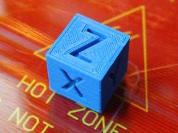
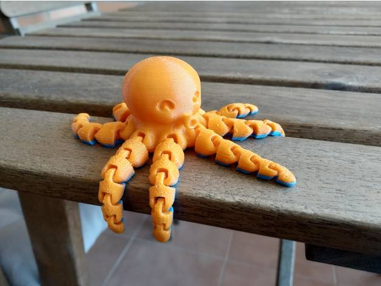
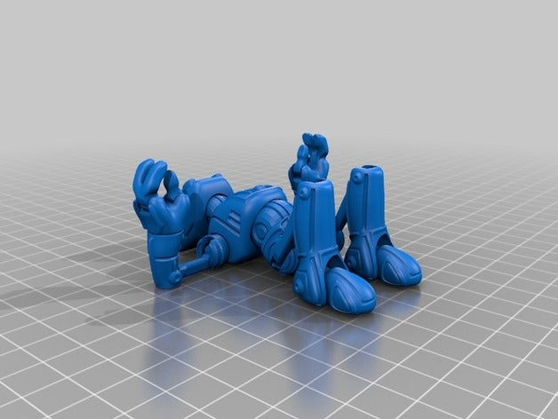
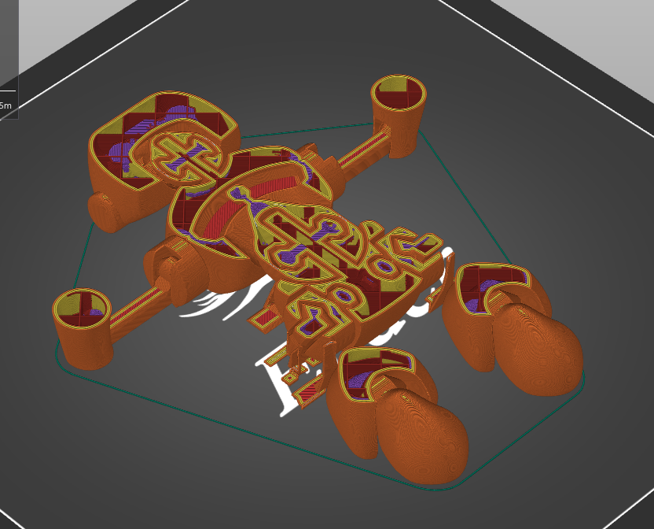
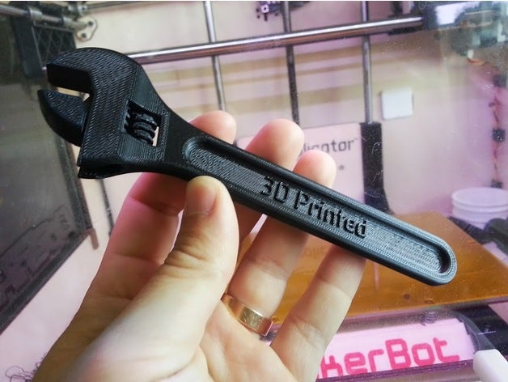
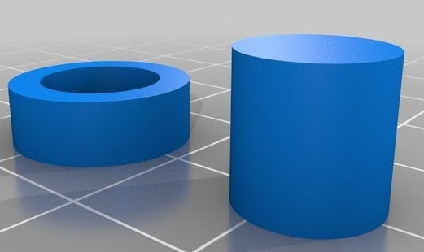
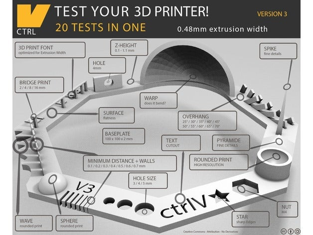
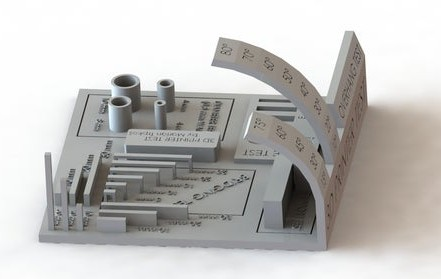

# Modelos para mejorar la calidad

En este apartado vamos a ver algunos modelos que pueden utilizar de manera recurrente para mejorar la calidad y también para conocer las características óptimas de impresión de determinados filamentos.

### Modelos sencillos para testear la calidad

Hay algunos modelos que siempre tenemos que tener a mano para imprimirlos y así comprobar si ha mejorado la calidad con las modificaciones que hemos hecho  a nuestra configuración.

El primero de ellos es el [xyz Cube](https://www.thingiverse.com/thing:1278865),  un cubo de 20 x 20 x 20 mm  que tiene hechos unos grabados de las letras x y z en tres de sus caras y que nos va a permitir tanto calibrar el tamaño exacto de nuestra impresiones como la calidad de las mismas.  Se imprime rápidamente  y en muchas ocasiones ni siquiera es necesario esperar hasta que termine.

Personalmente lo utilizo como prueba cuando vuelvo a imprimir después de un tiempo sin utilizar la impresora o cuando utilizo por primera vez un filamento.

Otro modelo clásico es nuestro querido [3dBenchy](https://www.thingiverse.com/thing:763622),  un simpático barquito diseñado por expertos y que incluye todas muchas características difíciles de imprimir,  cómo pueden ser los puentes, arcos, agujeros, voladizos, y así poder comparar la calidad de diferentes configuraciones. 

Yo lo utilizo cuando quiero afinar la calidad de la impresión también como prueba inicial de toda impresora que se precie. 

### Modelos articulados

Una vez tenemos bastante fina nuestra impresora, podemos empezar a imprimir piezas articuladas. Estas piezas necesitan  una muy buena calibración en la temperatura y características del filamento, puesto que internamente las piezas tienen una estructura interior bastante compleja, con partes separadas pero muy cercanas que requieren una tolerancia muy ajustada.

Un modelo articulado adecuado para empezar (necesita de un menor nivel de ajuste) es el conocido pulpo [Octopus](https://www.thingiverse.com/thing:3495390) con sus 8 tentáculos articulados. Tras imprimirlo y despegarlo de la base tenemos que retirar la primera capa que actúa como "pegamento" entre las partes de los tentáculos. 

Una vez desbloqueados los iremos moviendo para limar y retirar las pequeñas imperfecciones

Un modelo articulado más complejo es la [marioneta Ankly](https://www.thingiverse.com/thing:2431184) que se imprime como vemos tumbado y con relativa facilidad

En la siguiente imagen vemos que la estructura interior de los modelos articulados es compleja:

Si al imprimirlo vemos que las articulaciones no se mueven, podemos ir aplicando poco a poco más fuerza, hasta conseguir separar las piezas. 

Si la configuración no es adecuada, por ejemplo una temperatura excesiva, las piezas internas pueden quedar soldadas, impidiendo una buena articulación.

Otro modelo de piezas móviles clásico es la [llave inglesa de Daniel Noree](https://www.thingiverse.com/thing:139268)

### Modelos para ajustar la calidad

También existen modelos pensados para afinar la configuración de algún parámetro concreto, y que nos permiten por medio de la experimentación encontrar el valor óptimo.

Una [Torre de calibración de temperatura](https://www.thingiverse.com/thing:2729076) es un modelo pensado para comprobar a qué temperatura obtenemos una mejor calidad. Necesitamos configurar la impresión de este modelo de una manera especial para hacer que diferentes partes se impriman a distinta temperatura. Veremos más adelante cómo hacerlo.

El [Test de expansión horizontal](https://www.thingiverse.com/thing:1662342) nos va a permitir ajustar el tamaño de piezas que necesitamos que encajen a la perfección, por ejemplo un tornillo y una tuerca. 

Algunos materiales plásticos tienen la tendencia a expandirse al enfriarse con lo que el tamaño de la pieza impresa es levemente superior al que ha calculado el software laminar. 

Imprimiendo estas piezas para un material y temperatura concreta podemos ajustar un parámetro llamado **Expansión horizontal** para compensar esta expansión. Más adelante veremos cómo ajustar este parámetro.

### Test completos

Se suelen llamar a estos modelos "Tests de tortura" porque intentan llevar hasta el límite a las impresoras. Tienen un poco de todo:

* Voladizos
* Puentes
* Paredes muy finas
* Ajustes milimétricos

Y el objetivo es ver si nuestra impresora se comporta tan bien como esperamos. Cualquiera de estos tests son adecuados para comprobar la calidad del resultado

[Test completo 1 ](https://www.thingiverse.com/thing:1363023)

[Test completo 2](https://www.thingiverse.com/thing:2656594)

[Vídeo: Modelos para testear la calidad](https://drive.google.com/file/d/1btSOGQZCiA8Fd1DUBOTFdG3z-HdJys8a/view?usp=sharing)

