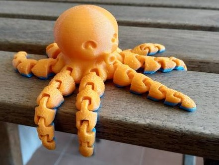
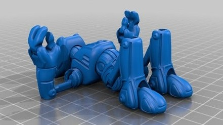

# Modelos para mejorar la calidad

### Modelos sencillos para testear la calidad

[xyz Cube](https://www.thingiverse.com/thing:1278865)

[3dBenchy](https://www.thingiverse.com/thing:763622)

### Modelos articulados

[Octopus](https://www.thingiverse.com/thing:3495390)

[Ankly: Modelo Articulado](https://www.thingiverse.com/thing:2431184)

### Modelos para ajustar la calidad

[Torre de temperatura](https://www.thingiverse.com/thing:2729076)

[Test de expansión horizontal](https://www.thingiverse.com/thing:1662342)

### Test completos

Se suelen llamar test de tortura porque intentan llevar hasta el extremo a las impresoras. Tienen un poco de todo:

* Voladizos
* Puentes
* Paredes muy finas
* Ajustes milimétricos

[Test completo](https://www.thingiverse.com/thing:1363023)

[Test completo](https://www.thingiverse.com/thing:2656594)

[Vídeo: Modelos para testear la calidad](https://drive.google.com/file/d/1btSOGQZCiA8Fd1DUBOTFdG3z-HdJys8a/view?usp=sharing)

