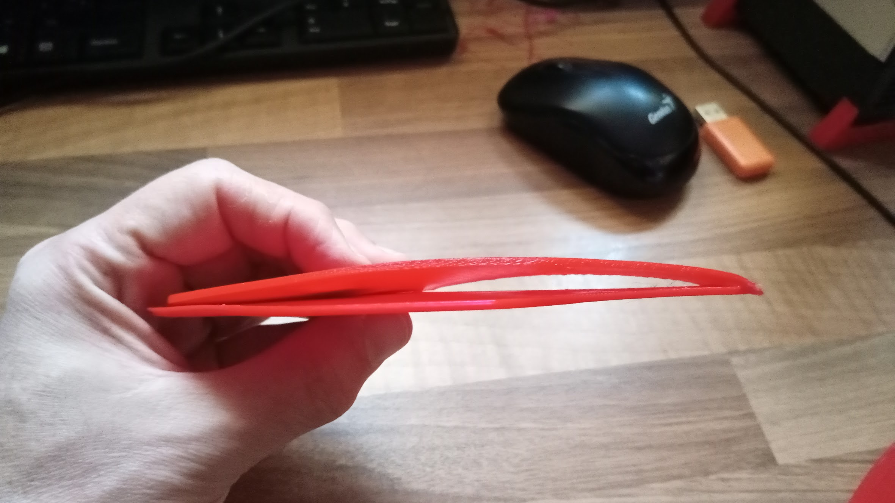
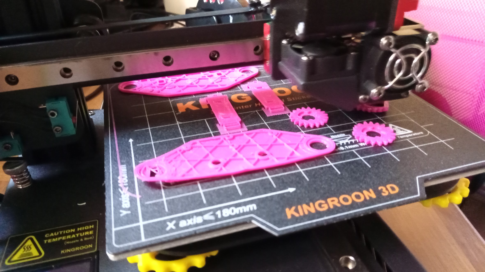

## Problemas con la adherencia

Vamos a ver varios ejemplos de piezas impresas en las que ha fallado la adherencia y sus consecuencias:

Vamos a ver un primer ejemplo donde una de las aletas del cohete de Tintín, se ha despegado de la base (por falta de calibración) curvándose bastante. 

Un caso similar en el que debido a la falta de calibración en una de las esquinas hace que una parte de la pieza se despegue.

También se pueden producir problemas de adherencia si la temperatura de la base es baja.

[Vídeo: 6.0.2 Problemas con la adherencia](https://drive.google.com/file/d/1D-ABtxHB_TlwLHV1EYeOe8yCa016kU8K/view?usp=sharing)

## Mejora de la adherencia

¿Qué podemos hacer para mejorar la adherencia?

1. Recalibra la base con frecuencia: una vez estamos acostumbrados a hacerlo no tardamos nada, incluso si es leve podemos hacerlo mientras imprimimos viendo la forma en la que se imprime la primera capa.
1. Subir temperatura de la base: al subirla conseguiremos una mejor adherencia, pero no sirve de nada si nuestra pieza ya ha comenzado a despegarse
1. Añadir laca: si imprimimos sobre cristal o una superficie muy lisa podemos mejorar la adherencia usando laca. Sirve casi cualquier laca, pero siempre he obtenido muy buenos resultados con la de la marca Nelly. Si añadimos mucha laca la pieza puede quedarse con parte de ella adherida, y salvo que el filamento sea blanco, se notarán los restos.
1. También se pueden usar otros materiales para mejorar la adherencia, como la cinta de carrocero o el pegamento en barra.
1. Añadir elementos de mejora de la adherencia como brim/falda/... en el laminado: estos elementos van a mejorar el agarre de la pieza. A veces pueden ser útiles si se añaden a las esquinas de nuestro modelo si este es bastante ancho.

## Tipos de base y su resultado

Dependiendo del tipo de superficie de la base de impresión obtendremos unos resultados u otros, con mejor o peor agarre y con un acabado más o menos liso:

1. Cristal/espejo: nos va a permitir obtener un acabado muy liso y brillante, pero habrá que mejorar la adherencia subiendo la temperatura o añadiendo laca.
1. Cristal con textura: permite acabados bastante lisos pero la textura o una serigrafía mejoran el agarre.
1. Base magnética: suelen ser rugosas para conseguir mejorar adherencia, lo que nos produce un acabado también rugoso.

[Vídeo: 6.0.2. Resultados con diferentes bases](https://drive.google.com/file/d/1BeZfm1jhCl5VGWXW434EYVqhP4YP2B7J/view?usp=sharing)

## Exceso de adherencia

A veces el problema es que tenemos demasiada adherencia y cuesta demasiado separar la pieza de la base (esto no ocurre en las bases flexibles magnéticas) o no vamos a poder separar la pieza del soporte, porque se han fundido entre sí.

Otro problema es que el filamento se quede tan pegado a la base que puede pegarse a otras impresiones si no limpiamos bien la base.

[Vídeo: 6.0.2 Problemas por exceso de adherencia](https://drive.google.com/file/d/1rYBQjDKGCGZZeqEXdMptzcw4_8lSE0TQ/view?usp=sharing)

