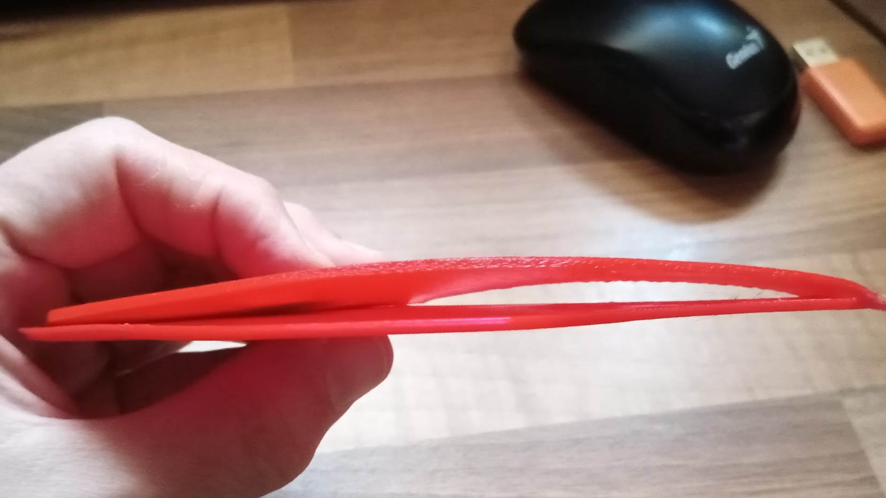
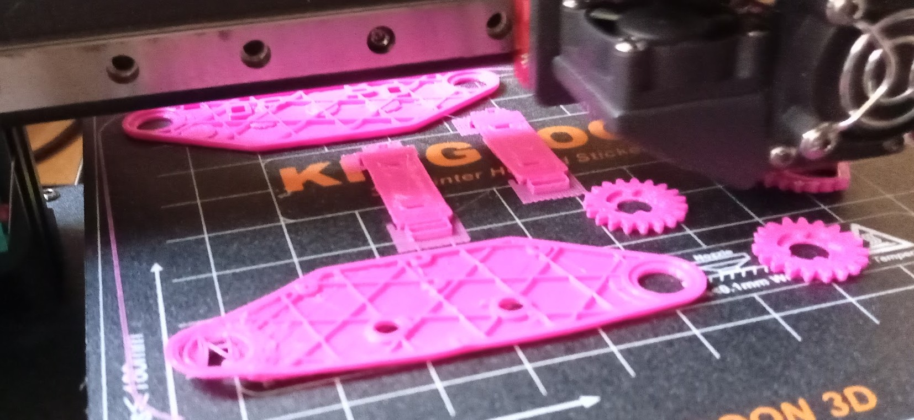

## Problemas con la adherencia

Vamos a ver varios ejemplos de piezas impresas en las que ha fallado la adherencia

Ejemplo de las aletas del cohete

[Vídeo: 6.0.2 Problemas con la adherencia](https://drive.google.com/file/d/1D-ABtxHB_TlwLHV1EYeOe8yCa016kU8K/view?usp=sharing)

## Mejora de la adherencia

1. Recalibra la base
1. Subir temperatura de la base
1. Añadir laca
1. Añadir brim/falda/...

## Tipos de base y su resultado

1. Cristal/espejo
1. Cristal con textura
1. Base magnética

[Vídeo: 6.0.2. Resultados con diferentes bases](https://drive.google.com/file/d/1BeZfm1jhCl5VGWXW434EYVqhP4YP2B7J/view?usp=sharing)

## Exceso de adherencia

No vamos a poder separar el soporte

El soporte y la pieza quedan fundidos

Se queda tan pegado el filamento que luego puede pegarse a otras impresiones

[Vídeo: 6.0.2 Problemas por exceso de adherencia](https://drive.google.com/file/d/1rYBQjDKGCGZZeqEXdMptzcw4_8lSE0TQ/view?usp=sharing)

